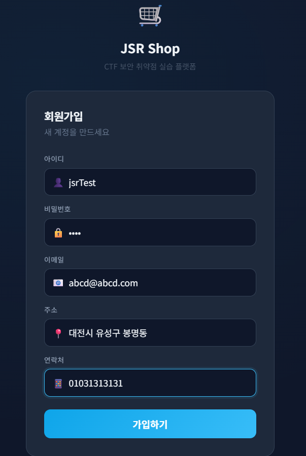
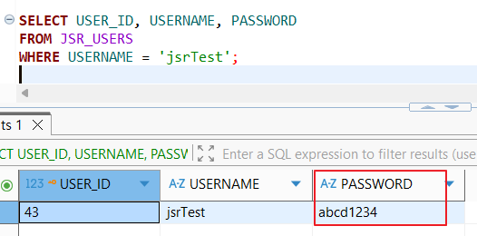
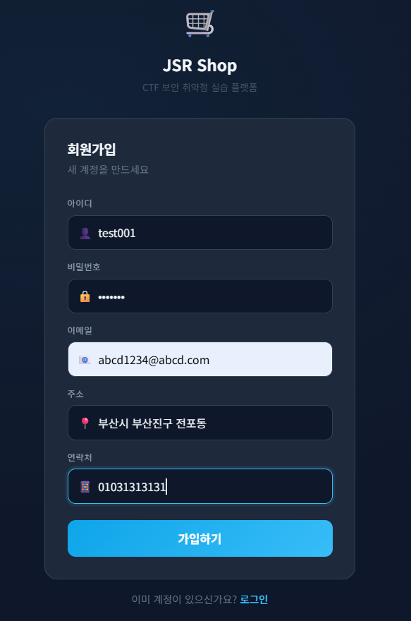

# 01. Register Security

## 개요

회원가입 기능에서 확인한 `Plaintext Password Storage` 취약점과 그 대응 내용을 정리하였다.

## 진입점

- `/jsr/register`

## 취약한 부분

회원가입 시 사용자가 입력한 비밀번호를 해시 처리 없이 `PASSWORD` 컬럼에 그대로 저장한다.

## 취약한 코드

파일: [`src/main/java/com/jsr/ctf/RegisterServlet.java`](../src/main/java/com/jsr/ctf/RegisterServlet.java)

```java
ps = conn.prepareStatement(
    "INSERT INTO JSR_USERS (USER_ID, USERNAME, PASSWORD, EMAIL, ROLE, POINT, ADDRESS, PHONE, CREATED_AT) " +
    "VALUES (JSR_USER_SEQ.NEXTVAL, ?, ?, ?, 'USER', 0, ?, ?, SYSDATE)");
ps.setString(1, userid);
ps.setString(2, password);
ps.setString(3, email);
ps.setString(4, address);
ps.setString(5, phone);
ps.executeUpdate();
```

## 취약한 코드 동작 설명

- 회원가입 요청에서 전달된 `password` 값이 별도 변환 없이 그대로 `ps.setString(2, password)`에 전달된다.
- 이후 `INSERT INTO JSR_USERS ... PASSWORD ...` 구문이 실행되면서 사용자가 입력한 문자열이 `PASSWORD` 컬럼에 평문으로 저장된다.
- 예를 들어 사용자가 `abcd1234`를 입력하면 DB에도 동일한 `abcd1234`가 저장된다.

## 취약한 코드 증적자료

### 1. 회원가입 입력 화면



### 2. DB 평문 저장 확인

```sql
SELECT USER_ID, USERNAME, PASSWORD
FROM JSR_USERS
WHERE USERNAME = 'jsrTest';
```



## 영향

- DB 유출 시 사용자 비밀번호가 즉시 노출될 수 있다.
- 동일 비밀번호 재사용 계정까지 추가 피해로 이어질 수 있다.

## 대응 방안

- 회원가입 시 비밀번호를 평문으로 저장하지 않고 단방향 해시로 저장한다.
- 본 예시에서는 `PBKDF2` 기반 해시를 적용하였다.
- 회원가입 저장 구조가 바뀌면 로그인 검증 코드도 해시 비교 방식으로 함께 수정해야 한다.

## PBKDF2 간단 설명

- `PBKDF2`는 비밀번호를 바로 저장하지 않고, salt와 반복 연산을 이용해 해시 값을 만드는 알고리즘이다.
- 같은 비밀번호라도 salt가 다르면 저장 결과가 달라지고, 반복 횟수를 사용해 무차별 대입 공격 비용을 높일 수 있다.

## 대응 코드

적용 브랜치: [`patched`](https://github.com/sangrok-jeon/jsr-vuln-shop/tree/patched)

적용 파일:

- [`patched/src/main/java/com/jsr/ctf/RegisterServlet.java`](https://github.com/sangrok-jeon/jsr-vuln-shop/blob/patched/src/main/java/com/jsr/ctf/RegisterServlet.java)
- [`patched/src/main/java/com/jsr/ctf/PasswordUtil.java`](https://github.com/sangrok-jeon/jsr-vuln-shop/blob/patched/src/main/java/com/jsr/ctf/PasswordUtil.java)
- [`patched/src/main/java/com/jsr/ctf/LoginServlet.java`](https://github.com/sangrok-jeon/jsr-vuln-shop/blob/patched/src/main/java/com/jsr/ctf/LoginServlet.java)

```java
String passwordHash = PasswordUtil.hash(password);

ps = conn.prepareStatement(
    "INSERT INTO JSR_USERS (USER_ID, USERNAME, PASSWORD, EMAIL, ROLE, POINT, ADDRESS, PHONE, CREATED_AT) " +
    "VALUES (JSR_USER_SEQ.NEXTVAL, ?, ?, ?, 'USER', 0, ?, ?, SYSDATE)");
ps.setString(1, userid);
ps.setString(2, passwordHash);
ps.setString(3, email);
ps.setString(4, address);
ps.setString(5, phone);
ps.executeUpdate();
```

```java
public static String hash(String password) {
    byte[] salt = new byte[SALT_LENGTH];
    new SecureRandom().nextBytes(salt);

    byte[] hash = derive(password.toCharArray(), salt, ITERATIONS, KEY_LENGTH);
    return "pbkdf2$" + ITERATIONS + "$"
        + Base64.getEncoder().encodeToString(salt) + "$"
        + Base64.getEncoder().encodeToString(hash);
}
```

```java
String sql = "SELECT USER_ID, USERNAME, PASSWORD, EMAIL, ROLE, POINT, ADDRESS, PHONE "
        + "FROM JSR_USERS WHERE USERNAME = ?";

PreparedStatement ps = conn.prepareStatement(sql);
ps.setString(1, userid);
ResultSet rs = ps.executeQuery();

if (rs.next() && PasswordUtil.matches(password, rs.getString("PASSWORD"))) {
    loginUser = new JsrUser();
    loginUser.setUserId(rs.getLong("USER_ID"));
    loginUser.setUsername(rs.getString("USERNAME"));
    loginUser.setEmail(rs.getString("EMAIL"));
    loginUser.setRole(rs.getString("ROLE"));
    loginUser.setPoint(rs.getInt("POINT"));
    loginUser.setAddress(rs.getString("ADDRESS"));
    loginUser.setPhone(rs.getString("PHONE"));
}
```

## 대응 코드 동작 설명

- 회원가입 요청에서 전달된 `password` 값은 먼저 `PasswordUtil.hash(password)`를 통해 해시 문자열로 변환된다.
- 이후 `ps.setString(2, passwordHash)`가 실행되므로 DB에는 원문 비밀번호가 아니라 `pbkdf2$...` 형식의 결과값이 저장된다.
- 이 방식으로 DB가 유출되더라도 사용자의 원문 비밀번호가 바로 노출되지 않도록 대응할 수 있다.
- 로그인 시에는 `PasswordUtil.matches(password, rs.getString("PASSWORD"))`로 입력값과 저장된 해시를 비교해야 새로 가입한 계정이 정상 인증된다.

## 대응 코드 증적자료

### 1. 회원가입 입력 화면



### 2. DB 해시 저장 확인

```sql
SELECT USER_ID, USERNAME, PASSWORD
FROM JSR_USERS
WHERE USERNAME = 'test001';
```


## 확인 내용

- 취약 버전에서는 `PASSWORD` 컬럼에 입력한 비밀번호가 평문으로 저장되었다.
- 대응 버전에서는 `PASSWORD` 컬럼에 `pbkdf2$...` 형식의 해시 문자열이 저장되는 것을 확인하였다.
