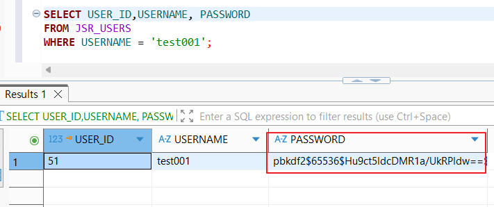

# 01. Register Security

## 개요

회원가입 기능에서 확인한 `Plaintext Password Storage` 취약점과 그 대응 내용을 정리하였다.

## 진입점

- `/jsr/register`

## 취약한 부분

회원가입 시 사용자가 입력한 비밀번호를 해시 처리 없이 `PASSWORD` 컬럼에 그대로 저장한다.

## 취약한 코드

파일: [`src/main/java/com/jsr/ctf/RegisterServlet.java`](../src/main/java/com/jsr/ctf/RegisterServlet.java)

```java
ps = conn.prepareStatement(
    "INSERT INTO JSR_USERS (USER_ID, USERNAME, PASSWORD, EMAIL, ROLE, POINT, ADDRESS, PHONE, CREATED_AT) " +
    "VALUES (JSR_USER_SEQ.NEXTVAL, ?, ?, ?, 'USER', 0, ?, ?, SYSDATE)");
ps.setString(1, userid);
ps.setString(2, password);
ps.setString(3, email);
ps.setString(4, address);
ps.setString(5, phone);
ps.executeUpdate();
```

## 취약한 코드 증적자료

### 1. 회원가입 입력 화면


### 2. DB 평문 저장 확인

```sql
SELECT USER_ID, USERNAME, PASSWORD
FROM JSR_USERS
WHERE USERNAME = 'jsrTest';
```


## 영향

- DB 유출 시 사용자 비밀번호가 즉시 노출될 수 있다.
- 동일 비밀번호 재사용 계정까지 추가 피해로 이어질 수 있다.

## 대응 방안

- 회원가입 시 비밀번호를 평문으로 저장하지 않고 단방향 해시로 저장한다.
- 본 예시에서는 `PBKDF2` 기반 해시를 적용하였다.

## 대응 코드

파일: [`src/main/java/com/jsr/ctf/RegisterServlet.java`](../src/main/java/com/jsr/ctf/RegisterServlet.java)

```java
String passwordHash = PasswordUtil.hash(password);

ps = conn.prepareStatement(
    "INSERT INTO JSR_USERS (USER_ID, USERNAME, PASSWORD, EMAIL, ROLE, POINT, ADDRESS, PHONE, CREATED_AT) " +
    "VALUES (JSR_USER_SEQ.NEXTVAL, ?, ?, ?, 'USER', 0, ?, ?, SYSDATE)");
ps.setString(1, userid);
ps.setString(2, passwordHash);
ps.setString(3, email);
ps.setString(4, address);
ps.setString(5, phone);
ps.executeUpdate();
```

파일: [`src/main/java/com/jsr/ctf/PasswordUtil.java`](../src/main/java/com/jsr/ctf/PasswordUtil.java)

```java
public static String hash(String password) {
    byte[] salt = new byte[SALT_LENGTH];
    new SecureRandom().nextBytes(salt);

    byte[] hash = derive(password.toCharArray(), salt, ITERATIONS, KEY_LENGTH);
    return "pbkdf2$" + ITERATIONS + "$"
        + Base64.getEncoder().encodeToString(salt) + "$"
        + Base64.getEncoder().encodeToString(hash);
}
```

## 대응 코드 증적자료

### 1. 회원가입 입력 화면


### 2. DB 해시 저장 확인

```sql
SELECT USER_ID, USERNAME, PASSWORD
FROM JSR_USERS
WHERE USERNAME = 'test001';
```



## 확인 내용

- 취약 버전에서는 `PASSWORD` 컬럼에 입력한 비밀번호가 평문으로 저장되었다.
- 대응 버전에서는 `PASSWORD` 컬럼에 `pbkdf2$...` 형식의 해시 문자열이 저장되는 것을 확인하였다.
