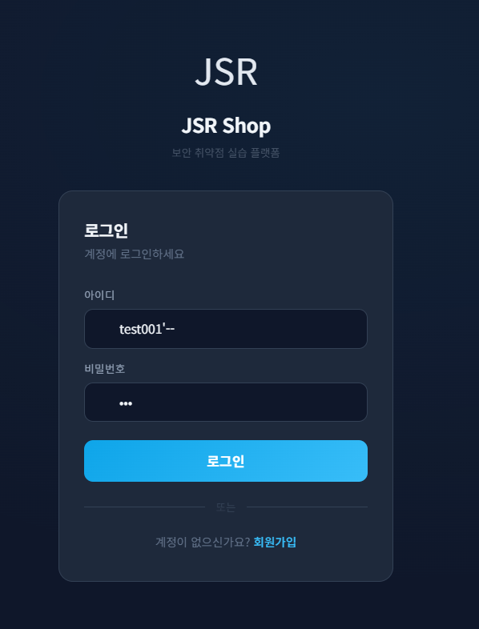
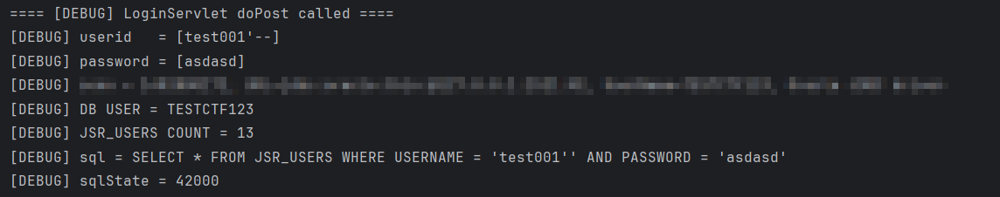
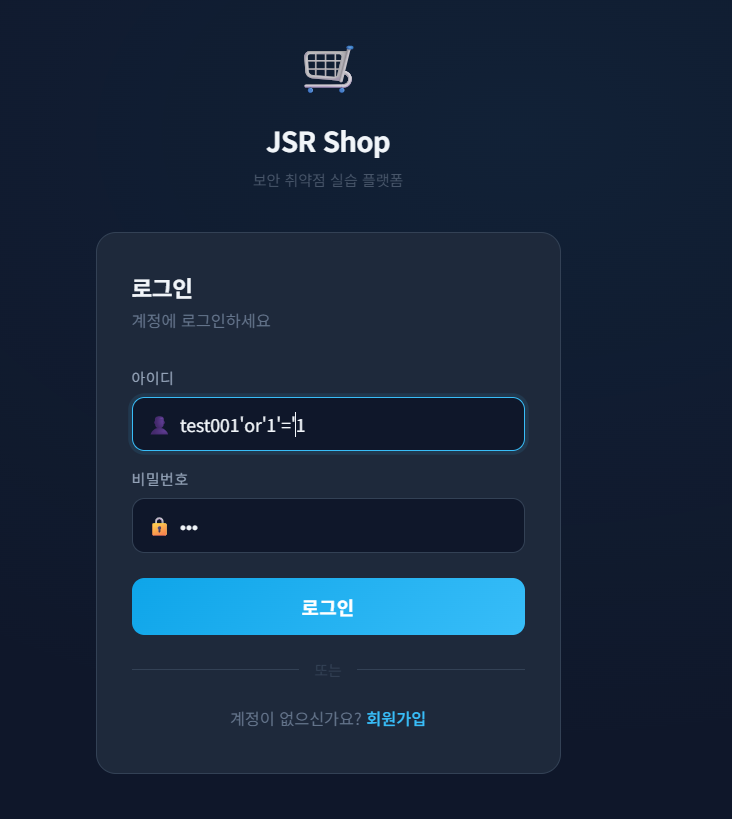
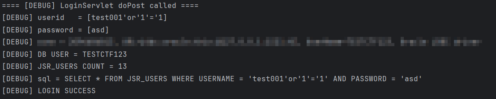
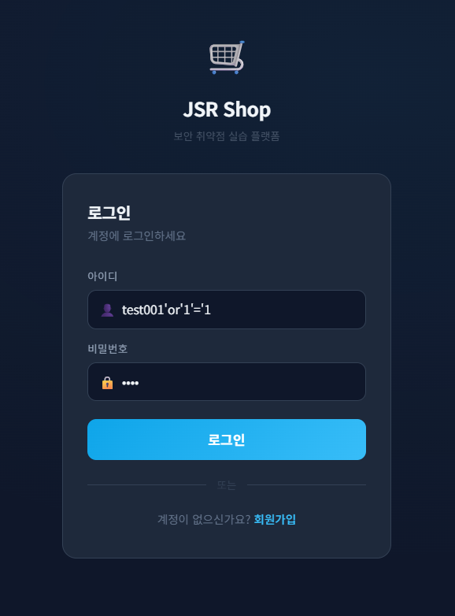
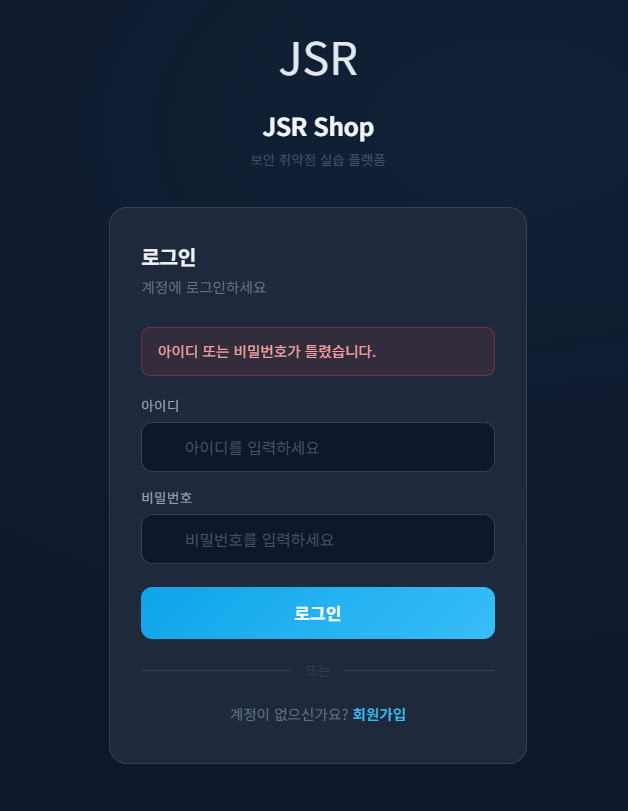
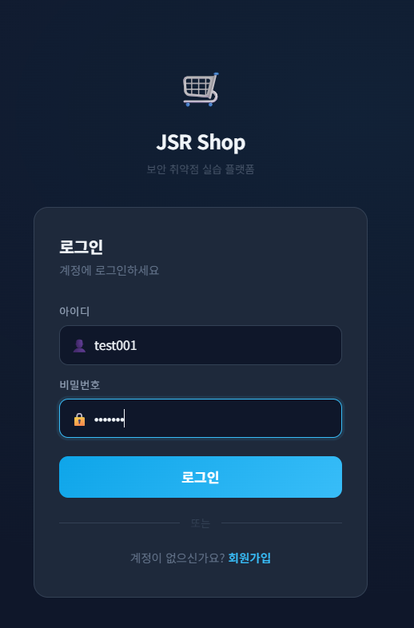

# 02. Login Security

## 개요

로그인 기능에서 확인된 보안 이슈를 정리한 문서이다. 본 문서에서는 `SQL Injection`, `민감한 디버그 로그 출력`을 다룬다.

## 진입점

- `/jsr/login`

## 포함 이슈

| 구분 | 취약점 | 설명 |
| --- | --- | --- |
| 주요 취약점 | SQL Injection | 사용자 입력이 문자열 결합 SQL로 실행되어 인증 우회가 가능함 |
| 추가 관찰 | Sensitive Debug Logging | 로그인 시도 시 사용자 ID와 비밀번호가 로그에 그대로 출력됨 |

## 재현 결과

### 1. 정상 실패 동작 확인

- 잘못된 계정 정보를 입력하면 로그인 실패 메시지가 표시된다.

### 2. 주석 기반 우회 시도는 실패

- 예시: `test'--`
- `--`, `#`, `/**/` 등 일부 주석 패턴이 제거되어 우회가 실패한다.





### 3. OR 조건 기반 우회는 성공

- 예시: `test'or'1'='1`
- 주석 제거 방식만으로는 boolean-based 조건 우회를 막지 못한다.
- 조건식이 참이 되면서 인증 우회가 발생한다.



### 4. OR 조건 기반 우회 성공 디버그 로그

- 동일 입력이 필터를 우회해 로그인 성공으로 이어지는 로그를 확인할 수 있다.



### 5. 로그인 우회 후 상품 페이지 진입

- OR 조건 기반 입력 이후 로그인 우회가 발생하면 상품 페이지로 이동한다.


## 확인 로그

민감한 연결 정보는 제외하고 로그인 요청 시 출력된 로그 일부만 정리하면 다음과 같다.

```text
==== [DEBUG] LoginServlet doPost called ====
[DEBUG] userid   = [test'or'1'='1]
[DEBUG] password = [12]
```

## 원인 분석

이 기능은 사용자 입력을 SQL 문자열에 직접 결합한 뒤 `Statement`로 실행한다. 따라서 입력값이 데이터가 아니라 SQL 구문으로 해석될 수 있다.

또한 로그인 과정에서 비밀번호 값을 그대로 비교하고, 요청값을 디버그 로그에 출력하고 있다. 비밀번호 저장 구조 자체는 [`01-register-security.md`](01-register-security.md)에서 별도로 정리한다.

## 취약 코드

파일: [`src/main/java/com/jsr/ctf/LoginServlet.java`](../src/main/java/com/jsr/ctf/LoginServlet.java)

```java
userid   = filterSqli(userid);
password = filterSqli(password);

String sql = "SELECT * FROM JSR_USERS "
        + "WHERE USERNAME = '" + userid + "' "
        + "AND PASSWORD = '" + password + "'";

stmt = conn.createStatement();
rs   = stmt.executeQuery(sql);

if (rs.next()) {
    loginUser = new JsrUser();
    loginUser.setUserId(rs.getLong("USER_ID"));
    loginUser.setUsername(rs.getString("USERNAME"));
    loginUser.setPassword(rs.getString("PASSWORD"));
    loginUser.setEmail(rs.getString("EMAIL"));
    loginUser.setRole(rs.getString("ROLE"));
    loginUser.setPoint(rs.getInt("POINT"));
    loginUser.setAddress(rs.getString("ADDRESS"));
    loginUser.setPhone(rs.getString("PHONE"));
}
```

## 취약 원인

1. `filterSqli()`는 일부 문자열만 제거하는 블랙리스트 방식이라 우회가 가능합니다.
2. `Statement`와 문자열 결합 SQL을 함께 사용해 SQL Injection이 발생합니다.
3. 로그인 시도 시 사용자 입력을 그대로 로그에 남깁니다.

## 현재 필터의 한계

```java
private String filterSqli(String input) {
    if (input == null) return input;
    input = input.replaceAll("--", "");
    input = input.replaceAll("#", "");
    input = input.replaceAll("/\\*.*?\\*/", "");
    return input;
}
```

이 방식은 특정 패턴만 제거할 뿐 SQL 문법 전체를 제어하지 못한다. 따라서 주석을 사용하지 않는 조건 우회 입력은 그대로 통과할 수 있다.

## 영향

- 인증 우회 가능
- 임의 사용자 세션 획득 가능
- 사용자 정보 조회 가능
- 로그 접근 시 계정 정보 노출 가능

## 대응 방안

### 1. SQL Injection 대응

- `Statement` 대신 `PreparedStatement` 사용
- 사용자 입력을 SQL 문자열에 직접 결합하지 않기
- 블랙리스트 필터에 의존하지 않기

### 2. 로그 처리 대응

- 사용자 비밀번호를 로그에 출력하지 않기
- 운영 환경에서 디버그 로그 최소화

### 3. 추가 권장 대응

- 로그인 실패 횟수 기반의 레이트 리밋 또는 계정 잠금 정책을 적용한다.
- 무차별 대입 시도가 반복되는 경우 CAPTCHA, 지연 응답, 추가 인증 수단을 함께 검토한다.

## 수정 코드 예시

파일: [`patched/src/main/java/com/jsr/ctf/LoginServlet.java`](https://github.com/sangrok-jeon/jsr-vuln-shop/blob/patched/src/main/java/com/jsr/ctf/LoginServlet.java)

```java
String sql = "SELECT USER_ID, USERNAME, PASSWORD, EMAIL, ROLE, POINT, ADDRESS, PHONE "
        + "FROM JSR_USERS WHERE USERNAME = ?";

PreparedStatement ps = conn.prepareStatement(sql);
ps.setString(1, userid);

ResultSet rs = ps.executeQuery();

if (rs.next() && PasswordUtil.matches(password, rs.getString("PASSWORD"))) {
    loginUser = new JsrUser();
    loginUser.setUserId(rs.getLong("USER_ID"));
    loginUser.setUsername(rs.getString("USERNAME"));
    loginUser.setEmail(rs.getString("EMAIL"));
    loginUser.setRole(rs.getString("ROLE"));
    loginUser.setPoint(rs.getInt("POINT"));
    loginUser.setAddress(rs.getString("ADDRESS"));
    loginUser.setPhone(rs.getString("PHONE"));
}
```

## 대응 코드 동작 설명

대응 코드에서는 사용자 입력을 SQL 문자열에 직접 연결하지 않고, `USERNAME`만 바인딩 값으로 조회한다. 따라서 `test001'or'1'='1` 같은 입력은 SQL 구문이 아니라 하나의 문자열 값으로 처리되어 인증 우회가 발생하지 않는다.

현재 `patched` 브랜치 예시에는 `PasswordUtil.matches()`가 포함되어 있지만, 이는 비밀번호 저장 방식에 맞춘 검증 로직이다. 로그인 SQL Injection 자체를 막는 핵심은 문자열 결합 SQL을 제거하고 `PreparedStatement`로 입력값을 바인딩하는 구조로 바꾸는 데 있다.

또한 본 문서의 대응은 SQL Injection과 민감 로그 출력 제거에 초점을 맞춘 것이며, 별도의 로그인 시도 제한이나 계정 잠금 정책은 추가 권장 대응으로 남아 있다.

## 대응 후 증적자료

### 1. OR 조건 기반 우회 입력 시도

- 대응 코드 적용 후 동일한 OR 조건 기반 입력으로 다시 로그인 시도를 수행하였다.



### 2. OR 조건 기반 우회 실패

- 동일 입력에 대해 로그인 실패 메시지가 출력되며 인증 우회가 발생하지 않음을 확인하였다.



### 3. 정상 계정 로그인 입력

- 정상 계정 정보로 로그인 시도를 수행하였다.



### 4. 정상 계정 로그인 성공

- 정상 계정은 기존과 같이 상품 페이지로 로그인된다.


