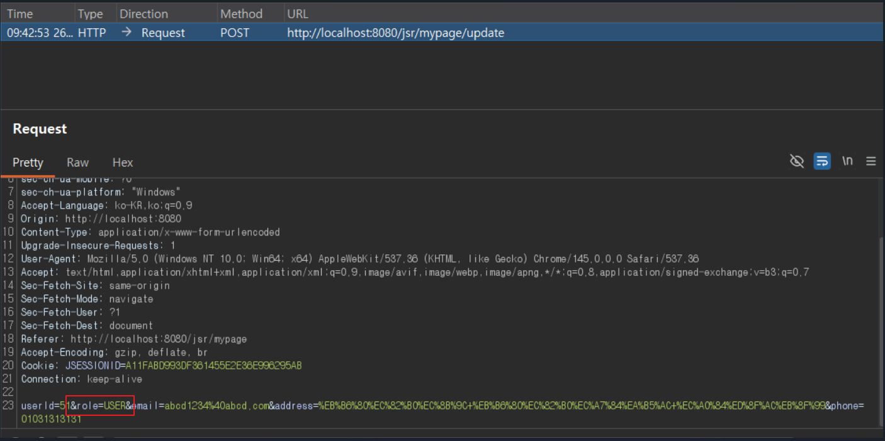
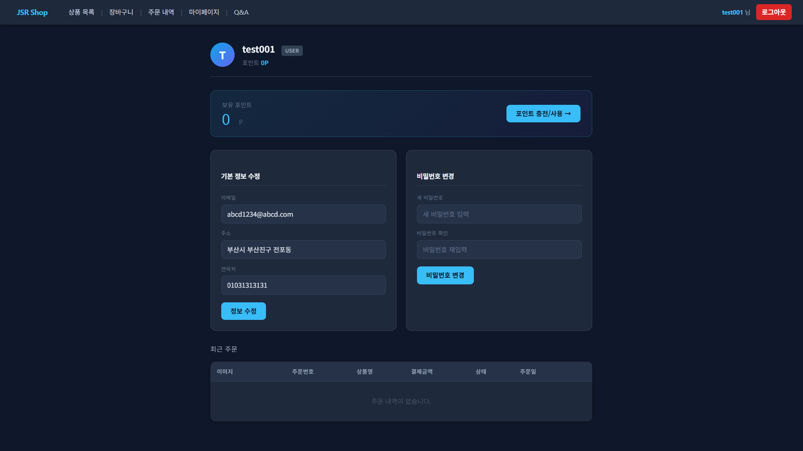
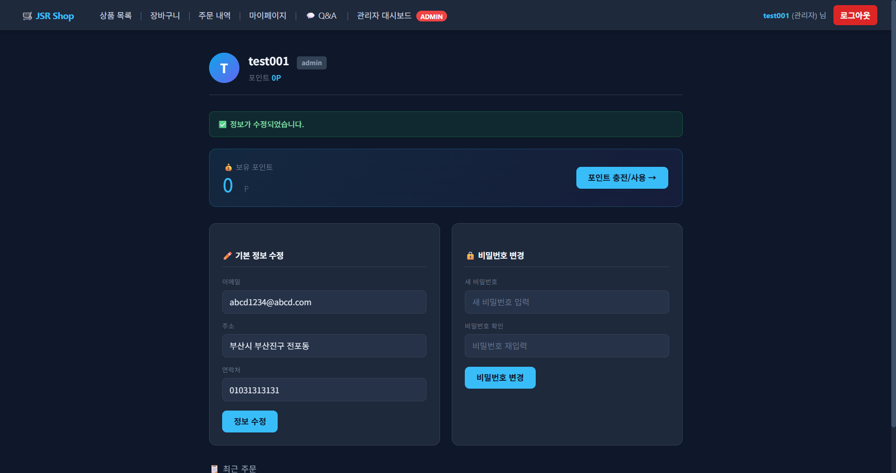
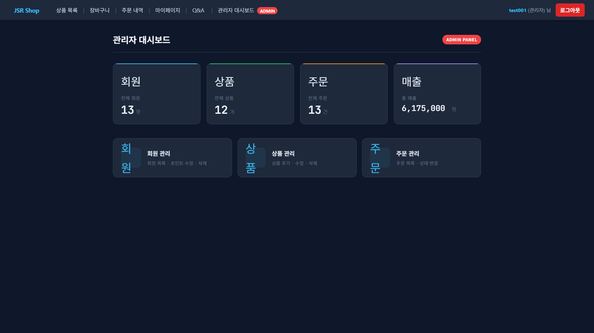
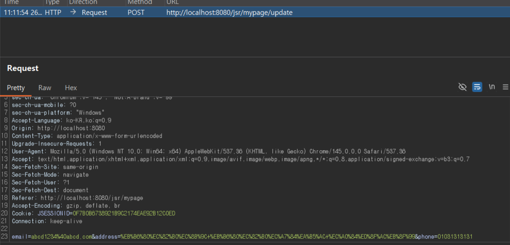
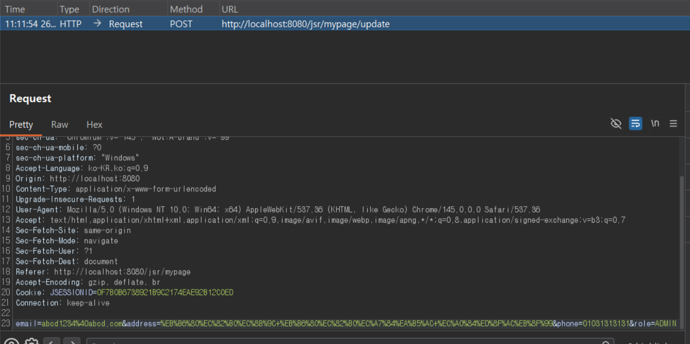
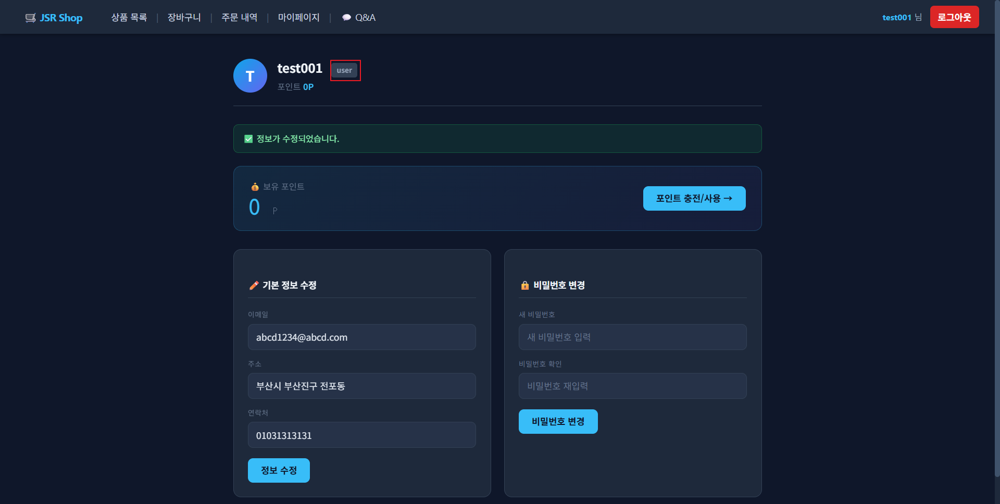
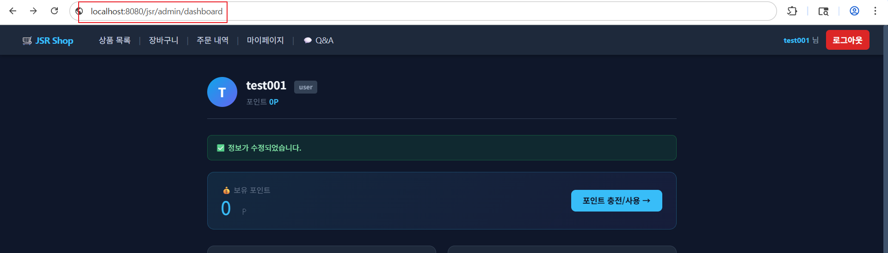
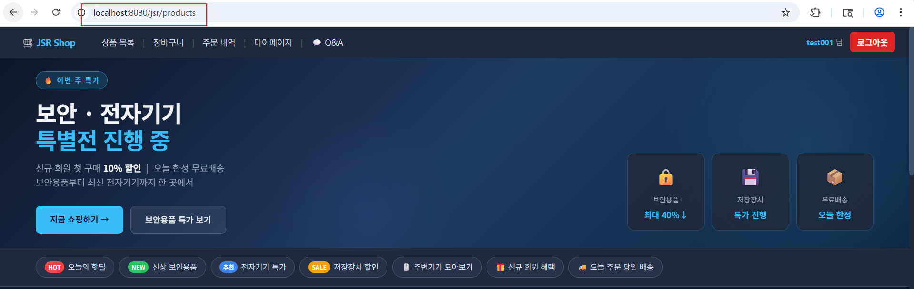

# 03. Privilege Escalation

## 개요

마이페이지 기본 정보 수정 기능에서 확인한 권한 상승 취약점과 대응 방향을 정리한 문서이다.  
일반 사용자 요청에 포함된 `role` 파라미터를 서버가 그대로 신뢰하면서, `USER` 계정이 `ADMIN` 권한으로 상승할 수 있었다.

## 진입점

- `/jsr/mypage`
- `/jsr/mypage/update`
- `/jsr/admin/dashboard`

## 포함 이슈

| 구분 | 취약점 | 설명 |
| --- | --- | --- |
| 주요 취약점 | Privilege Escalation | 클라이언트가 전송한 `role` 값을 신뢰하여 일반 사용자가 관리자 권한으로 상승 가능 |
| 관련 이슈 | Broken Access Control | 관리자 기능 접근 시 세션의 관리자 권한 검증이 충분하지 않음 |

## 취약한 부분

마이페이지 정보 수정 요청에는 `userId`, `role` 값이 함께 포함된다. 서버는 세션에 저장된 사용자 권한 대신, 클라이언트가 전송한 `role` 파라미터를 그대로 받아 DB와 세션에 반영한다.

이 구조에서는 일반 사용자가 Burp Suite 등으로 요청을 가로챈 뒤 `role=USER`를 `role=ADMIN`으로 변조할 수 있고, 그 결과 관리자 메뉴와 관리자 대시보드 접근이 가능해진다.

## 취약한 코드

파일: [`src/main/java/com/jsr/ctf/MypageServlet.java`](../src/main/java/com/jsr/ctf/MypageServlet.java)

```java
String roleParam   = request.getParameter("role");
String userIdParam = request.getParameter("userId");
if (roleParam != null && userIdParam != null) {
    try {
        long targetId = Long.parseLong(userIdParam);
        updateRole(targetId, roleParam);
        if (user.getUserId() == targetId) {
            user.setRole(roleParam);
            request.getSession().setAttribute("jsrUser", user);
        }
    } catch (NumberFormatException ignored) {}
}
```

```java
private void updateRole(long userId, String role) {
    Connection conn = null; PreparedStatement ps = null;
    try {
        conn = DBUtil.getConnection();
        ps = conn.prepareStatement("UPDATE JSR_USERS SET ROLE=? WHERE USER_ID=?");
        ps.setString(1, role);
        ps.setLong(2, userId);
        ps.executeUpdate();
    } catch (SQLException e) { e.printStackTrace(); }
    finally { DBUtil.close(ps, conn); }
}
```

파일: [`src/main/java/com/jsr/ctf/AdminServlet.java`](../src/main/java/com/jsr/ctf/AdminServlet.java)

```java
private boolean checkLogin(HttpServletRequest request, HttpServletResponse response)
        throws IOException {
    if (request.getSession().getAttribute("jsrUser") == null) {
        response.sendRedirect(request.getContextPath() + "/login");
        return false;
    }
    return true;
}
```

## 취약한 코드 동작 설명

- 마이페이지 수정 요청에서 `role`, `userId`를 클라이언트 요청으로부터 그대로 받는다.
- 서버는 세션 권한을 기준으로 권한 변경 가능 여부를 검사하지 않고 `updateRole()`을 실행한다.
- 이후 세션의 `jsrUser.role`도 요청값으로 갱신하므로 UI에도 관리자 권한이 즉시 반영된다.
- 관리자 페이지는 로그인 여부만 확인하고 실제 `ADMIN` 권한은 검사하지 않으므로, 상승된 세션으로 `/admin/dashboard`에 바로 접근할 수 있다.

## 취약한 코드 증적자료

### 1. 권한 변조 대상 파라미터 확인

- 일반 사용자의 마이페이지 수정 요청에 `userId=51`, `role=USER`가 함께 포함된 것을 확인하였다.
- 이 요청에서 `role` 파라미터가 실제 권한 변조 대상이며, Burp Suite에서 `USER`를 `ADMIN`으로 변경해 전송할 수 있다.



### 2. 권한 상승 전 일반 사용자 상태

- 마이페이지 상단 역할 표시가 `USER`인 상태를 확인하였다.



### 3. 권한 상승 후 관리자 권한 반영

- 요청 변조 후 마이페이지 역할 표시가 `admin`으로 변경되었고, 관리자 메뉴가 노출되었다.



### 4. 관리자 대시보드 접근 성공

- 일반 사용자 계정이 관리자 대시보드에 실제로 접근되는 것을 확인하였다.



## 영향

- 일반 사용자 계정의 관리자 권한 상승 가능
- 관리자 전용 메뉴 및 페이지 접근 가능
- 사용자 관리, 상품 관리, 주문 관리 기능 오남용 가능

## 대응 방안

- `role`, `userId` 같은 권한 관련 파라미터를 클라이언트 요청에서 받지 않기
- 수정 대상 사용자 정보는 세션의 `jsrUser` 기준으로만 처리하기
- 관리자 기능 진입 시 세션의 `ROLE` 값을 서버에서 다시 검증하기
- 숨김 필드(`hidden`) 값은 신뢰하지 않기

## 수정 코드 예시

파일: [`src/main/java/com/jsr/ctf/MypageServlet.java`](../src/main/java/com/jsr/ctf/MypageServlet.java)

```java
String email   = request.getParameter("email");
String address = request.getParameter("address");
String phone   = request.getParameter("phone");

updateUserInfo(user.getUserId(), email, address, phone);

JsrUser fresh = getUserById(user.getUserId());
request.getSession().setAttribute("jsrUser", fresh);
response.sendRedirect(request.getContextPath() + "/mypage?updated=1");
```

파일: [`src/main/java/com/jsr/ctf/AdminServlet.java`](../src/main/java/com/jsr/ctf/AdminServlet.java)

```java
private boolean checkAdmin(HttpServletRequest request, HttpServletResponse response)
        throws IOException {
    JsrUser user = (JsrUser) request.getSession().getAttribute("jsrUser");
    if (user == null) {
        response.sendRedirect(request.getContextPath() + "/login");
        return false;
    }
    if (!"ADMIN".equalsIgnoreCase(user.getRole())) {
        response.sendRedirect(request.getContextPath() + "/products");
        return false;
    }
    return true;
}
```

파일: [`src/main/webapp/WEB-INF/views/mypage_view.jsp`](../src/main/webapp/WEB-INF/views/mypage_view.jsp)

```jsp
<form method="post" action="<%= request.getContextPath() %>/mypage/update">
    <div class="form-field">
        <label>이메일</label>
        <input type="email" name="email" value="${jsrUser.email}" class="jsr-input">
    </div>
```

## 대응 코드 동작 설명

- 대응 코드에서는 권한 관련 값인 `role`, `userId`를 클라이언트 요청에서 받지 않는다.
- 마이페이지 수정은 현재 로그인된 세션 사용자 ID만 사용하므로, Burp Suite로 `role=ADMIN`을 추가하거나 변조해도 권한 변경에 사용되지 않는다.
- 관리자 페이지는 세션의 실제 권한이 `ADMIN`인지 서버에서 다시 검증하므로, 일반 사용자 세션으로는 `/admin/dashboard`에 직접 접근할 수 없다.

## 대응 후 증적자료

### 1. 정상 요청에서 `role` 파라미터 제거 확인

- 대응 코드 적용 후 마이페이지 수정 요청에는 `email`, `address`, `phone`만 포함되고 `role`, `userId`가 더 이상 전송되지 않는다.



### 2. `role=ADMIN` 강제 추가 재시도

- Burp Suite에서 `role=ADMIN` 파라미터를 수동으로 추가해 다시 전송하였다.



### 3. 권한 상승 차단 확인

- 변조 요청 이후에도 마이페이지 역할 표시는 여전히 `user`로 유지되었다.



### 4. 관리자 대시보드 직접 접근 시도

- 일반 사용자 세션으로 `/jsr/admin/dashboard`에 직접 접근을 시도하였다.



### 5. 관리자 대시보드 접근 차단

- 직접 접근 시 관리자 대시보드가 표시되지 않고 `/jsr/products`로 리다이렉트되는 것을 확인하였다.


