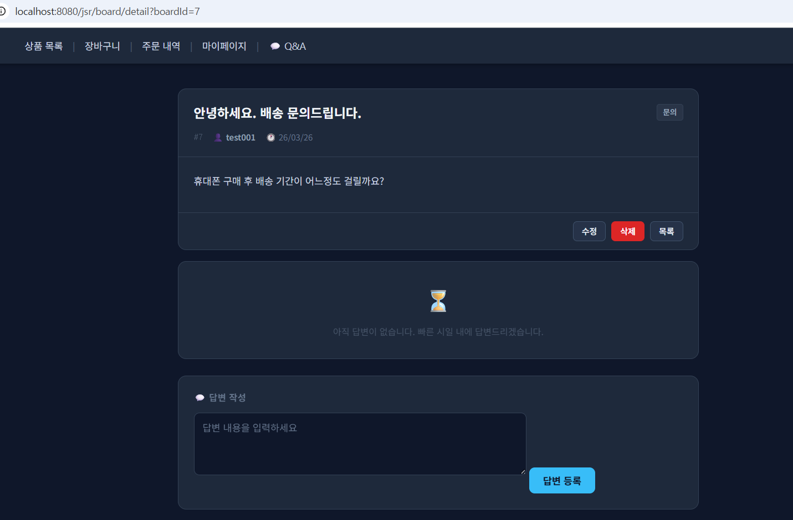
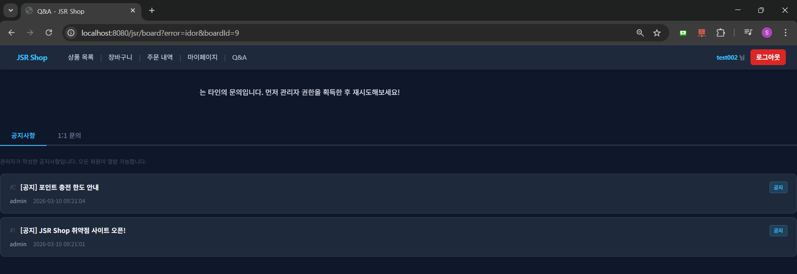
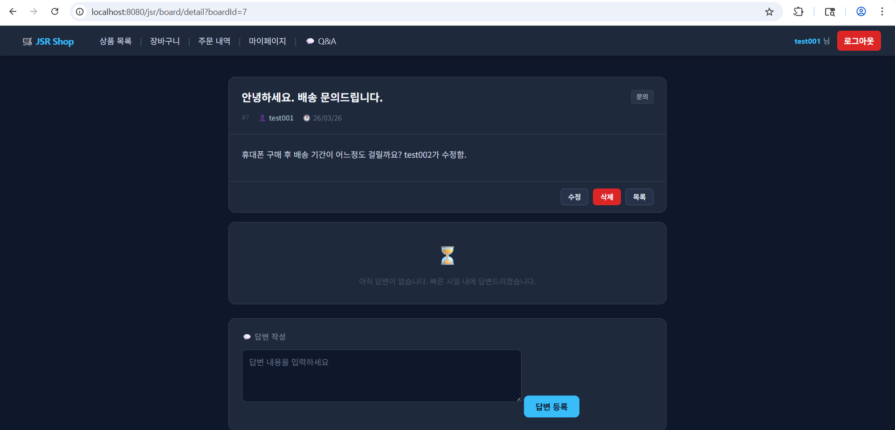
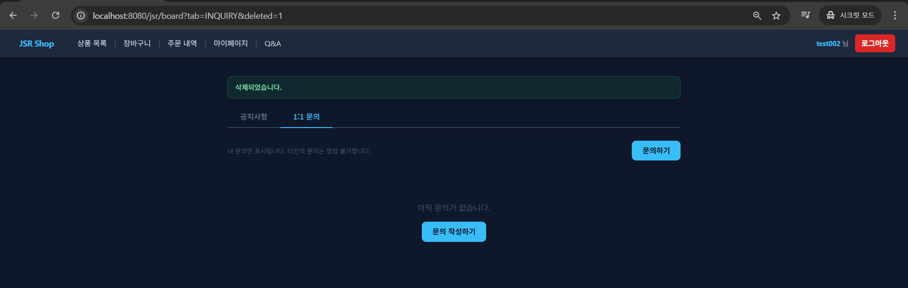
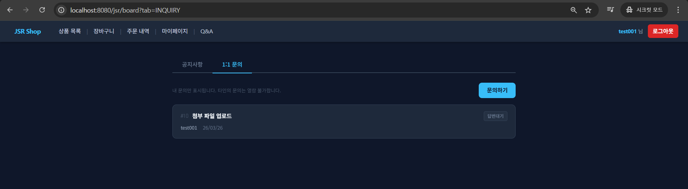
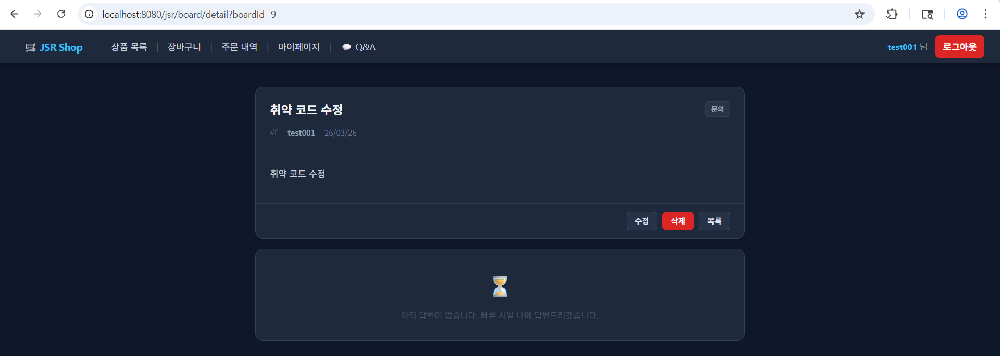
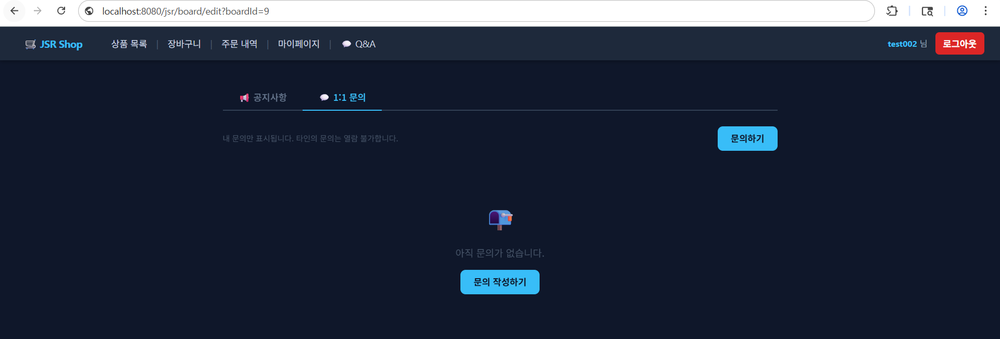
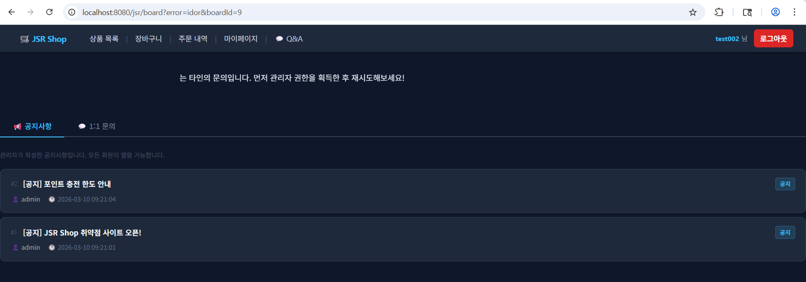
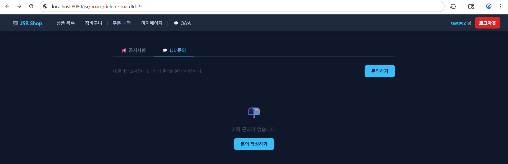
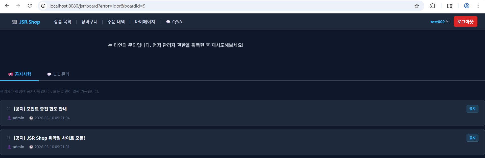

# 04. Inquiry Security

## 개요

1:1 문의 기능에서는 타인 문의글 상세조회는 차단되지만 수정과 삭제 요청에는 동일한 작성자 검증이 적용되지 않는다.  
그 결과 다른 사용자 계정으로 타인의 문의글을 직접 수정하거나 삭제할 수 있다.

## 진입점
- `/jsr/board?tab=INQUIRY`
- `/jsr/board/detail`
- `/jsr/board/edit`
- `/jsr/board/delete`

## 포함 이슈

| 구분 | 취약점 | 설명 |
| --- | --- | --- |
| 주요 취약점 | Broken Access Control / IDOR | 문의글 수정과 삭제 요청에서 작성자 또는 관리자 여부를 검증하지 않아 다른 사용자가 타인의 문의를 수정하거나 삭제할 수 있다. |
| 관련 이슈 | Hidden Field Role Trust | 답변 등록 요청에서 hidden `role` 값을 신뢰하므로 서버 세션 기준 권한 검증이 필요하다. |

## 취약한 부분

문의글 상세조회(`/board/detail`)는 작성자 또는 관리자만 접근할 수 있도록 제한되어 있지만, 수정(`/board/edit`)과 삭제(`/board/delete`)는 같은 `boardId`만 알면 실행된다.  
동일한 게시판 기능 안에서도 접근 통제가 일관되지 않아 문의글 무단 수정과 삭제가 가능하다.

## 취약한 코드

파일: [`src/main/java/com/jsr/ctf/BoardServlet.java`](../src/main/java/com/jsr/ctf/BoardServlet.java)

```java
} else if (path.equals("/board/edit")) {
    long boardId = Long.parseLong(request.getParameter("boardId"));
    JsrBoard board = getBoardById(boardId);
    if (board == null) {
        response.sendRedirect(request.getContextPath() + "/board");
        return;
    }
    request.setAttribute("jsrBoard", board);
    request.setAttribute("writeType", board.getBoardType());
    request.getRequestDispatcher("/WEB-INF/views/board_write_view.jsp")
           .forward(request, response);

} else if (path.equals("/board/delete")) {
    long boardId = Long.parseLong(request.getParameter("boardId"));
    JsrBoard board = getBoardById(boardId);
    String type = (board != null) ? board.getBoardType() : "INQUIRY";
    deleteBoard(boardId);
    response.sendRedirect(request.getContextPath() + "/board?tab=" + type + "&deleted=1");
}
```

```java
} else if (path.equals("/board/edit")) {
    long boardId = Long.parseLong(request.getParameter("boardId"));
    String title = request.getParameter("title");
    String content = request.getParameter("content");

    updateBoard(boardId, title, content, savedFileName);
    response.sendRedirect(request.getContextPath() + "/board/detail?boardId=" + boardId);
}
```

파일: [`src/main/webapp/WEB-INF/views/board_detail_view.jsp`](../src/main/webapp/WEB-INF/views/board_detail_view.jsp)

```jsp
<form method="post" action="<%= request.getContextPath() %>/board/answer">
    <input type="hidden" name="boardId" value="${jsrBoard.boardId}">
    <input type="hidden" name="role" value="${_navRole}">
    <textarea name="content" class="answer-textarea" required></textarea>
    <input type="submit" value="답변 등록" class="jsr-btn">
</form>
```

## 취약한 코드 동작 설명

- 상세조회는 작성자 또는 관리자 여부를 확인하지만 수정과 삭제는 같은 검증 없이 `boardId`만으로 처리한다.
- 다른 사용자 계정이 타인의 `boardId`를 알면 수정 페이지에 진입하고 내용을 변경할 수 있다.
- 삭제 요청도 동일한 검증 없이 실행되어 타인의 문의글을 제거할 수 있다.
- 답변 등록 역시 hidden `role` 값을 함께 전송하므로 서버가 세션 권한 대신 요청 파라미터를 신뢰하면 권한 검증 우회 위험이 발생한다.

## 취약한 코드 증적자료

### 1. 원본 문의글 상세 화면

- `test001` 계정이 작성한 문의글 `#9`의 기준 상태이다.



### 2. 타인 문의글 수정 페이지 무단 접근

- `test002` 계정이 직접 `/board/edit?boardId=9`에 접근해 수정 화면을 열었다.



### 3. 타인 문의글 수정 결과 확인

- `test001` 계정으로 다시 확인했을 때 본문이 `test002가 수정함.`으로 바뀌었다.



### 4. 타인 문의글 삭제 성공

- `test002` 계정이 직접 `/board/delete?boardId=9` 요청을 보내 삭제를 수행했다.



### 5. 삭제 후 문의글 사라짐 확인

- `test001` 계정으로 다시 조회했을 때 문의글이 목록에서 사라졌다.



## 영향

- 타인 문의글 무단 수정 가능
- 타인 문의글 무단 삭제 가능
- 문의 이력 위변조 가능
- 게시판 기능 내 접근 통제 정책 불일치

## 대응 방안

- 문의글 수정과 삭제 전에 작성자 또는 관리자 권한을 서버에서 검증하기
- 게시글 타입이 `NOTICE`인 경우 관리자만 수정과 삭제를 허용하기
- 답변 등록과 삭제는 hidden `role` 값이 아니라 세션의 관리자 권한으로 검증하기
- 관리자 전용 답변 폼은 서버 렌더링 단계에서 관리자에게만 노출하기

## 수정 코드 예시

적용 브랜치: [`patched`](https://github.com/sangrok-jeon/jsr-vuln-shop/tree/patched)

적용 파일:

- [`patched/src/main/java/com/jsr/ctf/BoardServlet.java`](https://github.com/sangrok-jeon/jsr-vuln-shop/blob/patched/src/main/java/com/jsr/ctf/BoardServlet.java)
- [`patched/src/main/webapp/WEB-INF/views/board_detail_view.jsp`](https://github.com/sangrok-jeon/jsr-vuln-shop/blob/patched/src/main/webapp/WEB-INF/views/board_detail_view.jsp)

```java
private boolean canManageBoard(JsrBoard board, JsrUser user, boolean isAdmin) {
    if (board == null) return false;
    if ("NOTICE".equals(board.getBoardType())) return isAdmin;
    return isAdmin || board.getUserId() == user.getUserId();
}
```

```java
} else if (path.equals("/board/edit")) {
    long boardId = Long.parseLong(request.getParameter("boardId"));
    JsrBoard board = getBoardById(boardId);
    if (board == null) {
        response.sendRedirect(request.getContextPath() + "/board?error=notfound");
        return;
    }
    if (!canManageBoard(board, user, isAdmin)) {
        response.sendRedirect(request.getContextPath()
            + "/board?error=" + getBoardAccessError(board, isAdmin) + "&boardId=" + boardId);
        return;
    }
    request.setAttribute("jsrBoard", board);
    request.setAttribute("writeType", board.getBoardType());
    request.getRequestDispatcher("/WEB-INF/views/board_write_view.jsp")
           .forward(request, response);
}
```

```java
} else if (path.equals("/board/delete")) {
    long boardId = Long.parseLong(request.getParameter("boardId"));
    JsrBoard board = getBoardById(boardId);
    if (board == null) {
        response.sendRedirect(request.getContextPath() + "/board?error=notfound");
        return;
    }
    if (!canManageBoard(board, user, isAdmin)) {
        response.sendRedirect(request.getContextPath()
            + "/board?error=" + getBoardAccessError(board, isAdmin) + "&boardId=" + boardId);
        return;
    }
    deleteBoard(boardId);
    response.sendRedirect(request.getContextPath()
        + "/board?tab=" + board.getBoardType() + "&deleted=1");
}
```

```java
} else if (path.equals("/board/answer")) {
    long boardId = Long.parseLong(request.getParameter("boardId"));
    JsrBoard board = getBoardById(boardId);
    if (board == null) {
        response.sendRedirect(request.getContextPath() + "/board?error=notfound");
        return;
    }

    String content = request.getParameter("content");
    if (!isAdmin || !"INQUIRY".equals(board.getBoardType())) {
        response.sendRedirect(request.getContextPath()
            + "/board/detail?boardId=" + boardId + "&error=noperm");
        return;
    }
```

```jsp
<c:if test="${_isAdmin}">
    <div class="answer-form-card">
        <h3>답변 작성</h3>
        <form method="post" action="<%= request.getContextPath() %>/board/answer">
            <input type="hidden" name="boardId" value="${jsrBoard.boardId}">
            <textarea name="content" class="answer-textarea"
                      placeholder="답변 내용을 입력하세요" required></textarea>
            <input type="submit" value="답변 등록" class="jsr-btn">
        </form>
    </div>
</c:if>
```

## 대응 코드 동작 설명

- 수정과 삭제 요청은 먼저 `boardId`로 게시글을 조회한 뒤 `canManageBoard()`로 작성자 또는 관리자 여부를 검증한다.
- 일반 사용자가 타인의 문의글에 접근하면 즉시 `error=idor`로 리다이렉트되어 수정과 삭제가 실행되지 않는다.
- 답변 등록과 삭제는 hidden `role` 값이 아니라 세션의 관리자 권한으로만 허용된다.
- 답변 작성 폼도 관리자에게만 렌더링되므로 일반 사용자는 브라우저 화면에서 관리자용 요청을 만들 수 없다.

## 대응 후 증적자료

### 1. 대응 코드 적용 후 기준 문의글 확인

- `test001` 계정이 새로 작성한 문의글 `#9`의 기준 상태이다.



### 2. 타인 문의글 수정 직접 접근 시도

- `test002` 계정이 다시 `/board/edit?boardId=9`에 직접 접근을 시도했다.



### 3. 수정 접근 차단 결과

- 수정 요청은 `error=idor`로 차단되었다.



### 4. 타인 문의글 삭제 직접 시도

- `test002` 계정이 `/board/delete?boardId=9` 요청을 직접 실행했다.



### 5. 삭제 접근 차단 결과

- 삭제 요청 역시 `error=idor`로 차단되어 문의글이 그대로 유지되었다.

