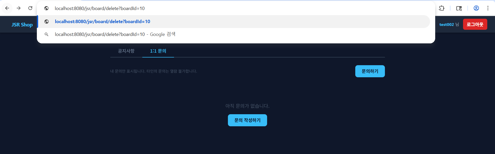
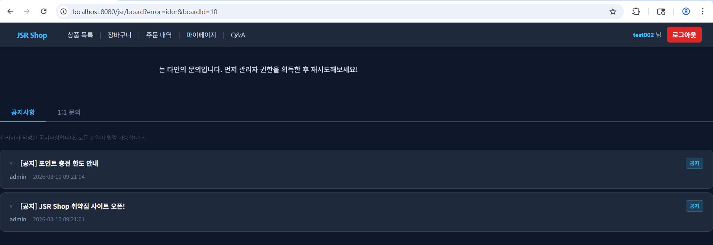

# 04. Inquiry Security

## 개요

1:1 문의 기능에서 확인한 `Broken Access Control / IDOR` 취약점과 대응 내용을 정리한다.  
문의 상세 조회는 타인 글 접근을 일부 차단하고 있었지만, 수정과 삭제 요청에는 같은 수준의 작성자/관리자 검증이 적용되지 않아 다른 사용자가 타인의 문의를 수정하거나 삭제할 수 있었다.

## 진입점

- `/jsr/board?tab=INQUIRY`
- `/jsr/board/detail`
- `/jsr/board/edit`
- `/jsr/board/delete`

## 포함 이슈

| 구분 | 취약점 | 설명 |
| --- | --- | --- |
| 주요 취약점 | Broken Access Control / IDOR | 문의 수정 및 삭제 요청에서 작성자 또는 관리자 여부를 검증하지 않아 다른 사용자가 타인의 문의를 변경하거나 삭제할 수 있다. |
| 관련 이슈 | Hidden Field Role Trust | 답변 등록 폼에서 hidden `role` 값을 함께 전송하므로, 서버는 요청 파라미터가 아니라 세션 기준으로 권한을 검증해야 한다. |

## 취약한 부분

문의 상세 조회(`/board/detail`)는 타인의 문의글에 대한 접근을 제한하고 있었지만, 수정(`/board/edit`)과 삭제(`/board/delete`)는 `boardId`만 있으면 처리되는 구조였다.  
즉 같은 게시판 기능 안에서도 조회와 수정·삭제의 접근통제 수준이 일치하지 않았고, 다른 사용자가 URL의 `boardId`만 바꿔 타인의 문의글을 수정하거나 삭제할 수 있었다.

## 취약한 코드

파일: [`src/main/java/com/jsr/ctf/BoardServlet.java`](../src/main/java/com/jsr/ctf/BoardServlet.java)

```java
} else if (path.equals("/board/edit")) {
    long boardId = Long.parseLong(request.getParameter("boardId"));
    JsrBoard board = getBoardById(boardId);
    if (board == null) {
        response.sendRedirect(request.getContextPath() + "/board");
        return;
    }
    request.setAttribute("jsrBoard", board);
    request.setAttribute("writeType", board.getBoardType());
    request.getRequestDispatcher("/WEB-INF/views/board_write_view.jsp")
           .forward(request, response);

} else if (path.equals("/board/delete")) {
    long boardId = Long.parseLong(request.getParameter("boardId"));
    JsrBoard board = getBoardById(boardId);
    String type = (board != null) ? board.getBoardType() : "INQUIRY";
    deleteBoard(boardId);
    response.sendRedirect(request.getContextPath() + "/board?tab=" + type + "&deleted=1");
}
```

```java
} else if (path.equals("/board/edit")) {
    long boardId = Long.parseLong(request.getParameter("boardId"));
    String title = request.getParameter("title");
    String content = request.getParameter("content");

    updateBoard(boardId, title, content, savedFileName);
    response.sendRedirect(request.getContextPath() + "/board/detail?boardId=" + boardId);
}
```

파일: [`src/main/webapp/WEB-INF/views/board_detail_view.jsp`](../src/main/webapp/WEB-INF/views/board_detail_view.jsp)

```jsp
<form method="post" action="<%= request.getContextPath() %>/board/answer">
    <input type="hidden" name="boardId" value="${jsrBoard.boardId}">
    <input type="hidden" name="role" value="${_navRole}">
    <textarea name="content" class="answer-textarea" required></textarea>
    <input type="submit" value="답변 등록" class="jsr-btn">
</form>
```

## 취약한 코드 동작 설명

- `/board/detail`은 타인 문의에 대한 조회를 차단하지만, `/board/edit`와 `/board/delete`는 같은 수준의 작성자 검증 없이 `boardId`만으로 처리한다.
- 다른 사용자 계정이 타인의 `boardId`를 알고 있으면 수정 페이지에 직접 접근할 수 있고, 변경 내용을 그대로 저장할 수 있다.
- 삭제 요청도 동일하게 처리되어 타인의 문의글을 직접 삭제할 수 있다.
- 답변 등록 폼은 hidden `role` 값을 전송하므로, 서버가 세션이 아닌 요청 파라미터를 신뢰할 경우 권한 우회 위험으로 이어질 수 있다.

## 취약한 코드 증적자료

### 1. 원본 문의 상세 확인

- `test001` 계정으로 작성한 문의글 `#9`의 상세 화면이다.


### 2. 다른 사용자에 의한 수정 페이지 접근

- `test002` 계정으로 `/board/edit?boardId=9`에 직접 접근한 화면이다.


### 3. 수정 결과 반영 확인

- `test001` 계정으로 다시 확인했을 때 내용이 `test002가 수정함.`으로 변경된 것을 확인하였다.


### 4. 다른 사용자에 의한 삭제 성공

- `test002` 계정으로 `/board/delete?boardId=9` 요청을 수행해 삭제가 성공한 화면이다.


### 5. 원본 작성자의 삭제 결과 확인

- `test001` 계정으로 다시 확인했을 때 문의글이 더 이상 존재하지 않는 것을 확인하였다.


## 영향

- 다른 사용자가 타인의 문의글 내용을 임의로 변경할 수 있음
- 다른 사용자가 타인의 문의글을 삭제할 수 있음
- 문의 내용의 무결성과 신뢰성이 훼손됨
- 고객 문의 이력 관리가 불가능해질 수 있음
- 답변 등록 권한 검증이 부실할 경우 추가 권한 우회로 이어질 수 있음

## 대응 방안

- 수정, 삭제, 답변 등록 전에 항상 `boardId` 기준 게시글을 조회하고 작성자 또는 관리자 여부를 검증
- `NOTICE`, `INQUIRY` 타입별 접근 정책을 서버에서 일관되게 적용
- hidden `role` 값을 신뢰하지 않고 세션의 실제 권한만 사용
- 무단 접근 시 수정·삭제를 수행하지 않고 오류 또는 차단 결과를 반환

## 수정 코드

대응 코드 브랜치: [`patched`](https://github.com/sangrok-jeon/jsr-vuln-shop/tree/patched)

대응 파일:

- [`patched/src/main/java/com/jsr/ctf/BoardServlet.java`](https://github.com/sangrok-jeon/jsr-vuln-shop/blob/patched/src/main/java/com/jsr/ctf/BoardServlet.java)
- [`patched/src/main/webapp/WEB-INF/views/board_detail_view.jsp`](https://github.com/sangrok-jeon/jsr-vuln-shop/blob/patched/src/main/webapp/WEB-INF/views/board_detail_view.jsp)

```java
private boolean canManageBoard(JsrBoard board, JsrUser user, boolean isAdmin) {
    if (board == null) return false;
    if ("NOTICE".equals(board.getBoardType())) return isAdmin;
    return isAdmin || board.getUserId() == user.getUserId();
}
```

```java
} else if (path.equals("/board/edit")) {
    long boardId = Long.parseLong(request.getParameter("boardId"));
    JsrBoard board = getBoardById(boardId);
    if (board == null) {
        response.sendRedirect(request.getContextPath() + "/board?error=notfound");
        return;
    }
    if (!canManageBoard(board, user, isAdmin)) {
        response.sendRedirect(request.getContextPath()
            + "/board?error=" + getBoardAccessError(board, isAdmin) + "&boardId=" + boardId);
        return;
    }
    request.setAttribute("jsrBoard", board);
    request.setAttribute("writeType", board.getBoardType());
    request.getRequestDispatcher("/WEB-INF/views/board_write_view.jsp")
           .forward(request, response);
}
```

```java
} else if (path.equals("/board/delete")) {
    long boardId = Long.parseLong(request.getParameter("boardId"));
    JsrBoard board = getBoardById(boardId);
    if (board == null) {
        response.sendRedirect(request.getContextPath() + "/board?error=notfound");
        return;
    }
    if (!canManageBoard(board, user, isAdmin)) {
        response.sendRedirect(request.getContextPath()
            + "/board?error=" + getBoardAccessError(board, isAdmin) + "&boardId=" + boardId);
        return;
    }
    deleteBoard(boardId);
    response.sendRedirect(request.getContextPath()
        + "/board?tab=" + board.getBoardType() + "&deleted=1");
}
```

```jsp
<c:if test="${_isAdmin}">
    <div class="answer-form-card">
        <h3>답변 작성</h3>
        <form method="post" action="<%= request.getContextPath() %>/board/answer">
            <input type="hidden" name="boardId" value="${jsrBoard.boardId}">
            <textarea name="content" class="answer-textarea"
                      placeholder="답변 내용을 입력하세요." required></textarea>
            <input type="submit" value="답변 등록" class="jsr-btn">
        </form>
    </div>
</c:if>
```

## 대응 코드 동작 설명

- 수정과 삭제 요청은 모두 `canManageBoard()`를 거쳐 작성자 또는 관리자만 수행할 수 있도록 변경했다.
- 권한이 없는 사용자가 수정이나 삭제를 시도하면 `error=idor` 또는 `error=noperm`으로 리다이렉트되어 실제 동작은 수행되지 않는다.
- 답변 등록은 hidden `role` 값 대신 세션의 관리자 권한(`_isAdmin`)으로만 노출하고, 서버에서도 같은 기준으로 검증한다.

## 대응 증적자료

### 1. 대응 코드 적용 후 원본 문의 상세 확인

- 대응 코드 적용 후 `test001` 계정으로 작성한 문의글 `#10`의 상세 화면이다.


### 2. 무단 수정 시도 차단

- `test002` 계정으로 `boardId=10` 수정 접근을 시도했지만 차단된 결과이다.


### 3. 무단 삭제 시도

- `test002` 계정으로 `boardId=10` 삭제를 직접 시도한 화면이다.



### 4. 삭제 차단 및 원본 글 유지 확인

- 무단 삭제 시도 후에도 문의글이 그대로 유지되는 것을 확인하였다.


