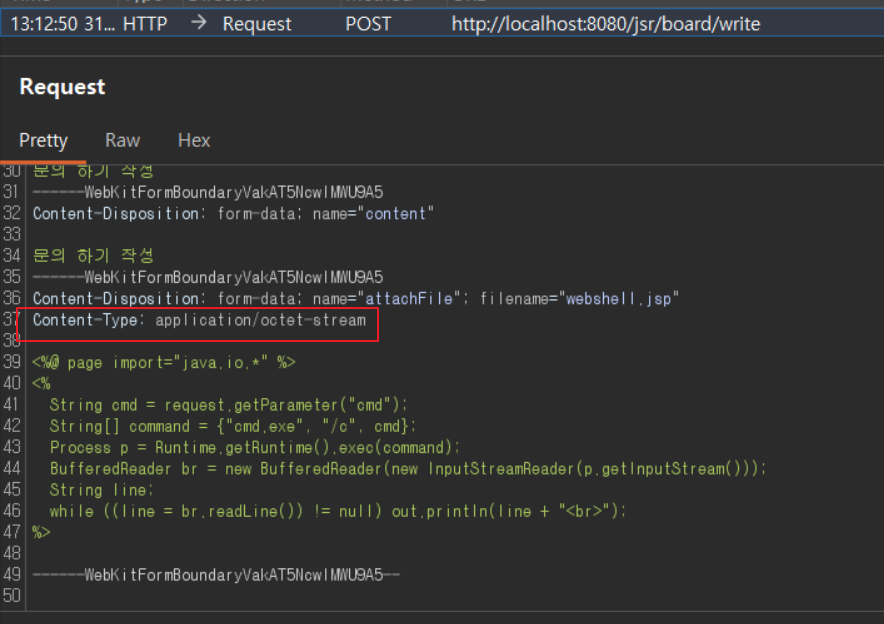
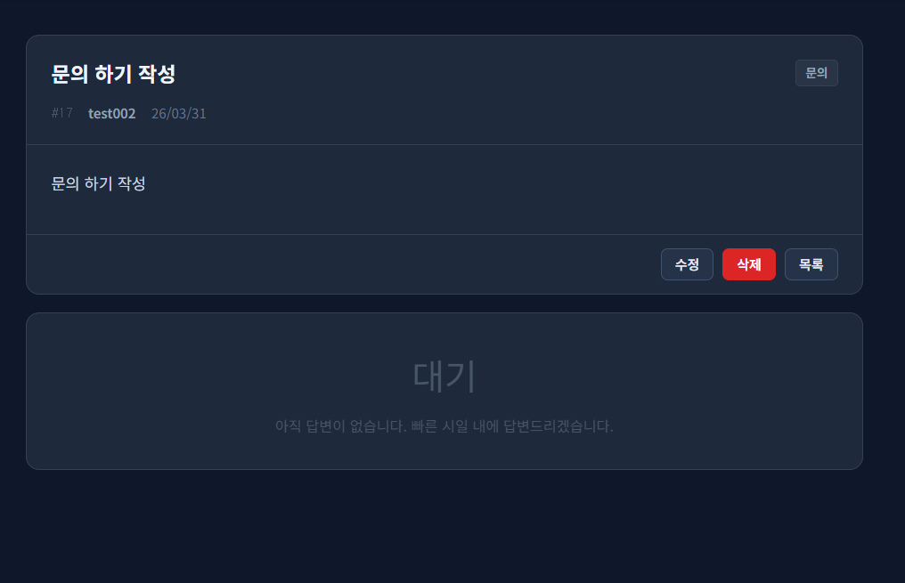
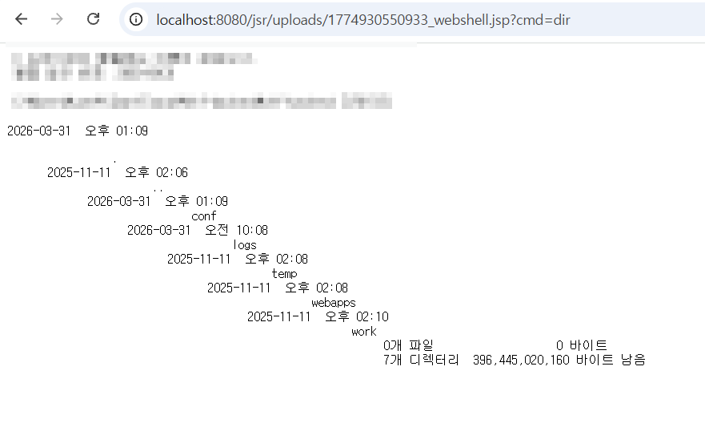
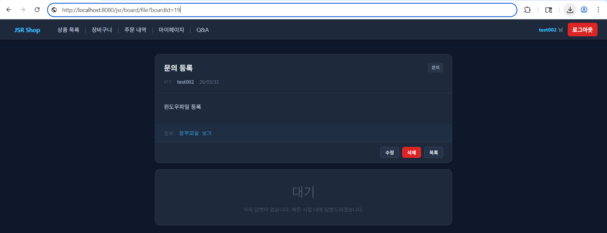
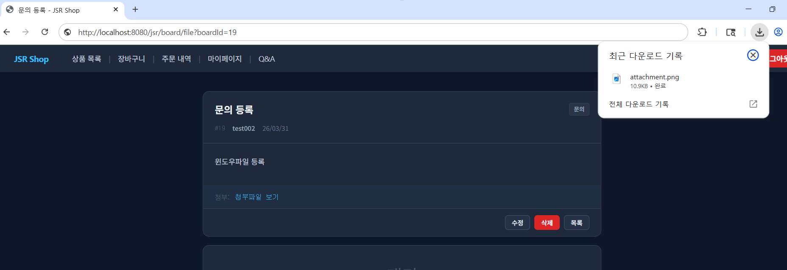
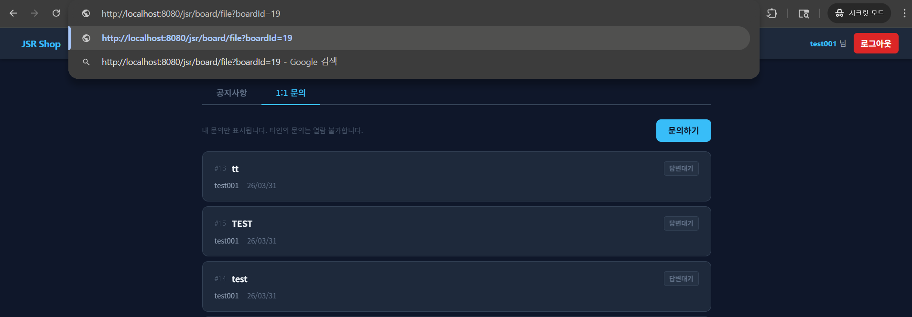
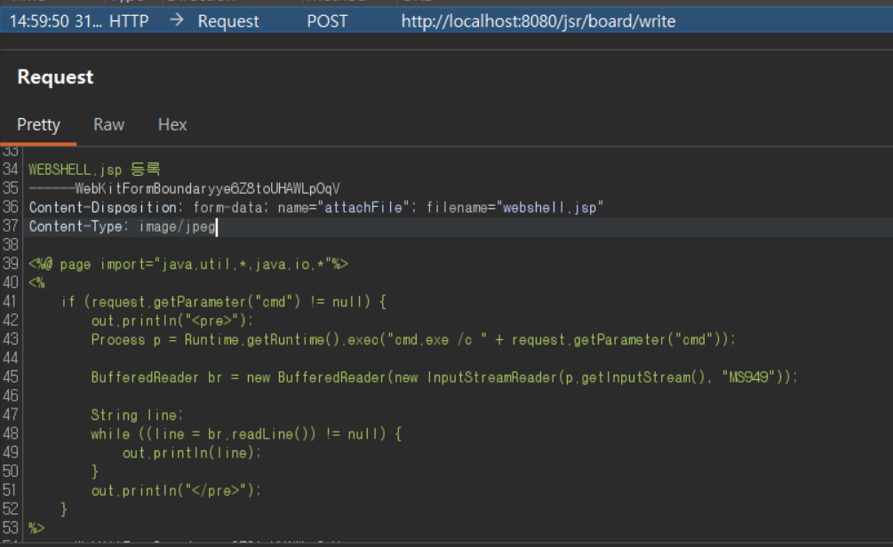

# 05. File Upload Security

## 개요

1:1 문의 첨부파일 업로드 기능에서 확인한 `Insecure File Upload`, `Web-Accessible Upload`, `Web Shell Upload` 취약점과 그 대응 방향을 정리한다.

## 진입점

- `/jsr/board/write`
- `/jsr/board/edit`
- `/jsr/uploads/<filename>`

## 포함 이슈

| 구분 | 취약점 | 설명 |
| --- | --- | --- |
| 주요 취약점 | Insecure File Upload | 업로드 검증이 요청 메타데이터에 과도하게 의존하고, 실제 파일 내용을 충분히 검증하지 않는다. |
| 주요 취약점 | Web-Accessible Upload | 업로드 파일이 웹 루트 하위 `/uploads` 경로에 저장되어 직접 URL로 접근 가능하다. |
| 주요 취약점 | Web Shell Upload / Server-Side Command Execution | 로컬 테스트 환경에서 업로드된 파일이 실행되며 서버측 명령 실행 결과가 확인되었다. |

## 취약한 부분

첨부파일 업로드 로직은 요청의 `Content-Type`과 파일명에 의존해 업로드를 허용하고, 저장 위치를 `getRealPath("/uploads")` 기준의 웹 접근 가능 경로로 두고 있다.

업로드 후에는 첨부 링크가 `/uploads/<filename>` 형태로 그대로 노출되어, 업로드된 파일에 직접 접근할 수 있다. 로컬 테스트 환경에서는 이 구조를 통해 업로드 파일이 서버측에서 실행되는 결과도 확인되었다.

## 취약한 코드

파일: [`src/main/java/com/jsr/ctf/BoardServlet.java`](../src/main/java/com/jsr/ctf/BoardServlet.java)

```java
private String handleFileUpload(Part filePart, HttpServletRequest request) throws IOException {
    String contentType = filePart.getContentType();

    boolean allowed = false;
    for (String ct : ALLOWED_CONTENT_TYPES) {
        if (ct.equals(contentType)) { allowed = true; break; }
    }
    if (!allowed) return null;

    String originalName = extractFileName(filePart);
    if (originalName == null || originalName.isEmpty()) return null;

    String saveFileName = System.currentTimeMillis() + "_" + originalName;

    String uploadDir = request.getServletContext().getRealPath("/uploads");
    File dir = new File(uploadDir);
    if (!dir.exists()) dir.mkdirs();

    Path savePath = Paths.get(uploadDir, saveFileName);
    try (InputStream is = filePart.getInputStream()) {
        Files.copy(is, savePath, StandardCopyOption.REPLACE_EXISTING);
    }

    return saveFileName;
}
```

파일: [`src/main/webapp/WEB-INF/views/board_detail_view.jsp`](../src/main/webapp/WEB-INF/views/board_detail_view.jsp)

```jsp
<c:if test="${not empty jsrBoard.attachFile}">
    <div class="attach-box">
        <span style="color:#475569">첨부:</span>
        <a class="attach-link"
           href="<%= request.getContextPath() %>/uploads/${jsrBoard.attachFile}"
           target="_blank">${jsrBoard.attachFile}</a>
    </div>
</c:if>
```

## 취약한 코드 동작 설명

- 기본 상태에서 `.jsp` 파일을 그대로 업로드하면 `Content-Type`이 허용 목록과 일치하지 않아 첨부가 저장되지 않는다.
- 그러나 서버가 요청 메타데이터인 `Content-Type`을 신뢰하기 때문에, 해당 값이 허용되는 이미지 타입으로 바뀌면 동일한 파일도 업로드 흐름을 통과할 수 있다.
- 서버는 요청에 포함된 `Content-Type`을 기준으로 업로드 허용 여부를 판단한다.
- 업로드 파일은 원본 파일명을 포함한 이름으로 저장되어 저장된 파일 이름과 업로드한 파일 사이의 연관성이 남는다.
- 저장 경로가 웹 루트 하위 `/uploads` 이기 때문에 저장 후 직접 URL로 접근 가능하다.
- 게시글 상세 화면에서 첨부 링크가 그대로 노출되므로 업로드 파일에 대한 직접 접근이 쉬워진다.

## 웹쉘 업로드가 위험한 이유

- 업로드된 파일이 서버측에서 실행되면 공격자가 서버에서 임의 명령을 수행할 수 있다.
- 실행형 업로드는 파일 열람, 수정, 삭제, 추가 업로드 등 2차 피해로 이어질 수 있다.
- 애플리케이션 설정 파일, 로그, 경로 정보 등 운영 환경 정보가 노출될 수 있다.
- 실제 운영 환경에서는 단순 게시판 취약점이 아닌 서버 장악으로 확대될 수 있다.

## 취약한 코드 증적자료

### 1. 기본 JSP 파일 선택


### 2. 기본 업로드 요청 확인



### 3. 기본 업로드 실패 결과



### 4. Content-Type 변조 요청


### 5. 업로드된 첨부 링크 노출


### 6. 업로드 파일 실행 결과 확인



## 영향

- 업로드 파일이 웹 경로에서 직접 접근 가능하다.
- 서버 설정과 업로드된 파일 유형에 따라 실행 위험이 발생할 수 있다.
- 서버측 명령 실행, 파일 열람·수정·삭제, 추가 파일 업로드로 이어질 수 있다.
- 운영 환경 정보와 경로 정보가 노출될 수 있다.

## 대응 방안

- 업로드 파일은 웹 루트 밖 별도 경로에 저장한다.
- 원본 파일명 대신 서버에서 생성한 안전한 파일명만 사용한다.
- 확장자, `Content-Type`, 실제 파일 내용을 함께 검증한다.
- 이미지 파일은 서버에서 재검증하거나 재인코딩한다.
- 첨부파일은 직접 URL이 아닌 보호된 다운로드 경로를 통해서만 제공한다.
- 다운로드 시 게시글 접근 권한을 다시 검증한다.
- 운영 환경에서는 업로드 저장 디렉터리에 실행 권한이 없도록 서버 설정을 분리하고, 파일 시그니처 기반 검증을 추가 적용하는 것이 바람직하다.

## 수정 코드 예시

코드: [`patched/src/main/java/com/jsr/ctf/BoardServlet.java`](https://github.com/sangrok-jeon/jsr-vuln-shop/blob/patched/src/main/java/com/jsr/ctf/BoardServlet.java)

```java
private String handleFileUpload(Part filePart, HttpServletRequest request) throws IOException {
    String originalName = extractFileName(filePart);
    if (originalName == null || originalName.isEmpty()) return null;

    String contentType = filePart.getContentType();
    if (!isAllowedContentType(contentType)) return null;

    String ext = getSafeImageExtension(originalName);
    if (ext == null) return null;

    byte[] fileBytes;
    try (InputStream is = filePart.getInputStream();
         ByteArrayOutputStream baos = new ByteArrayOutputStream()) {
        byte[] buf = new byte[4096];
        int len;
        while ((len = is.read(buf)) != -1) {
            baos.write(buf, 0, len);
        }
        fileBytes = baos.toByteArray();
    }

    BufferedImage image = ImageIO.read(new ByteArrayInputStream(fileBytes));
    if (image == null) return null;

    String saveFileName = UUID.randomUUID().toString().replace("-", "") + ext;
    String uploadDir = System.getProperty("catalina.base") + File.separator + "secure-uploads";
    File dir = new File(uploadDir);
    if (!dir.exists()) dir.mkdirs();

    ImageIO.write(image, ext.substring(1), new File(dir, saveFileName));
    return saveFileName;
}
```

```jsp
<a class="attach-link"
   href="<%= request.getContextPath() %>/board/file?boardId=${jsrBoard.boardId}">
   첨부파일 보기
</a>
```

## 대응 코드 동작 설명

- 업로드 파일은 웹 루트 밖의 별도 저장소에 저장된다.
- 저장 파일명은 UUID 기반으로 생성되어 원본 파일명이 직접 노출되지 않는다.
- `Content-Type`뿐 아니라 확장자와 실제 이미지 여부까지 함께 검증한다.
- 첨부파일은 `/board/file?boardId=...` 경로를 통해서만 내려받을 수 있다.
- 파일 다운로드 시 게시글 접근 권한을 다시 확인해 무단 접근을 차단한다.

현재 예시는 확장자, `Content-Type`, 실제 이미지 디코딩 검증과 웹 루트 외 저장까지 반영한 상태다. 추가적으로 운영 환경에서는 업로드 경로 실행 권한 제거, 파일 시그니처 검증, 악성 업로드 탐지를 위한 모니터링까지 함께 적용하면 더 안전하다.

## 대응 증적자료

### 1. 정상 이미지 업로드 성공


### 2. 보호된 첨부 링크 제공



### 3. 소유자 기준 다운로드 성공



### 4. 권한 없는 사용자 접근 시도



### 5. 권한 없는 사용자 접근 차단


### 6. 위험한 파일 업로드 시도



### 7. 위험한 파일 업로드 차단


