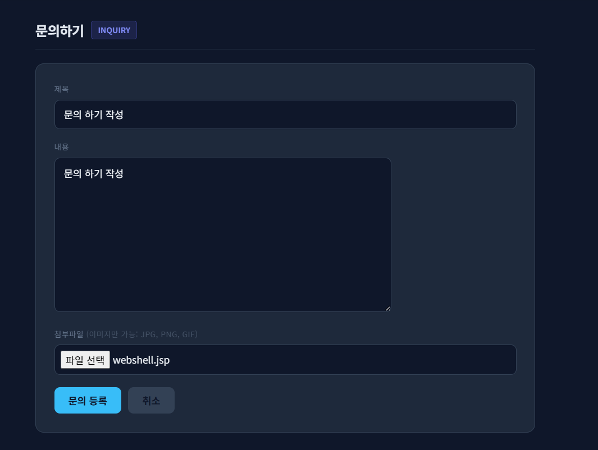
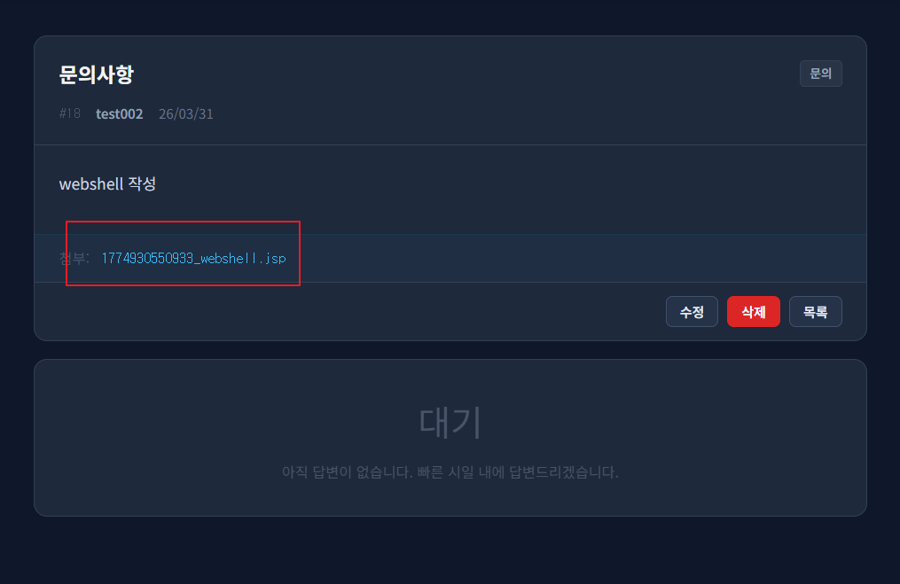
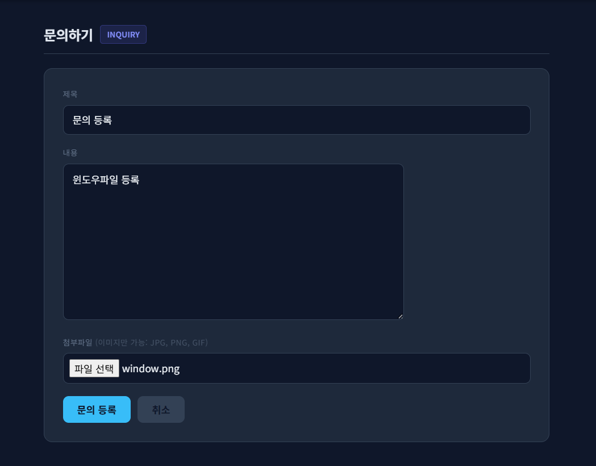
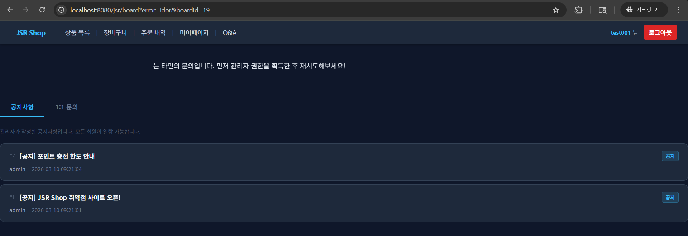
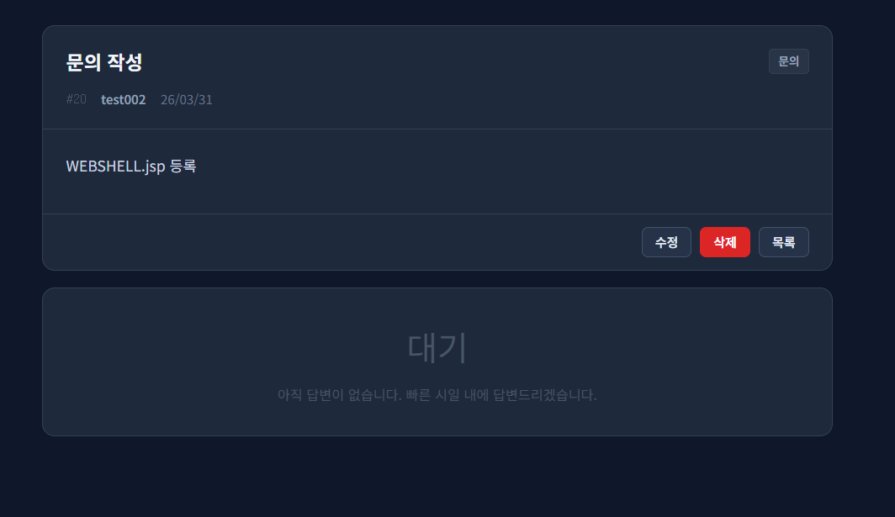

# 05. File Upload Security

## 개요

1:1 문의 첨부파일 업로드 기능에서 확인한 `Insecure File Upload`, `Web-Accessible Upload`, `Web Shell Upload / Server-Side Command Execution` 취약점과 그 대응 내용을 정리하였다.

## 진입점
- `/jsr/board/write`
- `/jsr/board/edit`
- `/jsr/uploads/<filename>`
- `/jsr/board/file?boardId=<id>`

## 포함 이슈

| 구분 | 취약점명 | 설명 |
| --- | --- | --- |
| 주요 취약점 | Insecure File Upload | 업로드 검증이 요청 메타데이터와 단순 파일명 검사에 의존하여 실제 파일 내용 검증이 불충분하다. |
| 주요 취약점 | Web-Accessible Upload | 업로드 파일이 웹 경로를 통해 직접 노출되어 URL로 바로 접근 가능하다. |
| 주요 취약점 | Web Shell Upload / Server-Side Command Execution | 로컬 테스트 환경에서 업로드 파일의 서버측 실행이 확인되었다. |

## 취약한 부분

기존 업로드 로직은 첨부파일을 웹 루트 하위 `/uploads` 경로에 저장하고, 게시글 상세 화면에서 해당 파일 경로를 직접 링크로 노출하였다.  
그 결과 업로드된 파일이 단순 다운로드 대상이 아니라 웹 경로에서 직접 실행될 수 있었고, 로컬 테스트 환경에서는 서버측 명령 실행 결과까지 확인되었다.

## 취약한 코드

파일: `src/main/java/com/jsr/ctf/BoardServlet.java`

```java
private String handleFileUpload(Part filePart, HttpServletRequest request) throws IOException {
    String contentType = filePart.getContentType();

    boolean allowed = false;
    for (String ct : ALLOWED_CONTENT_TYPES) {
        if (ct.equals(contentType)) { allowed = true; break; }
    }
    if (!allowed) return null;

    String originalName = extractFileName(filePart);
    if (originalName == null || originalName.isEmpty()) return null;

    String saveFileName = System.currentTimeMillis() + "_" + originalName;

    String uploadDir = request.getServletContext().getRealPath("/uploads");
    File dir = new File(uploadDir);
    if (!dir.exists()) dir.mkdirs();

    Path savePath = Paths.get(uploadDir, saveFileName);
    try (InputStream is = filePart.getInputStream()) {
        Files.copy(is, savePath, StandardCopyOption.REPLACE_EXISTING);
    }

    return saveFileName;
}
```

파일: `src/main/webapp/WEB-INF/views/board_detail_view.jsp`

```jsp
<c:if test="${not empty jsrBoard.attachFile}">
    <div class="attach-box">
        <span style="color:#475569">첨부:</span>
        <a class="attach-link"
           href="<%= request.getContextPath() %>/uploads/${jsrBoard.attachFile}"
           target="_blank">${jsrBoard.attachFile}</a>
    </div>
</c:if>
```

## 취약한 코드 동작 설명

- 업로드 파일은 웹 루트 하위 `/uploads` 경로에 저장된다.
- 첨부 링크는 `/uploads/<filename>` 형태로 직접 노출된다.
- 파일명이 URL에 그대로 드러나고, 서버가 웹 경로에서 파일을 직접 제공한다.
- 로컬 테스트 환경에서는 업로드 파일이 웹 경로를 통해 실행되며 서버측 명령 실행 결과가 확인되었다.

## 웹쉘 업로드가 위험한 이유

- 업로드 파일이 웹 경로에서 실행되면 서버 내부에서 임의 코드 실행으로 이어질 수 있다.
- 서버측 명령 실행이 가능해지면 파일 열람, 수정, 삭제, 추가 업로드 등의 2차 피해가 발생할 수 있다.
- 애플리케이션 설정 정보, 운영 환경 정보, 로그, 업로드 경로 등이 노출될 수 있다.
- 실제 운영 환경에서는 서비스 변조, 추가 계정 탈취, 권한 확장으로 이어질 수 있다.

## 취약한 코드 증적자료

### 1. 위험한 파일 업로드 시도



### 2. 업로드된 파일 링크 노출



### 3. 업로드 파일 실행 확인


## 영향

- 업로드 파일이 웹 경로에서 직접 노출된다.
- 파일이 실행 가능한 형태로 처리되는 경우 서버측 코드 실행로 이어질 수 있다.
- 파일 시스템 열람, 추가 파일 업로드, 서비스 변조 등 2차 피해가 가능하다.

## 대응 방안

- 업로드 파일을 웹 루트 밖 별도 경로에 저장한다.
- 원본 파일명 대신 서버 생성 UUID 파일명을 사용한다.
- 확장자, `Content-Type`, 실제 파일 내용을 함께 검증한다.
- 첨부파일은 직접 URL이 아니라 보호된 다운로드 엔드포인트를 통해 제공한다.
- 첨부파일 다운로드 시 게시글 접근 권한을 다시 확인한다.

## 수정 코드 예시

파일: `src/main/java/com/jsr/ctf/BoardServlet.java`

```java
private String handleFileUpload(Part filePart, HttpServletRequest request) throws IOException {
    String originalName = sanitizeOriginalName(extractFileName(filePart));
    if (!hasText(originalName)) return null;

    String contentType = filePart.getContentType();
    if (!isAllowedContentType(contentType)) return null;

    String ext = getExtension(originalName);
    if (!ext.matches("\\.(jpg|jpeg|png|gif)")) return null;

    byte[] fileBytes;
    try (InputStream is = filePart.getInputStream();
         ByteArrayOutputStream baos = new ByteArrayOutputStream()) {
        byte[] buf = new byte[4096];
        int len;
        while ((len = is.read(buf)) != -1) {
            baos.write(buf, 0, len);
        }
        fileBytes = baos.toByteArray();
    }
    if (fileBytes.length == 0) return null;
    if (ImageIO.read(new ByteArrayInputStream(fileBytes)) == null) return null;

    String saveFileName = UUID.randomUUID().toString().replace("-", "") + ext;
    Path uploadDir = resolveUploadDir();
    Files.createDirectories(uploadDir);
    Files.write(uploadDir.resolve(saveFileName), fileBytes,
        StandardOpenOption.CREATE, StandardOpenOption.TRUNCATE_EXISTING);

    return saveFileName;
}
```

```java
} else if (path.equals("/board/file")) {
    long boardId = Long.parseLong(request.getParameter("boardId"));
    JsrBoard board = getBoardById(boardId);
    if (board == null || !hasText(board.getAttachFile())) {
        response.sendError(HttpServletResponse.SC_NOT_FOUND);
        return;
    }
    if (!canViewBoard(board, user, isAdmin)) {
        response.sendRedirect(request.getContextPath()
            + "/board?error=" + getBoardAccessError(board, isAdmin) + "&boardId=" + boardId);
        return;
    }
    ...
}
```

파일: `src/main/webapp/WEB-INF/views/board_detail_view.jsp`

```jsp
<c:if test="${not empty jsrBoard.attachFile}">
    <div class="attach-box">
        <span style="color:#475569">첨부:</span>
        <a class="attach-link"
           href="<%= request.getContextPath() %>/board/file?boardId=${jsrBoard.boardId}"
           target="_blank">첨부파일 보기</a>
    </div>
</c:if>
```

## 대응 코드 동작 설명

- 업로드 파일은 `catalina.base` 하위의 별도 저장 경로에 보관된다.
- 파일명은 UUID 기반으로 생성되어 원본 파일명이 노출되지 않는다.
- 확장자, `Content-Type`, 실제 이미지 여부를 함께 검증한다.
- 첨부파일은 `/board/file?boardId=...` 경로를 통해서만 제공된다.
- 파일 제공 시 게시글 접근 권한을 다시 검사하여 다른 사용자의 파일 접근을 차단한다.

## 대응 증적자료

### 1. 정상 이미지 업로드 성공



### 2. 보호된 첨부 링크 노출


### 3. 파일 다운로드 성공


### 4. 권한 없는 사용자 파일 접근 시도


### 5. 권한 없는 사용자 파일 접근 차단



### 6. 위험한 업로드 차단 결과


