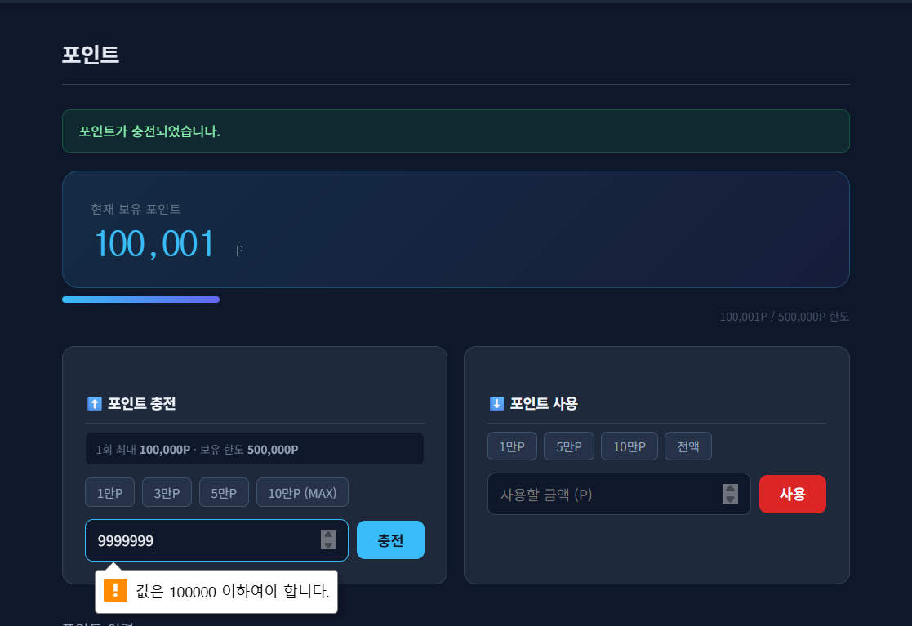
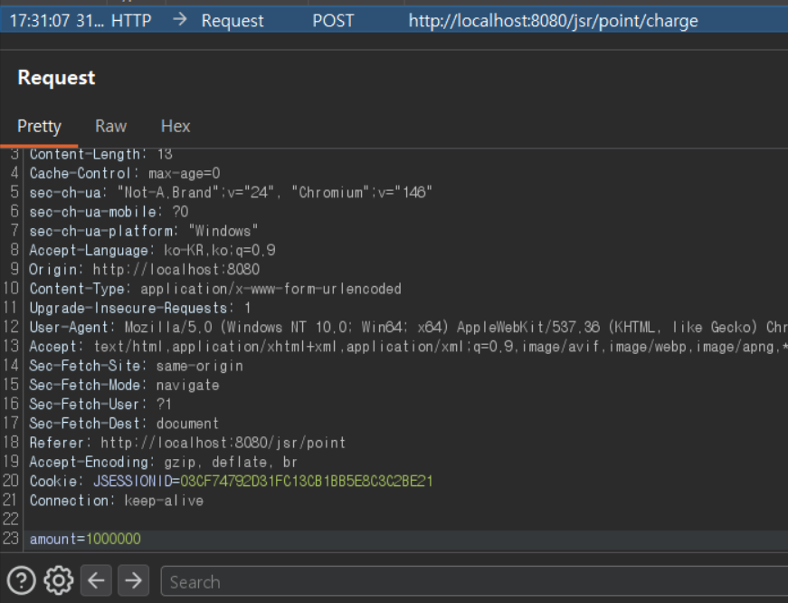
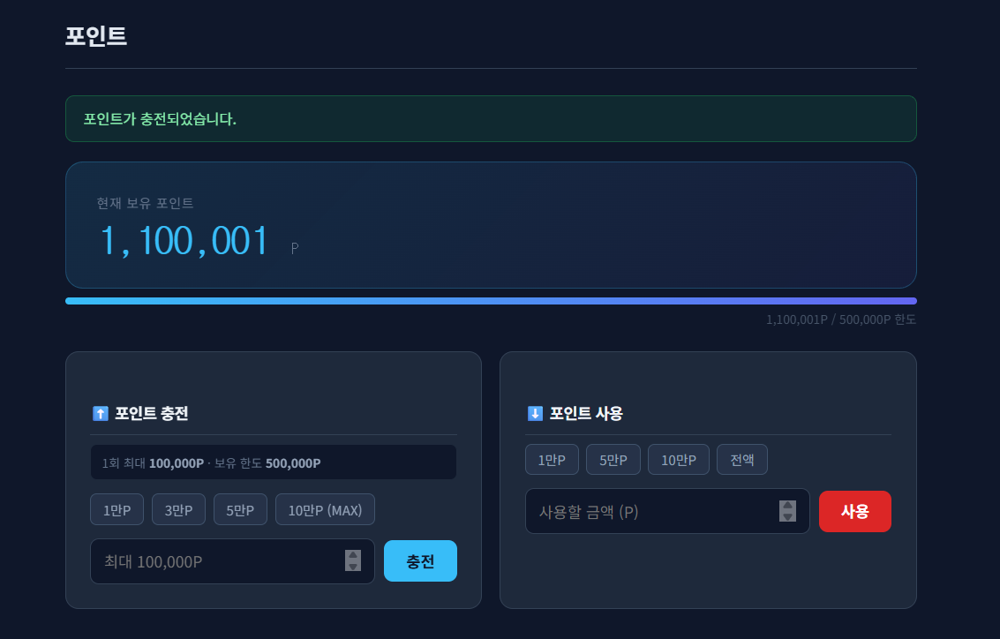
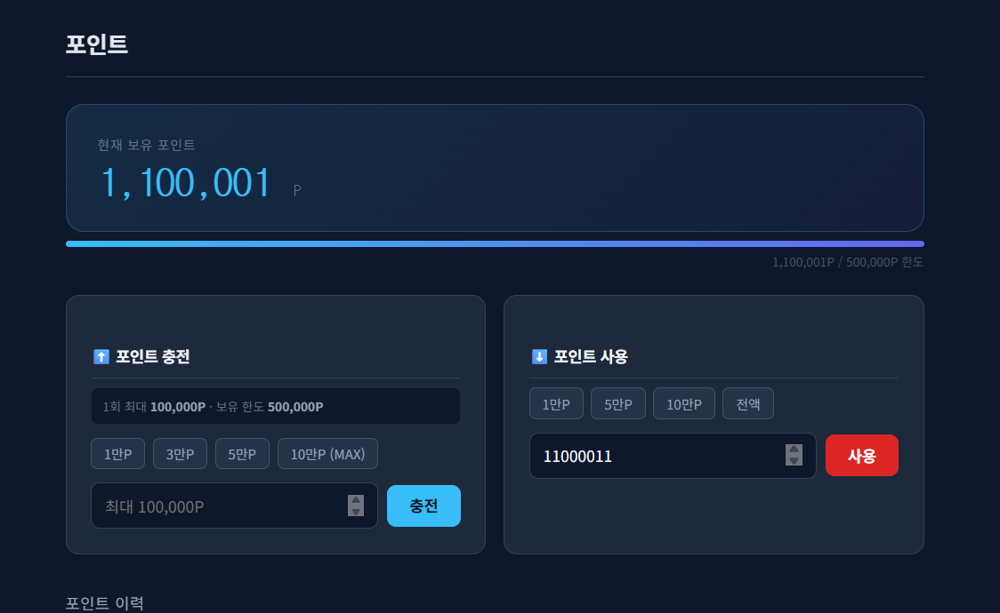
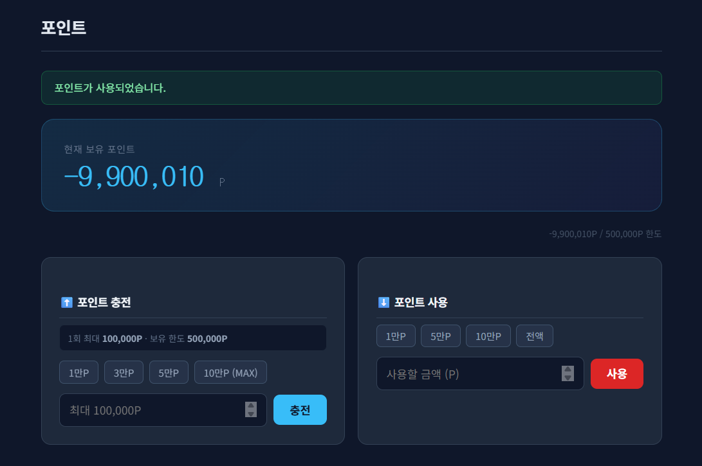

# 06. Point Charge Security

## 개요
포인트 기능에서 확인한 `Business Logic Flaw` 취약점과 그 대응 방향을 정리했다.

정책상 포인트는 1회 최대 `100,000P`, 최대 보유 `500,000P`로 제한되어야 한다.  
그러나 서버가 충전 금액과 사용 금액을 충분히 검증하지 않으면, 요청 변조를 통해 정책을 초과한 포인트 충전이 가능하고 음수 포인트 상태까지 발생할 수 있다.

## 진입점
- `/jsr/point`
- `/jsr/point/charge`
- `/jsr/point/use`

## 포함 이슈

| 구분 | 취약점 | 설명 |
|------|--------|------|
| 주요 취약점 | Business Logic Flaw | 서버가 포인트 충전/사용 정책을 최종적으로 검증하지 않아 정책 위반 상태가 발생한다. |
| 세부 이슈 | Charge Limit Bypass | 1회 최대 충전 한도(`100,000P`)를 초과한 요청이 처리된다. |
| 세부 이슈 | Maximum Point Balance Bypass | 최대 보유 한도(`500,000P`)를 초과한 상태가 허용된다. |
| 세부 이슈 | Negative Point Balance | 보유 포인트보다 큰 금액 사용이 가능하여 음수 포인트 상태가 발생한다. |

## 취약한 부분
포인트 화면에는 `1회 최대 100,000P`, `보유 한도 500,000P` 정책이 표시되어 있고, 충전 입력창에도 `max="100000"`이 적용되어 있다.  
그러나 서버가 충전 요청과 사용 요청을 최종적으로 검증하지 않으면, 브라우저 UI 제한은 쉽게 우회될 수 있다.

그 결과 다음과 같은 문제가 발생한다.
- 1회 최대 충전 한도 우회
- 최대 보유 포인트 정책 무력화
- 보유 포인트보다 큰 금액 사용으로 인한 음수 포인트 발생

## 취약한 코드
파일: `src/main/java/com/jsr/ctf/PointServlet.java`

```java
if (path.contains("charge")) {
    if (amount <= 0) {
        response.sendRedirect(request.getContextPath() + "/point?error=invalid");
        return;
    }

    int newPoint = fresh.getPoint() + amount;
    updatePoint(fresh.getUserId(), newPoint);
    saveHistory(fresh.getUserId(), "CHARGE", amount, "포인트 충전");

    response.sendRedirect(request.getContextPath() + "/point?charged=1&amount=" + amount);

} else if (path.contains("use")) {
    if (amount <= 0) {
        response.sendRedirect(request.getContextPath() + "/point?error=invalid");
        return;
    }

    int newPoint = fresh.getPoint() - amount;
    updatePoint(fresh.getUserId(), newPoint);
    saveHistory(fresh.getUserId(), "USE", -amount, "포인트 사용");

    response.sendRedirect(request.getContextPath() + "/point?used=1&amount=" + amount);
}
```

파일: `src/main/webapp/WEB-INF/views/point_view.jsp`

```jsp
<input type="number" name="amount" id="chargeAmount"
       min="1" max="100000" placeholder="최대 100,000P" required>
```

## 취약한 코드 동작 설명
포인트 충전 화면은 프론트엔드에서 `max="100000"` 속성을 사용해 1회 최대 입력값을 제한하는 것처럼 보인다.  
또한 화면에는 최대 보유 한도 `500,000P` 정책이 함께 표시된다.

하지만 서버가 충전 금액과 사용 금액을 다시 검증하지 않으면, 요청 변조 시 이 정책은 그대로 무력화된다.  
충전 로직은 `amount`를 그대로 더하고, 사용 로직은 `amount`를 그대로 차감하기 때문에 다음이 가능하다.

- `100,000P` 초과 충전
- `500,000P` 초과 보유
- 보유 포인트보다 큰 금액 사용
- 음수 포인트 상태 발생

즉, 화면에 표시된 정책이 존재하더라도 서버 측 검증이 빠지면 비즈니스 규칙이 보장되지 않는다.

## 취약한 코드 증적자료

### 1. 프론트엔드에서 1회 최대 100,000P 제한이 표시됨


### 2. Burp를 통해 충전 요청 금액을 초과 값으로 변조


### 3. 변조 요청 이후 최대 한도를 초과한 포인트가 반영됨


### 4. 보유 포인트를 초과하는 사용 금액 입력


### 5. 포인트 사용 이후 음수 잔액이 발생함


## 영향
- 포인트 충전 정책 무력화
- 최대 보유 포인트 정책 무력화
- 음수 포인트 허용으로 데이터 무결성 훼손
- 주문/결제 정책과 정산 로직 신뢰성 저하

## 대응 방안
- 서버에서 1회 최대 충전 한도(`MAX_CHARGE_ONCE`)를 검증
- 서버에서 최대 보유 포인트(`MAX_POINT_TOTAL`)를 검증
- 포인트 사용 시 현재 보유 포인트보다 큰 금액은 거부
- 충전/사용 금액은 `0` 이하를 거부하고, 필요 시 허용 범위를 화이트리스트로 제한

## 수정 코드 예시
파일: `src/main/java/com/jsr/ctf/PointServlet.java`

```java
if (path.contains("charge")) {
    if (amount <= 0) {
        response.sendRedirect(request.getContextPath() + "/point?error=invalid");
        return;
    }
    if (amount > MAX_CHARGE_ONCE) {
        response.sendRedirect(request.getContextPath()
            + "/point?error=overlimit&limit=" + MAX_CHARGE_ONCE);
        return;
    }
    if (fresh.getPoint() + amount > MAX_POINT_TOTAL) {
        response.sendRedirect(request.getContextPath()
            + "/point?error=maxpoint&max=" + MAX_POINT_TOTAL
            + "&current=" + fresh.getPoint());
        return;
    }

    int newPoint = fresh.getPoint() + amount;
    updatePoint(fresh.getUserId(), newPoint);
    saveHistory(fresh.getUserId(), "CHARGE", amount, "포인트 충전");

    response.sendRedirect(request.getContextPath() + "/point?charged=1&amount=" + amount);

} else if (path.contains("use")) {
    if (amount <= 0) {
        response.sendRedirect(request.getContextPath() + "/point?error=invalid");
        return;
    }
    if (amount > fresh.getPoint()) {
        response.sendRedirect(request.getContextPath()
            + "/point?error=notenough&current=" + fresh.getPoint());
        return;
    }

    int newPoint = fresh.getPoint() - amount;
    updatePoint(fresh.getUserId(), newPoint);
    saveHistory(fresh.getUserId(), "USE", -amount, "포인트 사용");

    response.sendRedirect(request.getContextPath() + "/point?used=1&amount=" + amount);
}
```

## 대응 코드 동작 설명
수정 후에는 프론트엔드 제한과 별개로 서버가 최종적으로 충전/사용 정책을 검증한다.

- 충전 시 `MAX_CHARGE_ONCE`를 초과하면 거부
- 충전 후 보유 포인트가 `MAX_POINT_TOTAL`을 초과하면 거부
- 사용 시 현재 보유 포인트보다 큰 금액이면 거부

이렇게 하면 브라우저 UI 제한을 우회하더라도 서버가 정책 위반 요청을 차단할 수 있다.

## 대응 증적자료
대응 코드 적용 후에는 아래 항목을 추가로 확인할 수 있다.

- 1회 최대 충전 한도 초과 요청 차단
- 최대 보유 포인트 초과 요청 차단
- 보유 포인트 초과 사용 요청 차단
