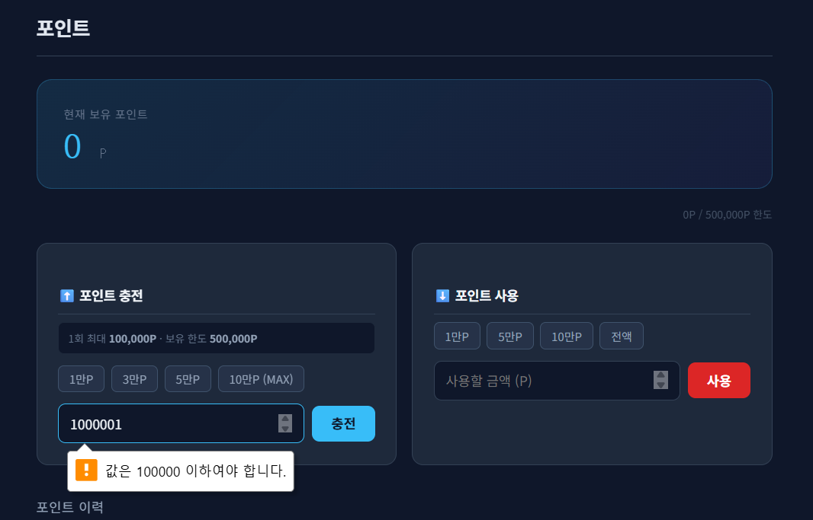
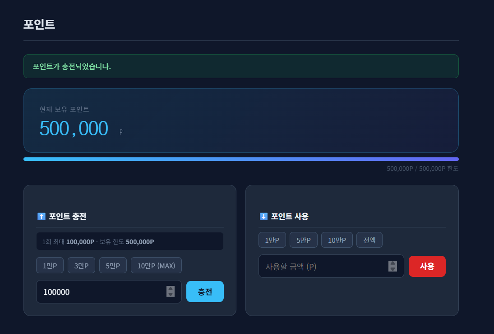
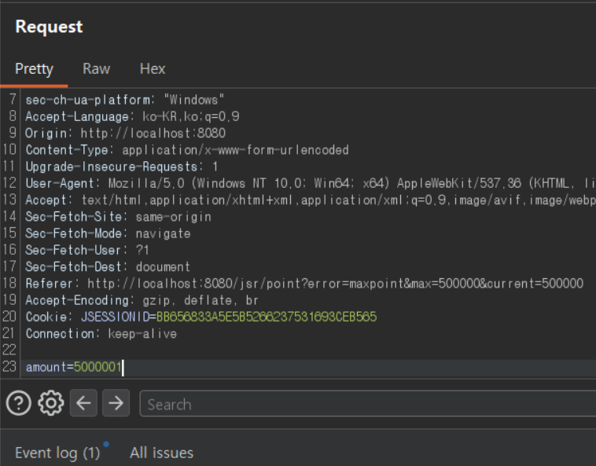
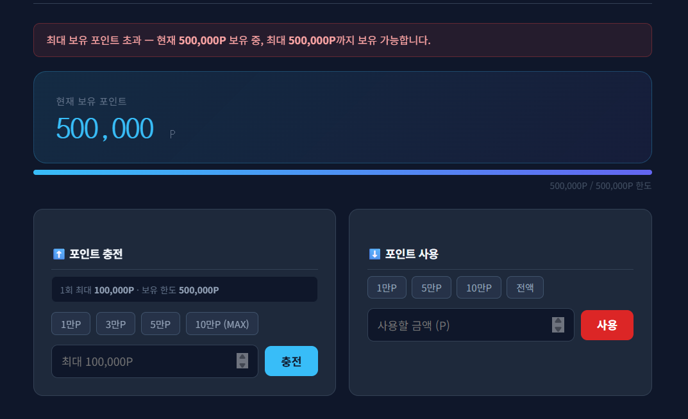
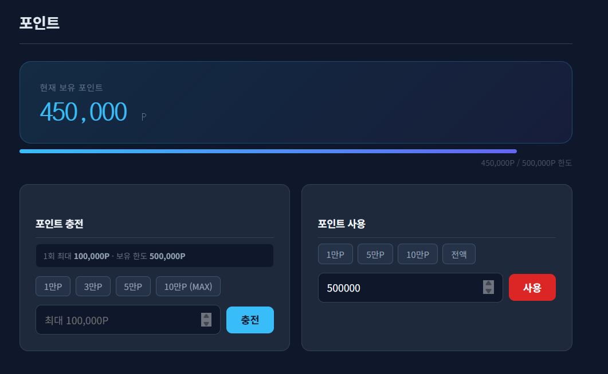
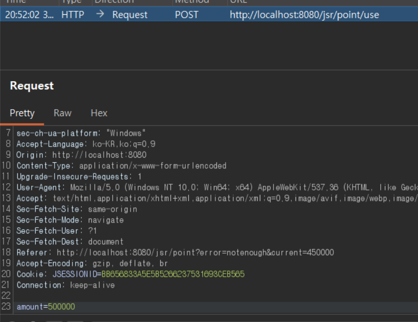
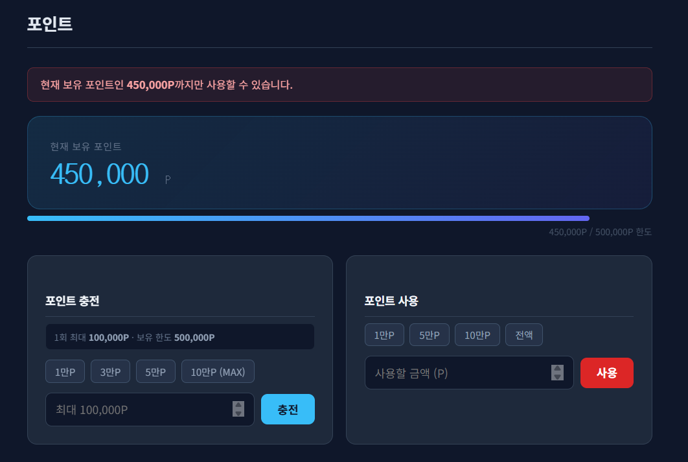

# 06. Point Charge Security

## 개요
포인트 기능에서 확인한 `Business Logic Flaw` 취약점과 그 대응 방향을 정리한다.

정상 정책은 다음과 같다.
- 1회 최대 충전 한도: `100,000P`
- 최대 보유 포인트 한도: `500,000P`

그러나 서버가 충전 금액과 사용 금액을 충분히 검증하지 않으면 요청 변조를 통해 위 정책을 우회할 수 있다. 그 결과 최대 보유 한도를 초과한 포인트 충전이 가능하고, 보유 포인트보다 많은 금액을 사용해 음수 포인트 상태까지 발생할 수 있다.

## 진입점
- `/jsr/point`
- `/jsr/point/charge`
- `/jsr/point/use`

## 포함 이슈

| 구분 | 취약점 | 설명 |
|------|--------|------|
| 주요 취약점 | Business Logic Flaw | 포인트 충전 및 사용 정책을 서버가 최종 검증하지 않아 정책 위반 상태가 발생한다. |
| 관련 이슈 | Charge Limit Bypass | 1회 최대 충전 한도(`100,000P`)를 초과한 요청이 처리된다. |
| 관련 이슈 | Maximum Point Balance Bypass | 최대 보유 포인트 한도(`500,000P`)를 초과한 상태가 허용된다. |
| 관련 이슈 | Negative Point Balance | 현재 보유 포인트보다 많은 금액 사용이 가능해 음수 포인트 상태가 발생한다. |

## 취약한 부분
포인트 페이지에는 `1회 최대 100,000P`, `보유 한도 500,000P` 정책이 안내되고, 충전 입력창에는 브라우저 수준의 제한이 적용되어 있다.

하지만 서버가 충전 및 사용 요청을 최종 검증하지 않으면, 사용자는 요청 값을 변조해 정책을 우회할 수 있다. 이 경우 다음 문제가 발생한다.

- 1회 최대 충전 한도 우회
- 최대 보유 포인트 한도 우회
- 보유 포인트보다 많은 금액 사용
- 음수 포인트 상태 발생

## 취약한 코드
파일: `src/main/java/com/jsr/ctf/PointServlet.java`

```java
if (path.contains("charge")) {
    if (amount <= 0) {
        response.sendRedirect(request.getContextPath() + "/point?error=invalid");
        return;
    }

    int newPoint = fresh.getPoint() + amount;
    updatePoint(fresh.getUserId(), newPoint);
    saveHistory(fresh.getUserId(), "CHARGE", amount, "포인트 충전");

    response.sendRedirect(request.getContextPath() + "/point?charged=1&amount=" + amount);

} else if (path.contains("use")) {
    if (amount <= 0) {
        response.sendRedirect(request.getContextPath() + "/point?error=invalid");
        return;
    }

    int newPoint = fresh.getPoint() - amount;
    updatePoint(fresh.getUserId(), newPoint);
    saveHistory(fresh.getUserId(), "USE", -amount, "포인트 사용");

    response.sendRedirect(request.getContextPath() + "/point?used=1&amount=" + amount);
}
```

파일: `src/main/webapp/WEB-INF/views/point_view.jsp`

```jsp
<input type="number" name="amount" id="chargeAmount"
       min="1" max="100000" placeholder="최대 100,000P" required>
```

## 취약한 코드 동작 설명
프론트엔드는 `max="100000"` 속성을 통해 1회 최대 충전 금액을 제한하는 것처럼 보인다. 또한 화면에는 최대 보유 포인트 `500,000P` 정책이 표시된다.

하지만 서버가 충전 금액과 사용 금액을 다시 검증하지 않으면, 클라이언트가 요청 값을 변조하는 순간 정책은 무력화된다.

- 충전 로직은 요청의 `amount` 값을 그대로 더한다.
- 사용 로직은 요청의 `amount` 값을 그대로 차감한다.
- 그 결과 최대 보유 한도 초과나 음수 포인트 같은 비정상 상태가 발생한다.

즉, UI 정책 안내가 존재하더라도 서버 검증이 빠지면 비즈니스 규칙은 보장되지 않는다.

## 취약한 코드 증적자료

### 1. 프론트엔드에서 1회 최대 100,000P 제한이 표시됨


### 2. Burp를 통해 충전 요청 금액을 초과 값으로 변조


### 3. 변조 요청 이후 최대 한도를 초과한 포인트가 반영됨


### 4. 보유 포인트를 초과하는 사용 금액 입력


### 5. 포인트 사용 이후 음수 잔액이 발생함


## 영향
- 포인트 충전 정책 무력화
- 최대 보유 포인트 정책 무력화
- 음수 포인트 허용으로 데이터 무결성 훼손
- 주문/결제 정책 및 정산 로직 신뢰성 저하

## 대응 방안
- 서버에서 1회 최대 충전 한도(`MAX_CHARGE_ONCE`)를 검증한다.
- 서버에서 최대 보유 포인트(`MAX_POINT_TOTAL`)를 검증한다.
- 포인트 사용 시 현재 보유 포인트보다 많은 금액은 거부한다.
- `0` 이하 금액은 충전 및 사용 모두 차단한다.
- 에러 발생 시 리다이렉트만 하지 않고, 사용자에게 정책 위반 사유를 명확히 안내한다.

## 수정 코드 예시
파일: `src/main/java/com/jsr/ctf/PointServlet.java`

```java
if (path.contains("charge")) {
    if (amount <= 0) {
        response.sendRedirect(request.getContextPath() + "/point?error=invalid");
        return;
    }
    if (amount > MAX_CHARGE_ONCE) {
        response.sendRedirect(request.getContextPath()
            + "/point?error=overlimit&limit=" + MAX_CHARGE_ONCE);
        return;
    }
    if (fresh.getPoint() + amount > MAX_POINT_TOTAL) {
        response.sendRedirect(request.getContextPath()
            + "/point?error=maxpoint&max=" + MAX_POINT_TOTAL
            + "&current=" + fresh.getPoint());
        return;
    }

    int newPoint = fresh.getPoint() + amount;
    updatePoint(fresh.getUserId(), newPoint);
    saveHistory(fresh.getUserId(), "CHARGE", amount, "포인트 충전");

    response.sendRedirect(request.getContextPath() + "/point?charged=1&amount=" + amount);

} else if (path.contains("use")) {
    if (amount <= 0) {
        response.sendRedirect(request.getContextPath() + "/point?error=invalid");
        return;
    }
    if (amount > fresh.getPoint()) {
        response.sendRedirect(request.getContextPath()
            + "/point?error=notenough&current=" + fresh.getPoint());
        return;
    }

    int newPoint = fresh.getPoint() - amount;
    updatePoint(fresh.getUserId(), newPoint);
    saveHistory(fresh.getUserId(), "USE", -amount, "포인트 사용");

    response.sendRedirect(request.getContextPath() + "/point?used=1&amount=" + amount);
}
```

## 대응 코드 동작 설명
수정 이후에는 브라우저의 입력 제한과 별개로 서버가 충전 및 사용 정책을 최종 검증한다.

- 1회 최대 충전 한도를 초과하면 차단
- 최대 보유 포인트를 초과하면 차단
- 현재 보유 포인트보다 큰 사용 금액은 차단

또한 차단 시 사용자에게 왜 실패했는지 안내 문구를 표시해 정책이 적용되었음을 분명하게 보여준다.

## 대응 증적자료

### 1. 프론트엔드에서 1회 최대 100,000P 제한이 그대로 표시됨


### 2. 정상 범위 충전은 성공함


### 3. Burp를 통해 과도한 충전 요청을 다시 시도


### 4. 최대 보유 포인트 초과 요청이 차단됨


### 5. 현재 보유 포인트를 초과하는 사용 금액을 입력


### 6. Burp를 통해 과도한 사용 요청을 다시 시도


### 7. 현재 보유 포인트 초과 사용 요청이 차단됨

