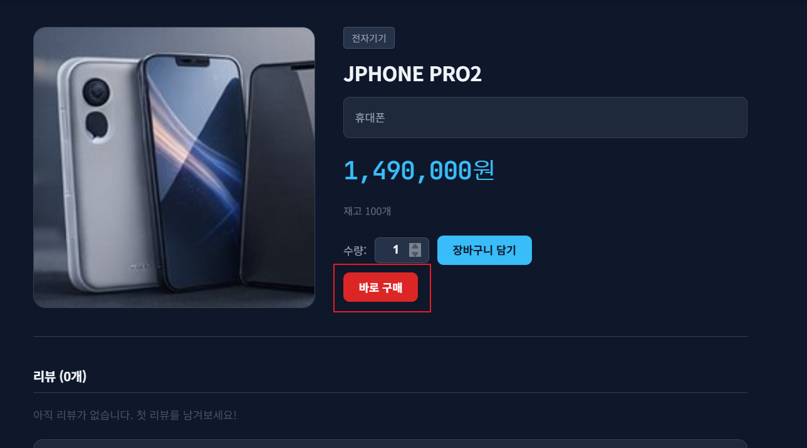
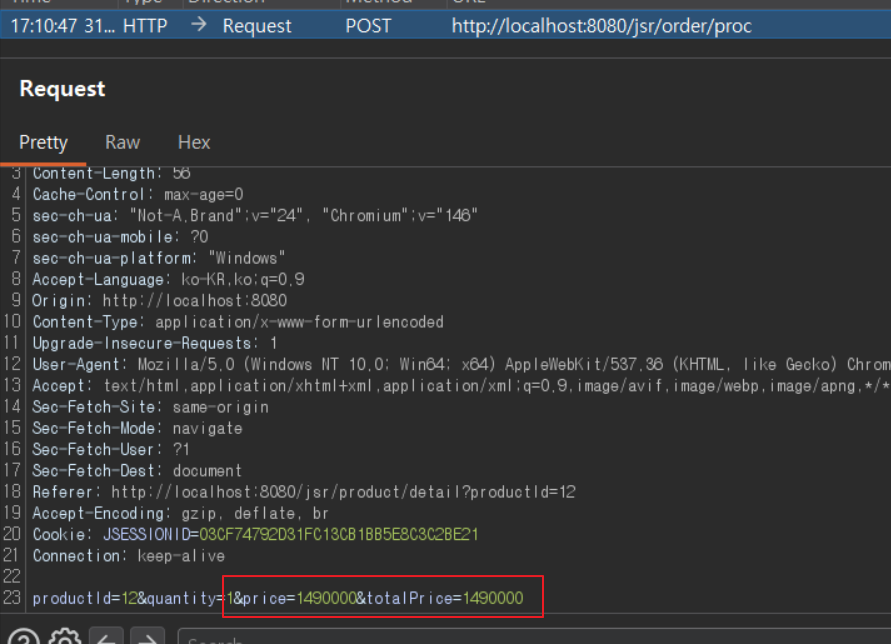
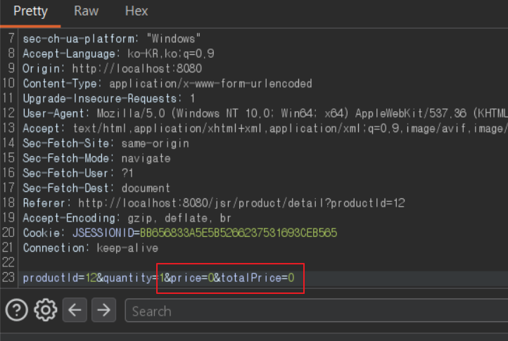
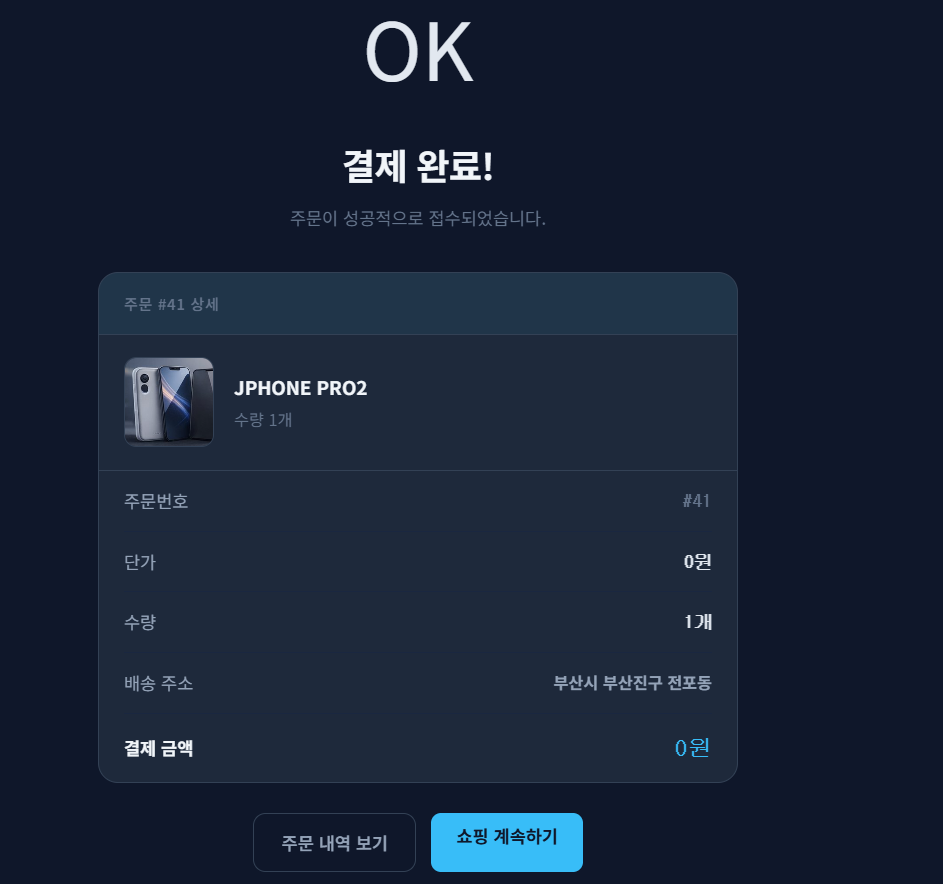
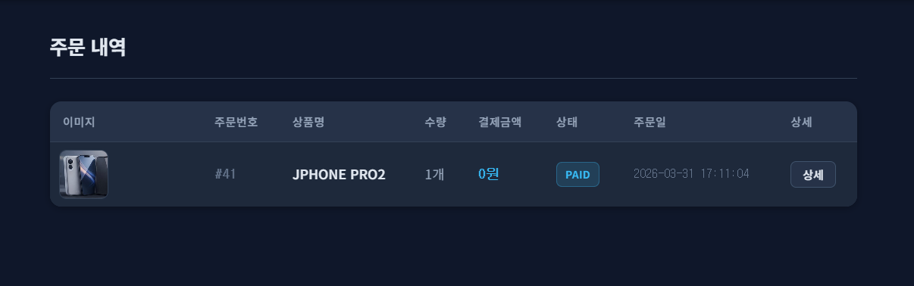
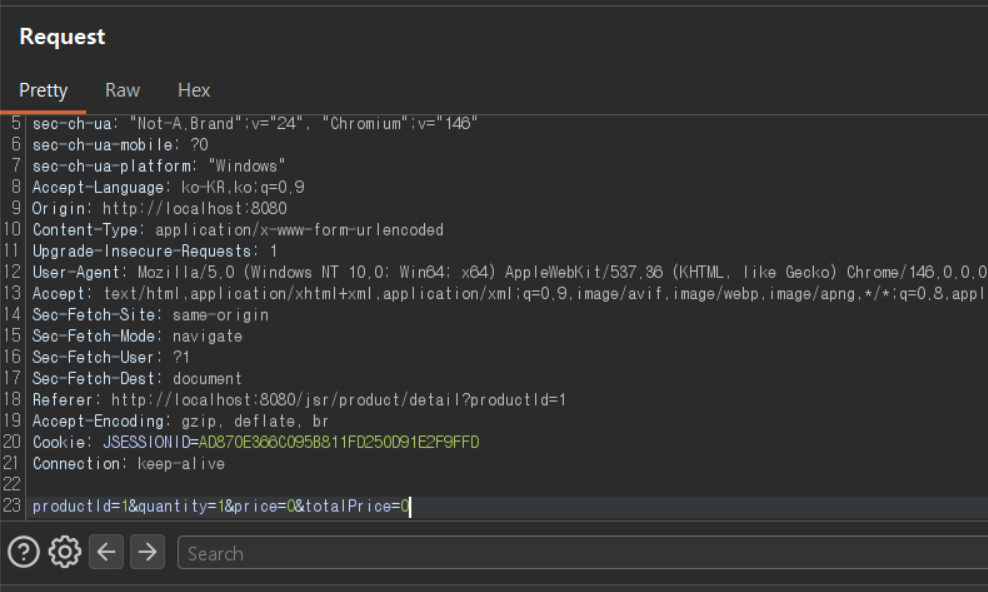
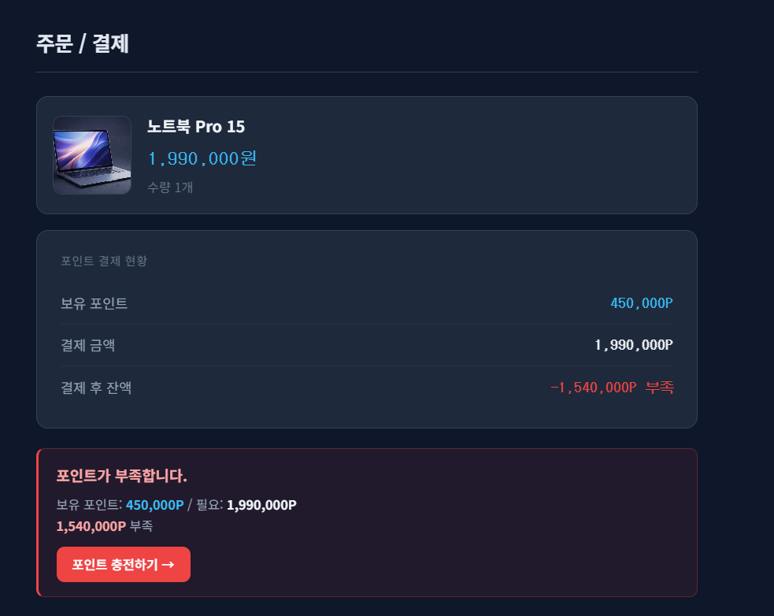
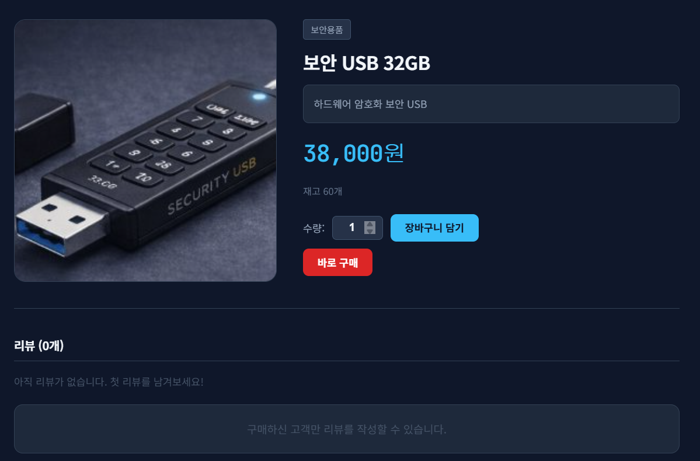
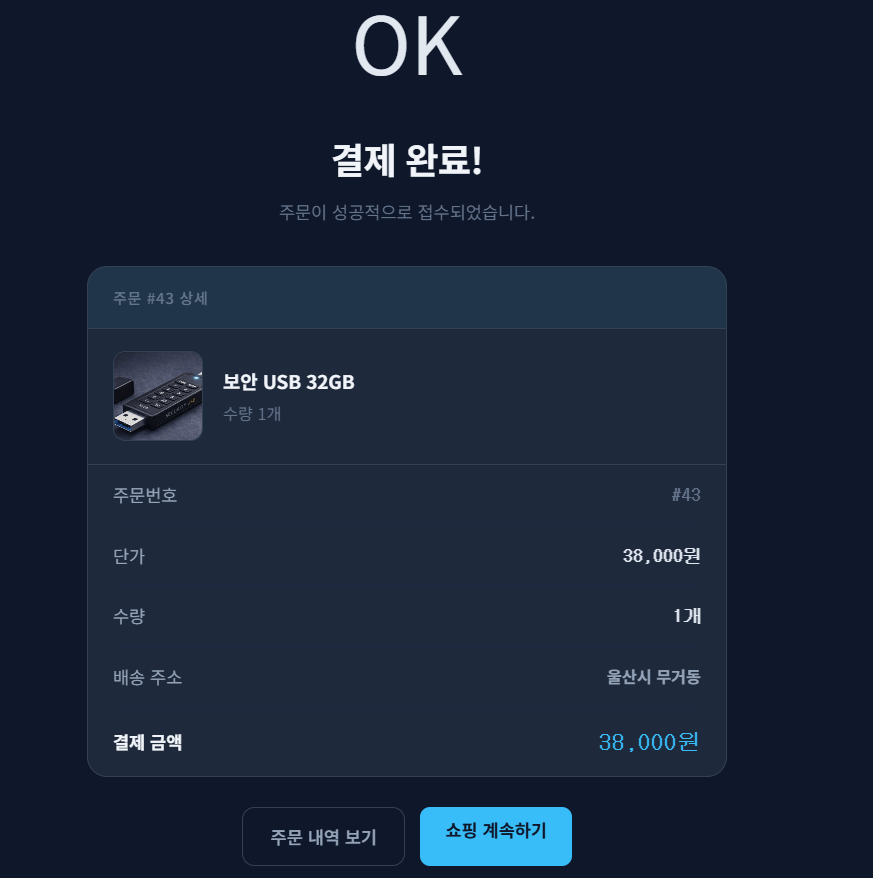
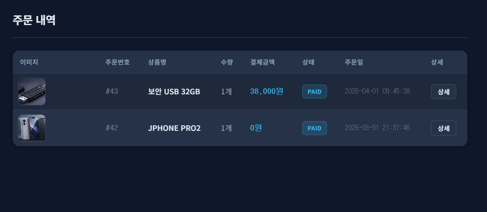

# 07. Order Security

## 개요
주문/결제 기능에서 확인한 `Price Tampering / Business Logic Flaw` 취약점과 그 대응 내용을 정리한다.

주문 페이지는 상품 가격과 총 결제 금액을 hidden input으로 전달하고, 서버는 해당 값을 그대로 사용한다. 그 결과 클라이언트가 요청값을 변조하면 실제 상품 가격과 다른 금액으로 주문이 처리될 수 있다.

## 진입점
- `/jsr/product/detail`
- `/jsr/order`
- `/jsr/order/proc`
- `/jsr/order/complete`
- `/jsr/order/list`

## 포함 이슈

| 구분 | 취약점 | 설명 |
| --- | --- | --- |
| 주요 취약점 | Price Tampering / Business Logic Flaw | 주문 처리 시 `price`, `totalPrice`를 클라이언트 요청값 그대로 사용하여 가격 변조가 가능하다. |
| 관련 이슈 | Hidden Field Trust | hidden input으로 전달된 가격 정보를 서버가 재계산하지 않고 신뢰한다. |

## 취약한 부분
주문/결제 기능은 상품 상세 페이지에서 주문 페이지로 이동할 때 결제 금액 관련 정보를 hidden input으로 전달한다.

하지만 서버는 주문 처리 시 DB의 실제 상품 가격을 다시 계산하지 않고, 클라이언트가 보낸 `price`, `totalPrice`를 그대로 사용한다. 그 결과 요청값을 변조하면 고가 상품도 비정상적으로 낮은 금액 또는 `0원`으로 주문할 수 있다.

## 취약한 코드
파일: `src/main/java/com/jsr/ctf/OrderServlet.java`

```java
long   productId  = Long.parseLong(request.getParameter("productId"));
int    quantity   = Integer.parseInt(request.getParameter("quantity"));
int    price      = Integer.parseInt(request.getParameter("price"));
int    totalPrice = Integer.parseInt(request.getParameter("totalPrice"));

JsrProduct product = getProductById(productId);

int currentPoint = getUserPoint(user.getUserId());

if (currentPoint < totalPrice) {
    request.setAttribute("jsrProduct", product);
    request.setAttribute("jsrQty", quantity);
    request.setAttribute("jsrOrderTotal", totalPrice);
    request.setAttribute("jsrCurrentPoint", currentPoint);
    request.setAttribute("jsrShortfall", totalPrice - currentPoint);
    request.setAttribute("jsrUser", user);
    request.setAttribute("errorMsg", "포인트가 부족합니다.");
    request.getRequestDispatcher("/WEB-INF/views/order_view.jsp")
           .forward(request, response);
    return;
}

ps.setInt(6, price);
ps.setInt(7, totalPrice);

ps = conn.prepareStatement(
    "UPDATE JSR_USERS SET POINT = POINT - ? WHERE USER_ID = ?");
ps.setInt(1, totalPrice);
```

파일: `src/main/webapp/WEB-INF/views/order_view.jsp`

```jsp
<input type="hidden" name="productId"  value="${jsrProduct.productId}">
<input type="hidden" name="quantity"   value="${jsrQty}">
<input type="hidden" name="price"      value="${jsrProduct.price}">
<input type="hidden" name="totalPrice" value="${jsrProduct.price * jsrQty}">
```

## 취약한 코드 동작 설명
주문 페이지는 `price`와 `totalPrice`를 hidden input으로 전달한다. 서버는 주문 처리 시 해당 값을 다시 계산하지 않고, 포인트 부족 여부 검증, 주문 저장, 포인트 차감에 그대로 사용한다.

즉 서버가 DB의 실제 상품 가격을 기준으로 계산하지 않기 때문에, 클라이언트가 요청값을 변조하면 결제 로직 전체가 변조된 금액 기준으로 처리된다.

## 취약한 코드 증적자료

### 1. 상품 상세에서 원래 가격 확인


### 2. 주문 원본 요청 확인


### 3. Burp를 통해 가격 요청값을 변조


### 4. 변조된 값으로 `0원` 주문 완료


### 5. 주문 내역에도 `0원` 반영


## 영향
- 고가 상품을 비정상적으로 낮은 금액으로 주문 가능
- 포인트 차감 정책 무력화
- 주문 내역과 결제 금액 데이터 무결성 훼손
- 가격 정책 및 정산 로직 신뢰 저하

## 대응 방안
- 주문 처리 시 `price`, `totalPrice`를 요청값으로 신뢰하지 않는다.
- 서버에서 `productId`, `quantity`를 기준으로 실제 상품 가격을 다시 계산한다.
- 재계산한 금액으로 포인트 부족 여부를 검증한다.
- 주문 저장과 포인트 차감도 서버 계산 금액만 사용한다.

## 수정 코드 예시
파일: `src/main/java/com/jsr/ctf/OrderServlet.java`

```java
long productId = Long.parseLong(request.getParameter("productId"));
int quantity = Integer.parseInt(request.getParameter("quantity"));
String address = request.getParameter("address");
if (address == null || address.isEmpty()) address = user.getAddress();

JsrProduct product = getProductById(productId);
if (product == null || quantity <= 0) {
    response.sendRedirect(request.getContextPath() + "/products");
    return;
}

int serverPrice = product.getPrice();
int serverTotal = serverPrice * quantity;
int currentPoint = getUserPoint(user.getUserId());

if (currentPoint < serverTotal) {
    request.setAttribute("jsrProduct", product);
    request.setAttribute("jsrQty", quantity);
    request.setAttribute("jsrOrderTotal", serverTotal);
    request.setAttribute("jsrCurrentPoint", currentPoint);
    request.setAttribute("jsrShortfall", serverTotal - currentPoint);
    request.setAttribute("jsrUser", user);
    request.setAttribute("errorMsg", "포인트가 부족합니다.");
    request.getRequestDispatcher("/WEB-INF/views/order_view.jsp")
           .forward(request, response);
    return;
}

ps.setInt(6, serverPrice);
ps.setInt(7, serverTotal);

ps = conn.prepareStatement(
    "UPDATE JSR_USERS SET POINT = POINT - ? WHERE USER_ID = ?");
ps.setInt(1, serverTotal);
```

## 대응 코드 동작 설명
수정 후에는 클라이언트가 전송한 `price`, `totalPrice`를 사용하지 않고, 서버가 `productId`와 `quantity`를 기준으로 실제 상품 가격을 다시 계산한다.

따라서 주문 요청에서 가격을 `0` 또는 임의의 값으로 변조해도 서버는 실제 상품 가격 기준으로 결제 금액을 계산하며, 변조 요청은 더 이상 우회로 이어지지 않는다.

또한 정상 범위의 상품 주문은 그대로 처리되어 정상 기능도 유지된다.

## 대응 증적자료

### 6. 고가 상품 상세 화면 확인


### 7. 가격 변조 요청 시도


### 8. 서버가 실제 가격으로 다시 계산하여 주문 차단


### 9. 정상 결제용 저가 상품 상세 화면


### 10. 정상 상품 주문 완료


### 11. 주문 내역에 정상 가격 반영

