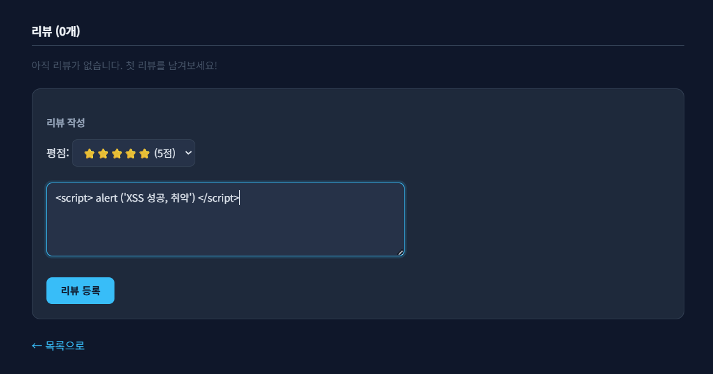
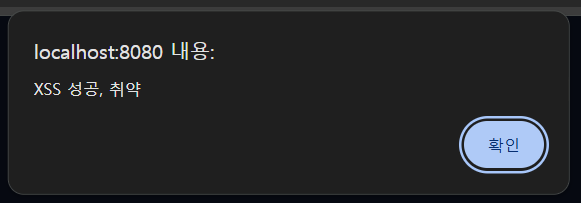
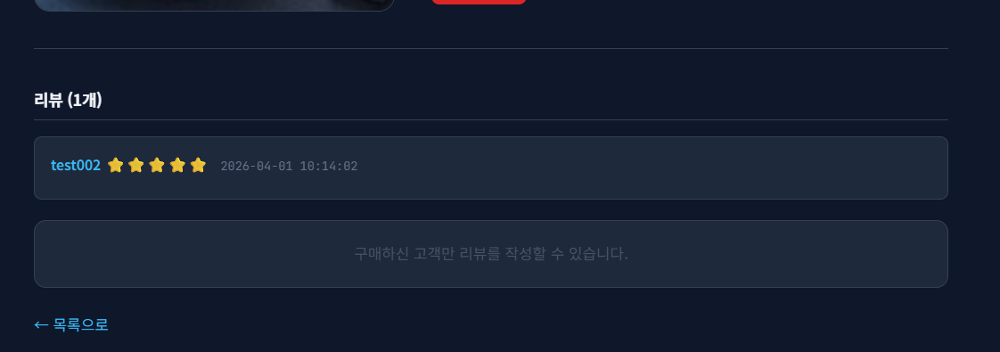
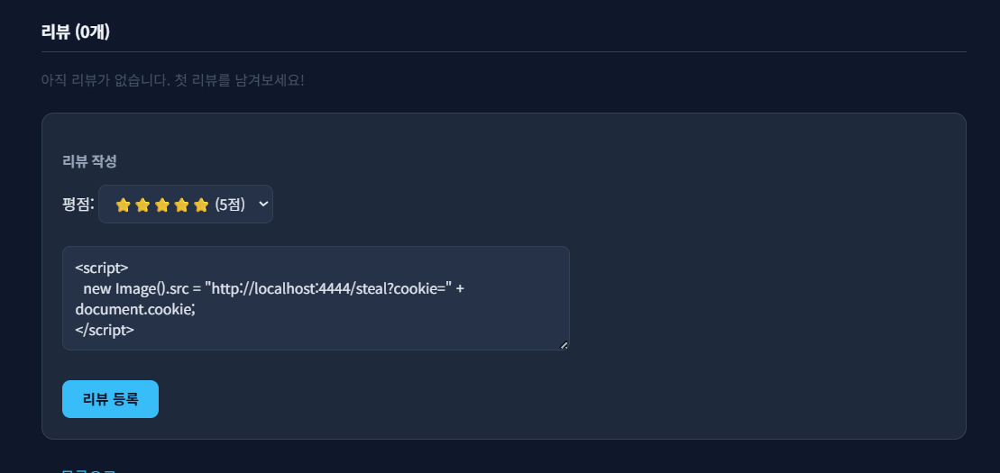
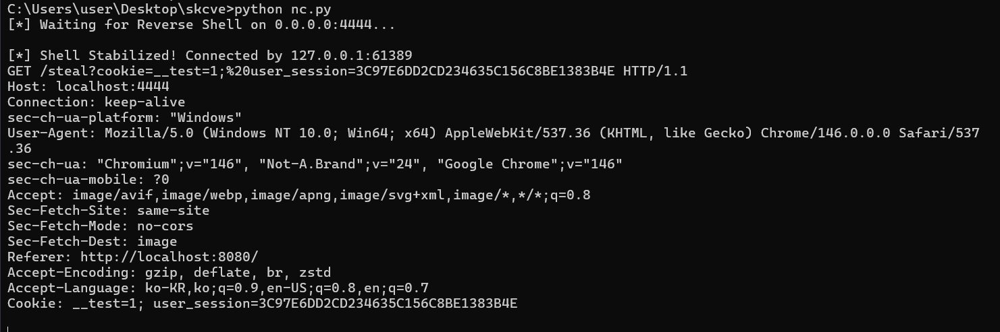
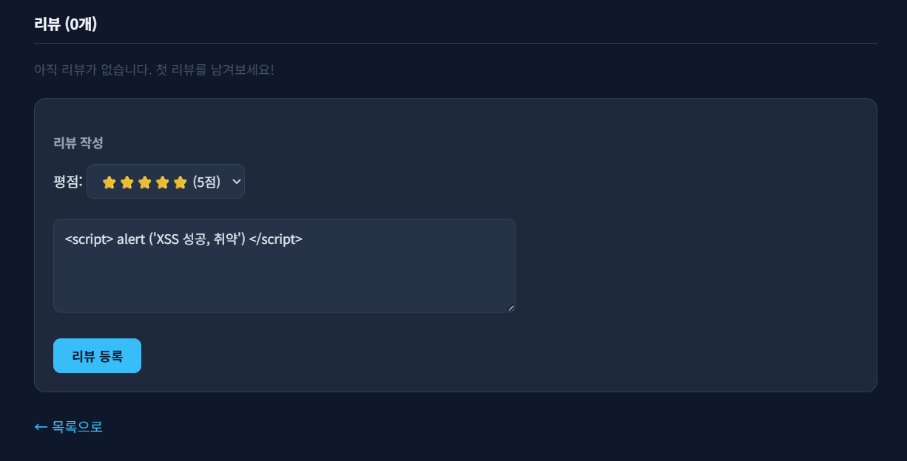
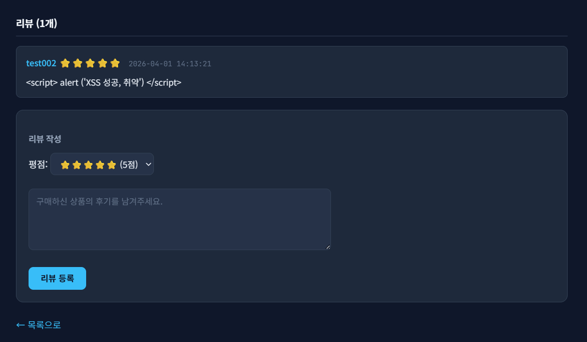
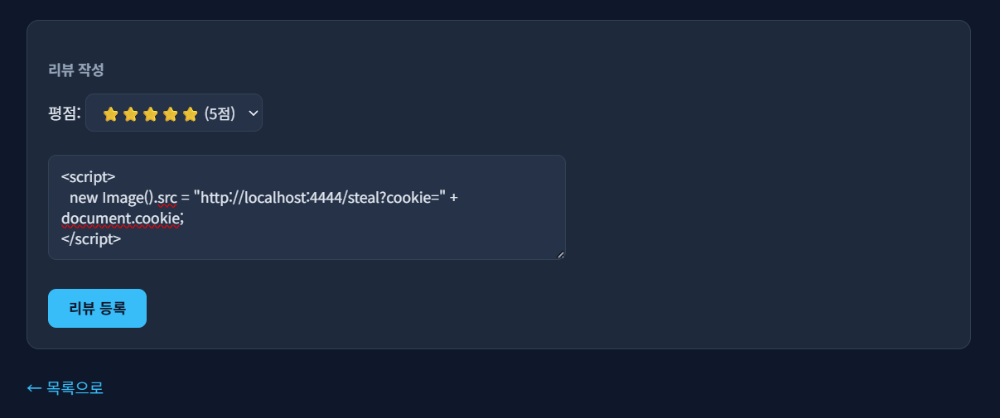
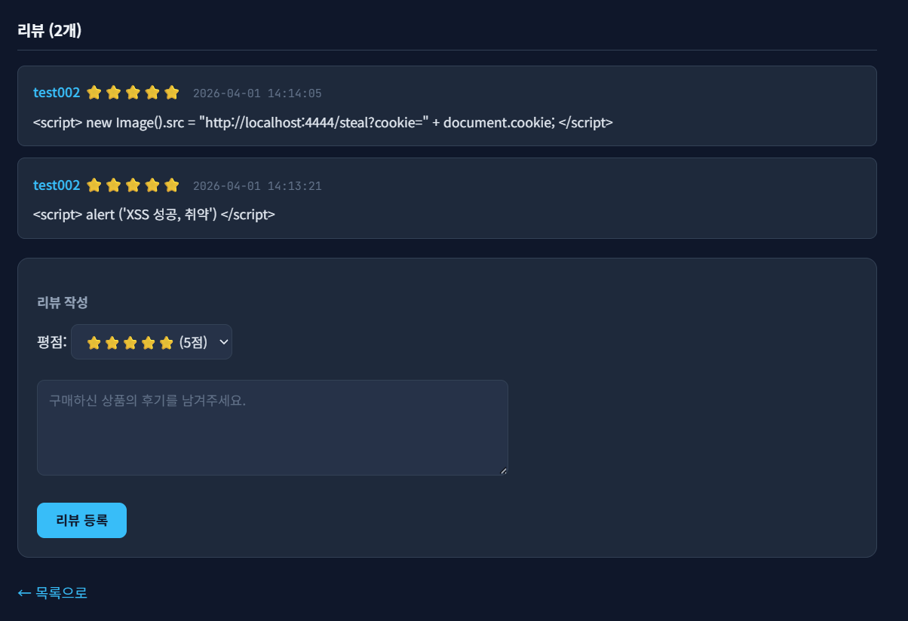
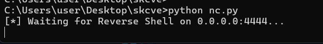

# 08. Stored XSS Security

## 개요
상품 리뷰 기능에서 확인한 `Stored XSS` 취약점과 그 대응 내용을 정리한다.

리뷰 내용이 서버에서 별도의 이스케이프 처리 없이 DB에 저장되고, 상품 상세 페이지에서 그대로 출력되기 때문에 공격자가 입력한 스크립트가 이후 다른 사용자의 브라우저에서 실행될 수 있다.

이번 문서에서는 저장형 XSS 자체를 먼저 증명하고, 추가로 로컬 테스트 환경에서 영향 범위를 확인하기 위해 로그인 성공 시 읽을 수 있는 테스트용 쿠키를 임시 발급하여 외부 요청 전송 여부를 확인하였다. 이 테스트용 쿠키는 실제 취약점의 본질이 아니라 영향 시연을 위한 보조 코드이며, 대응 단계에서는 제거한다.

## 진입점
- `/jsr/login`
- `/jsr/product/detail`
- `/jsr/product/review`

## 포함 이슈

| 구분 | 취약점 | 설명 |
| --- | --- | --- |
| 주요 취약점 | Stored XSS | 리뷰 내용이 이스케이프 없이 저장 및 출력되어 저장형 XSS가 발생한다. |
| 관련 이슈 | Test Cookie Exposure (Local Test Only) | 로컬 테스트 환경에서 XSS 영향 확인을 위해 로그인 시 읽을 수 있는 테스트용 쿠키를 임시 발급하였다. |

## 취약한 부분
리뷰 작성 기능은 사용자가 입력한 `content` 값을 그대로 DB에 저장하고, 상품 상세 페이지는 저장된 리뷰 내용을 HTML 이스케이프 없이 출력한다.

그 결과 공격자가 리뷰에 `<script>` 태그를 삽입하면 해당 값이 DB에 저장된 뒤, 이후 동일 상품 상세 페이지를 조회하는 다른 사용자의 브라우저에서 스크립트가 실행된다.

추가로 이번 테스트에서는 Tomcat이 생성하는 `JSESSIONID` 쿠키가 `HttpOnly`가 적용된 상태였기 때문에, XSS가 실행되더라도 `document.cookie`로 세션 쿠키를 직접 확인할 수 없었다. 따라서 로컬 테스트 환경에서 영향 시연을 위해 로그인 성공 시 `HttpOnly=false`인 테스트용 쿠키 `user_session`을 임시 발급하였다.

## 취약한 코드
파일: `src/main/java/com/jsr/ctf/ProductDetailServlet.java`

```java
String content = request.getParameter("content");

ps = conn.prepareStatement(
    "INSERT INTO JSR_REVIEWS (REVIEW_ID,PRODUCT_ID,USER_ID,USERNAME,CONTENT,RATING,CREATED_AT) " +
    "VALUES (JSR_REVIEW_SEQ.NEXTVAL,?,?,?,?,?,SYSDATE)");
ps.setLong(1, productId);
ps.setLong(2, user.getUserId());
ps.setString(3, user.getUsername());
ps.setString(4, content);
ps.setInt(5, rating);
ps.executeUpdate();
```

파일: `src/main/webapp/WEB-INF/views/product_detail_view.jsp`

```jsp
<c:forEach var="r" items="${jsrReviews}">
    <div class="jsr-review">
        <b>${r.username}</b>
        <span class="jsr-date">${r.createdAt}</span>
        <br>
        <p>${r.content}</p>
    </div>
</c:forEach>
```

파일: `src/main/java/com/jsr/ctf/LoginServlet.java`

```java
HttpSession session = request.getSession();
session.setAttribute("jsrUser", loginUser);

Cookie cookie = new Cookie("user_session", session.getId());
cookie.setHttpOnly(false);
cookie.setPath("/");
response.addCookie(cookie);
```

## 취약한 코드 동작 설명
`ProductDetailServlet`은 리뷰 내용을 검증하거나 이스케이프하지 않고 그대로 저장한다. 이후 `product_detail_view.jsp`는 `${r.content}`를 그대로 출력하므로, 저장된 `<script>`가 브라우저에서 HTML로 해석되어 실행된다.

즉 공격자는 한 번의 리뷰 작성만으로 스크립트를 DB에 저장할 수 있고, 이후 다른 사용자가 동일 상품 상세 페이지를 볼 때마다 해당 스크립트가 반복 실행되는 저장형 XSS가 발생한다.

이번 테스트에서는 단순 `alert` 실행으로 저장형 XSS 자체를 먼저 확인한 뒤, 로컬 테스트 환경에서 외부 요청 전송 여부를 보기 위해 로그인 시 테스트용 쿠키를 추가 발급하였다. 그 결과 외부 요청은 정상 수신되었고, `cookie=` 값에는 `user_session`과 테스트용 `__test` 쿠키가 포함되었지만 Tomcat이 관리하는 `JSESSIONID`는 `HttpOnly` 특성으로 인해 `document.cookie`에 포함되지 않았다.

## 취약한 코드 증적자료

### 1. 리뷰 입력란에 XSS 페이로드 삽입


### 2. 저장된 스크립트가 상품 상세 페이지에서 실행


### 3. 다른 계정에서 동일 상품 상세 페이지 조회 시 저장된 리뷰 확인


### 4. 외부 요청 전송 확인용 페이로드 입력


### 5. 로컬 테스트 환경에서 외부 요청 수신 및 쿠키 값 확인


## 영향
- 다른 사용자가 상품 상세 페이지를 조회하는 순간 공격자가 저장한 스크립트가 브라우저에서 실행될 수 있다.
- 동일 출처 컨텍스트에서 DOM 조작, UI 변조, 추가 요청 전송 등 브라우저 측 행위를 수행할 수 있다.
- 테스트용 쿠키를 통해 외부 요청으로 쿠키 값이 전달되는 것을 확인하였다.
- 다만 실제 세션 쿠키 `JSESSIONID`는 `HttpOnly`가 적용되어 있어 `document.cookie`를 통한 직접 노출은 제한되었다.
- `HttpOnly`는 세션 쿠키 탈취 일부를 제한하는 보조 방어일 뿐이며, 저장형 XSS 자체를 제거하지는 못한다.

## 대응 방안
- 리뷰 출력 시 사용자 입력값을 HTML 이스케이프 처리하여 스크립트가 실행되지 않도록 한다.
- 가능한 경우 서버 측 입력 검증을 추가하여 리뷰 필드에 불필요한 태그가 들어오지 않도록 제한한다.
- 테스트 시연을 위해 임시로 추가했던 로그인 쿠키 발급 코드를 제거한다.
- 추가적으로 `Content-Security-Policy` 등 방어 기법을 적용해 영향 범위를 줄일 수 있다.

## 수정 코드 예시
파일: `src/main/webapp/WEB-INF/views/product_detail_view.jsp`

```jsp
<c:forEach var="r" items="${jsrReviews}">
    <div class="jsr-review">
        <b><c:out value="${r.username}" /></b>
        <span class="jsr-date"><c:out value="${r.createdAt}" /></span>
        <br>
        <p><c:out value="${r.content}" /></p>
    </div>
</c:forEach>
```

파일: `src/main/java/com/jsr/ctf/LoginServlet.java`

```java
HttpSession session = request.getSession();
session.setAttribute("jsrUser", loginUser);

if ("ADMIN".equals(loginUser.getRole())) {
    response.sendRedirect(request.getContextPath() + "/admin/dashboard");
} else {
    response.sendRedirect(request.getContextPath() + "/products");
}
```

## 대응 코드 동작 설명
리뷰 출력부를 `<c:out>`으로 변경하면 저장된 리뷰 내용이 HTML 특수문자로 이스케이프되어 `<script>`가 더 이상 브라우저에서 실행되지 않는다. 즉 공격자가 스크립트를 입력하더라도 화면에는 문자열 그대로만 표시되고, 저장형 XSS로 이어지지 않는다.

또한 로그인 시 영향 시연용으로 임시 추가했던 테스트용 쿠키 발급 코드를 제거하면, XSS가 실행되더라도 브라우저에서 읽을 수 있는 추가 쿠키가 남지 않는다. 이후에는 컨테이너가 관리하는 세션 쿠키 정책만 유지되므로 불필요한 노출 지점이 줄어든다.

## 대응 증적자료
### 1. `alert` 기반 XSS 페이로드 입력 시도


### 2. 입력한 스크립트가 실행되지 않고 문자열 그대로 저장됨


### 3. 외부 요청 전송용 페이로드 입력 시도


### 4. 외부 요청 전송용 페이로드도 문자열 그대로 출력됨


### 5. 외부 수신 대기 서버에 추가 요청이 도달하지 않음


즉 대응 이후에는 리뷰에 입력된 `<script>`가 더 이상 브라우저에서 실행되지 않고, 상품 상세 페이지에는 문자열 그대로만 출력된다. 따라서 `alert` 실행도 발생하지 않으며, 외부 수신 서버로의 추가 요청 전송도 확인되지 않는다.
