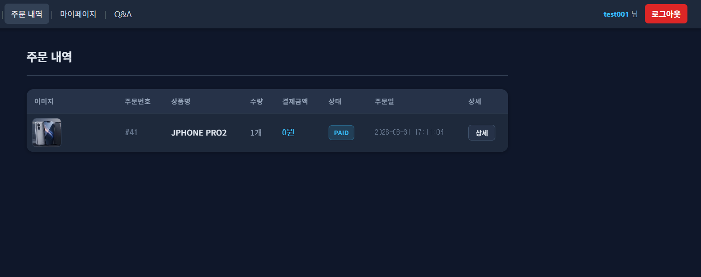
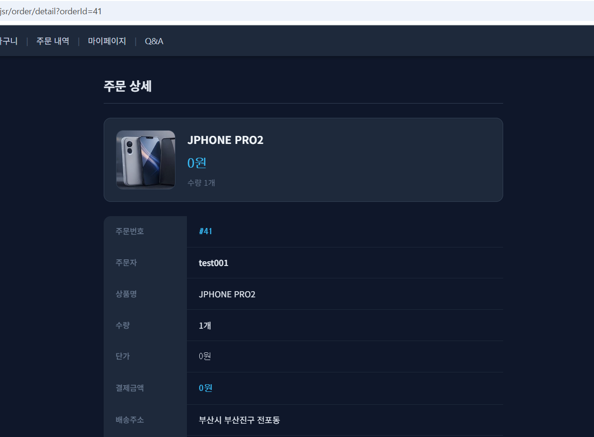
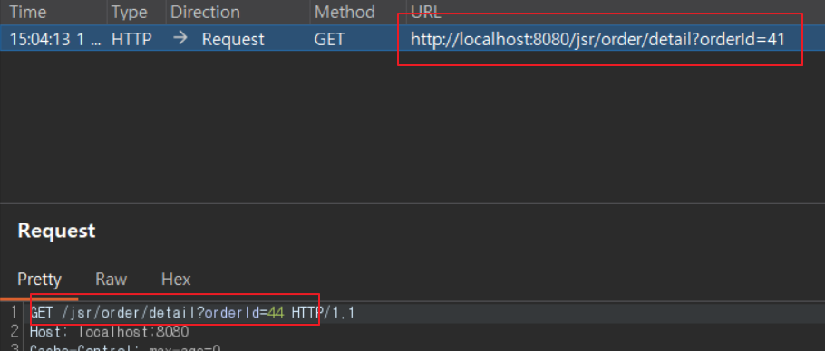
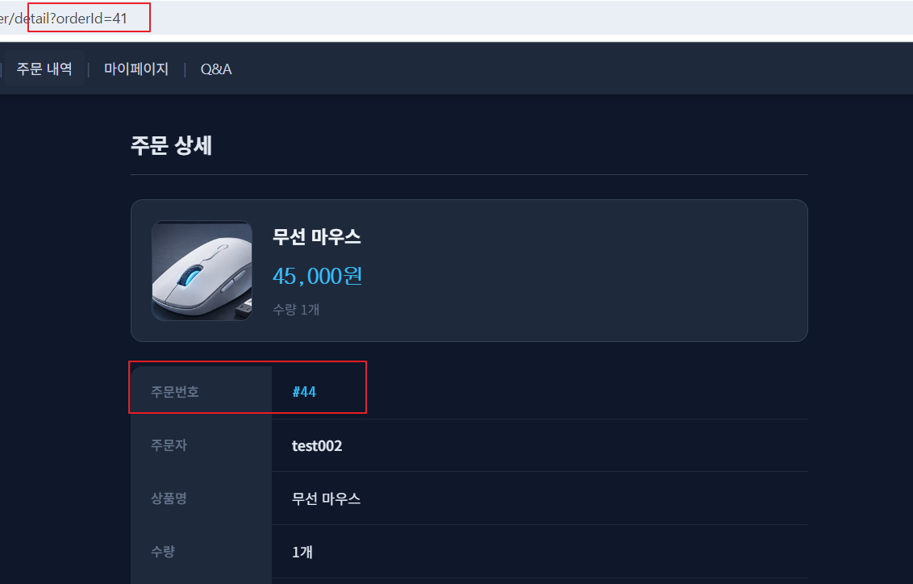
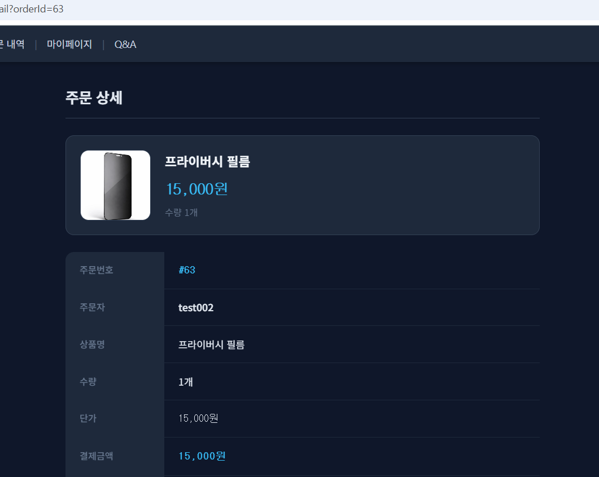
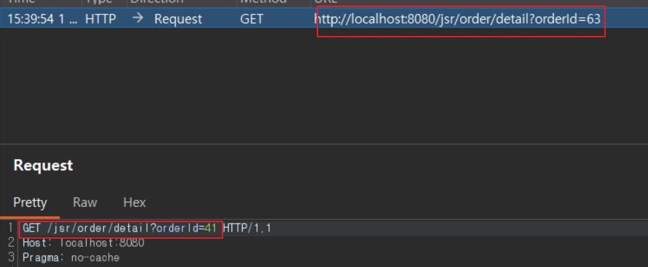
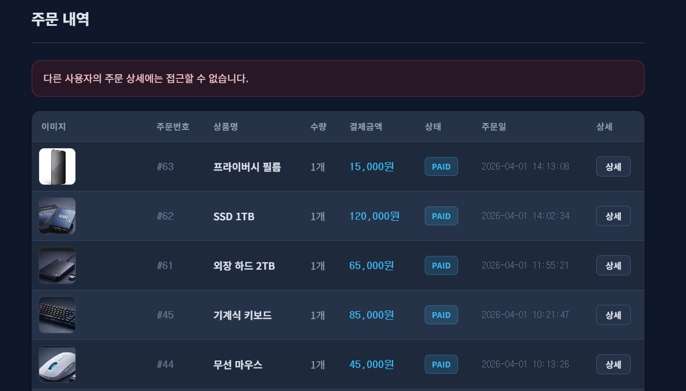

# 09. Order IDOR Security

## 개요
주문 상세 조회 기능에서 확인한 `Broken Access Control / IDOR` 취약점과 그 대응 내용을 정리한다.

주문 목록 화면에서는 로그인한 사용자의 주문만 표시되지만, 주문 상세 조회는 `orderId` 파라미터만으로 처리된다. 그 결과 다른 사용자의 주문번호를 추측하거나 변조하면 타인의 주문 상세 정보가 그대로 노출될 수 있다.

## 진입점
- `/jsr/order/list`
- `/jsr/order/detail`

## 포함 이슈

| 구분 | 취약점 | 설명 |
| --- | --- | --- |
| 주요 취약점 | Broken Access Control / IDOR | 주문 상세 조회 요청에서 주문 소유자 여부를 검증하지 않아, 다른 사용자가 타인의 주문 상세 정보를 조회할 수 있다. |

## 취약한 부분
주문 목록은 로그인한 사용자의 주문만 보여주지만, 주문 상세 화면은 `orderId` 값만 맞으면 그대로 조회된다.

서버는 현재 로그인한 사용자가 해당 주문의 실제 소유자인지, 또는 관리자 권한을 가진 사용자인지 확인하지 않는다. 따라서 다른 사용자의 주문번호를 요청 파라미터에 넣으면 상품명, 결제금액, 배송주소 등 타인의 주문 정보가 그대로 노출된다.

## 취약한 코드
파일: `src/main/java/com/jsr/ctf/OrderServlet.java`

```java
} else if (path.equals("/order/detail")) {
    long orderId = Long.parseLong(request.getParameter("orderId"));
    request.setAttribute("jsrOrder", getOrderById(orderId));
    request.getRequestDispatcher("/WEB-INF/views/order_detail_view.jsp")
           .forward(request, response);
}
```

## 취약한 코드 동작 설명
주문 상세 조회는 `orderId`를 요청 파라미터로 받아 `getOrderById(orderId)`를 호출한 뒤 바로 화면으로 전달한다.

이 과정에서 현재 로그인한 사용자가 해당 주문의 소유자인지 확인하는 로직이 없기 때문에, 다른 사용자의 `orderId`를 추측하거나 변조하면 타인의 주문 상세 정보를 그대로 조회할 수 있다.

## 취약한 코드 증적자료

### 1. test001 계정의 주문 내역에서 자신의 주문 확인


### 2. test001 계정으로 자신의 주문 상세 조회


### 3. Burp에서 orderId 값을 41에서 44로 수정하여 전송


### 4. test001 계정에서 타인(test002)의 주문 상세 정보 노출
응답 화면에서는 주문번호 `#44`, 주문자 `test002`의 정보가 표시되어, 단순 파라미터 변조만으로 타인 주문 상세가 조회됨을 확인할 수 있다.


## 영향
- 타인의 주문번호, 주문자, 상품명, 결제금액, 배송주소 등 민감한 주문 정보 노출
- 주문 이력과 결제 내역에 대한 프라이버시 침해
- 공격자가 다른 사용자의 주문 정보를 수집하거나 추적할 수 있음

## 대응 방안
- 주문 상세 조회 전에 현재 로그인한 사용자가 해당 주문의 소유자인지 검증한다.
- 관리자 권한이 아닌 경우 타인 주문 조회를 차단한다.
- 존재하지 않는 주문이거나 권한 없는 요청은 주문 목록으로 리다이렉트하고 오류 메시지를 제공한다.

## 수정 코드 예시
파일: `src/main/java/com/jsr/ctf/OrderServlet.java`

```java
} else if (path.equals("/order/detail")) {
    long orderId = Long.parseLong(request.getParameter("orderId"));
    JsrOrder order = getOrderById(orderId);
    JsrUser loginUser = (JsrUser) request.getSession().getAttribute("jsrUser");

    if (order == null || loginUser == null) {
        response.sendRedirect(request.getContextPath() + "/order/list?error=notfound");
        return;
    }

    boolean isOwner = order.getUserId() == loginUser.getUserId();
    boolean isAdmin = "ADMIN".equalsIgnoreCase(loginUser.getRole());
    if (!isOwner && !isAdmin) {
        response.sendRedirect(request.getContextPath()
            + "/order/list?error=idor&orderId=" + orderId);
        return;
    }

    request.setAttribute("jsrOrder", order);
    request.getRequestDispatcher("/WEB-INF/views/order_detail_view.jsp")
           .forward(request, response);
}
```

파일: `src/main/webapp/WEB-INF/views/order_list_view.jsp`

```jsp
<c:if test="${param.error eq 'idor'}">
    <div class="notice-error">
        다른 사용자의 주문 상세에는 접근할 수 없습니다.
    </div>
</c:if>
```

## 대응 코드 동작 설명
수정 후에는 주문 상세 조회 전에 현재 로그인한 사용자와 조회 대상 주문의 `userId`를 비교한다.

주문 소유자이거나 관리자 권한을 가진 경우에만 상세 화면을 조회할 수 있고, 그 외의 사용자는 주문 목록으로 이동하며 차단 메시지가 표시된다. 이로써 단순히 `orderId`만 바꾸어 타인 주문을 조회하는 IDOR 공격을 방지할 수 있다.

## 대응 코드 증적자료

### 5. Burp에서 자신의 주문 상세 요청을 가로채 `orderId`를 63에서 41로 수정하여 전송


### 6. test002 계정에서 자신의 주문 상세는 정상 조회 가능


### 7. 타인 주문 상세 접근이 차단되고 주문 목록으로 리다이렉트됨

