# 10. Admin CSRF Security

## 개요
1:1 문의 상세 화면에서 본문이 HTML 이스케이프 없이 그대로 렌더링되고, 포인트 사용 기능에는 CSRF 토큰 검증이 없어 관리자가 문의를 확인하는 과정에서 악성 링크를 클릭하면 관리자 세션으로 상태 변경 요청이 실행될 수 있었다.

이번 시나리오에서는 일반 사용자가 문의글에 악성 링크를 삽입하고, 로그인된 관리자가 해당 문의를 열어 링크를 클릭했을 때 관리자 포인트가 의도치 않게 변경되는 것을 확인하였다.

## 진입점
- `/jsr/board?tab=INQUIRY`
- `/jsr/board/detail`
- `/jsr/point/use`
- 외부 테스트 페이지: `http://localhost:8989/jsr.html`

## 포함 이슈

| 구분 | 취약점 | 설명 |
|------|--------|------|
| 주요 취약점 | CSRF (Cross-Site Request Forgery) | 관리자 세션이 유지된 상태에서 외부 페이지가 `/point/use` 요청을 자동 전송해 관리자 의도와 무관한 상태 변경이 발생한다. |
| 관련 이슈 | HTML Injection in Inquiry Content | 문의 본문이 raw HTML로 렌더링되어 관리자에게 악성 링크를 자연스럽게 노출할 수 있다. |

## 취약한 부분
문의 상세 화면은 사용자 입력 본문을 그대로 출력하고, 포인트 사용 기능은 세션 확인만 할 뿐 요청의 출처나 CSRF 토큰을 검증하지 않았다.  
그 결과 공격자는 문의글에 악성 링크를 삽입해 두고, 관리자가 해당 링크를 클릭하도록 유도함으로써 관리자 권한으로 포인트 사용 요청을 발생시킬 수 있었다.

## 취약한 코드
파일: `src/main/webapp/WEB-INF/views/board_detail_view.jsp`

```jsp
<div class="post-body">${jsrBoard.content}</div>
```

파일: `src/main/java/com/jsr/ctf/PointServlet.java`

```java
} else if (path.equals("/point/use")) {
    int amount = Integer.parseInt(request.getParameter("amount"));

    if (amount <= 0) {
        response.sendRedirect(request.getContextPath() + "/point?error=invalid");
        return;
    }

    try {
        usePoint(loginUser.getUserId(), amount);
        response.sendRedirect(request.getContextPath() + "/point?used=1");
    } catch (Exception e) {
        response.sendRedirect(request.getContextPath() + "/point?error=invalid");
    }
}
```

파일: 외부 테스트 페이지 `jsr.html`

```html
<!DOCTYPE html>
<html>
<head><title>이벤트 안내</title></head>
<body>
    <h1>잠시만 기다려주세요...</h1>
    <form action="http://localhost:8080/jsr/point/use" method="POST" id="csrfForm">
        <input type="hidden" name="amount" value="100000000">
    </form>
    <script>
        document.getElementById('csrfForm').submit();
    </script>
</body>
</html>
```

## 취약한 코드 동작 설명
문의 본문은 HTML이 이스케이프되지 않아 `<a>` 같은 링크 태그가 그대로 렌더링된다.  
관리자가 문의 상세를 확인하는 과정에서 해당 링크를 클릭하면 외부 페이지가 열리고, 외부 페이지는 관리자의 로그인 세션을 이용해 `/point/use`로 자동 POST 요청을 보낸다.  
서버는 이 요청에 대해 CSRF 토큰이나 요청 출처를 검증하지 않기 때문에 관리자 의사와 무관하게 상태 변경을 수행한다.

## 취약한 코드 증적자료

### 1. 공격자가 준비한 외부 CSRF 페이지
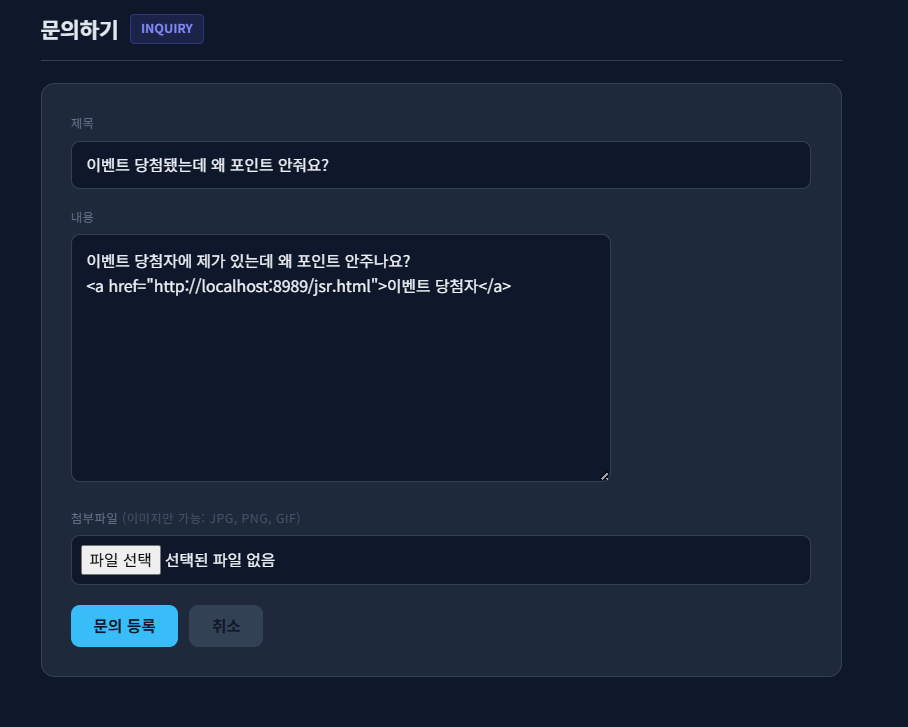

### 2. 관리자 포인트 변경 전 상태
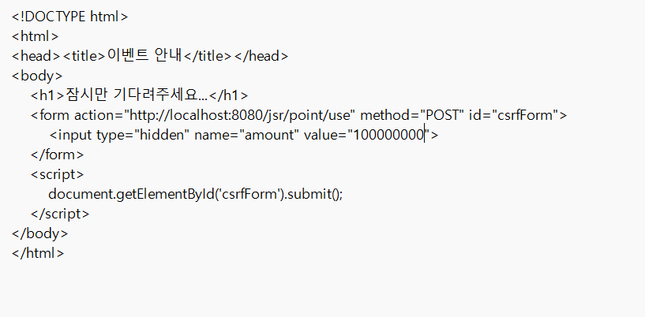

### 3. 공격자가 문의글에 악성 링크를 삽입하여 등록
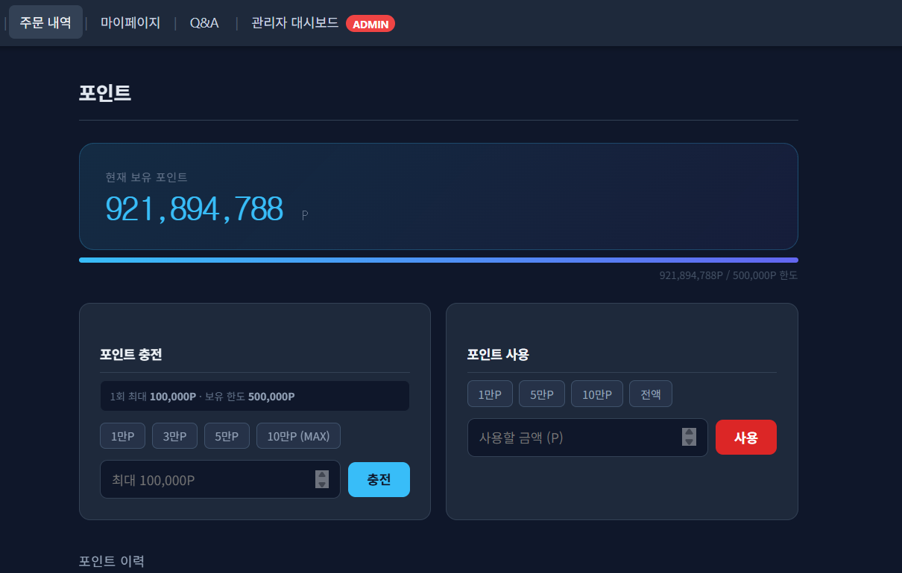

### 4. 관리자가 문의글을 열었을 때 악성 링크가 그대로 노출됨
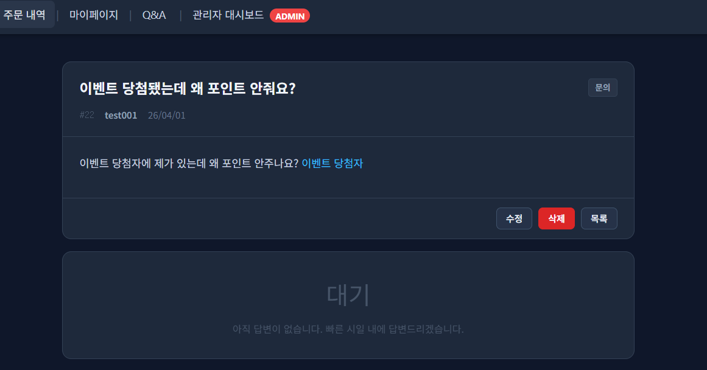

### 5. 링크 클릭 후 관리자 포인트가 실제로 변경됨
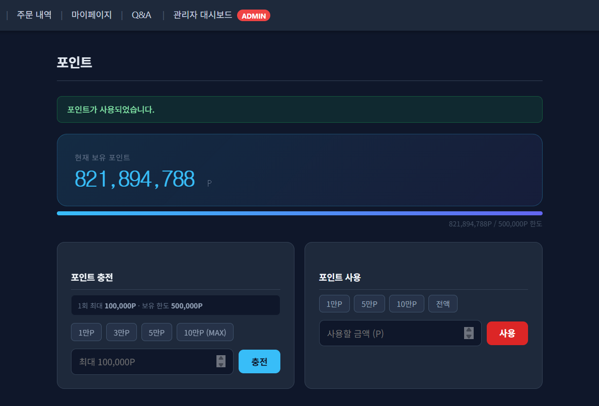

### 6. 외부 서버가 관리자 요청을 수신한 기록
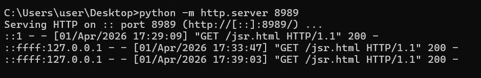

## 영향
- 로그인된 관리자 세션을 이용해 의도하지 않은 포인트 사용 요청을 발생시킬 수 있다.
- 동일한 구조가 다른 관리자 기능에도 존재한다면 관리자 포인트 변경, 주문 상태 변경, 사용자 정보 수정 등으로 악용 범위가 확대될 수 있다.
- 문의글 본문이 HTML을 그대로 렌더링하기 때문에 관리자를 자연스럽게 악성 링크로 유도할 수 있다.

## 대응 방안
1. 상태 변경 요청에 CSRF 토큰 검증을 추가한다.
2. 문의 본문은 전체 HTML을 이스케이프해 raw 태그가 실행되지 않도록 한다.
3. 사용성을 위해 plain text URL만 안전하게 링크화하고, raw `<a>`, ``, `<form>`, `<iframe>` 등은 모두 문자열로만 보이게 처리한다.

## 수정 코드 예시
파일: `src/main/java/com/jsr/ctf/PointServlet.java`

```java
} else if (path.equals("/point")) {
    String csrfToken = (String) session.getAttribute("csrfToken");
    if (csrfToken == null) {
        csrfToken = UUID.randomUUID().toString();
        session.setAttribute("csrfToken", csrfToken);
    }
    ...
} else if (path.equals("/point/use")) {
    String csrfToken = request.getParameter("csrfToken");
    String sessionToken = (String) session.getAttribute("csrfToken");

    if (sessionToken == null || csrfToken == null || !sessionToken.equals(csrfToken)) {
        response.sendRedirect(request.getContextPath() + "/point?error=csrf");
        return;
    }

    int amount = Integer.parseInt(request.getParameter("amount"));
    ...
}
```

파일: `src/main/webapp/WEB-INF/views/point_view.jsp`

```jsp
<form method="post" action="${pageContext.request.contextPath}/point/use" class="point-form">
    <input type="hidden" name="csrfToken" value="${sessionScope.csrfToken}">
    <input type="number" name="amount" class="point-input" placeholder="사용할 금액 (P)">
    <button type="submit" class="action-btn use-btn">사용</button>
</form>
```

파일: `src/main/webapp/WEB-INF/views/board_detail_view.jsp`

```jsp
<%!
    private static final Pattern SAFE_URL_PATTERN =
            Pattern.compile("(https?://[\\w\\-./?%&=+#:~]+)");

    private String renderSafeTextWithLinks(String input) {
        if (input == null) return "";

        String escaped = input
                .replace("&", "&amp;")
                .replace("<", "&lt;")
                .replace(">", "&gt;")
                .replace("\"", "&quot;")
                .replace("'", "&#x27;");

        Matcher matcher = SAFE_URL_PATTERN.matcher(escaped);
        StringBuffer sb = new StringBuffer();
        while (matcher.find()) {
            String url = matcher.group(1);
            String replacement = "<a href=\"" + url
                    + "\" target=\"_blank\" rel=\"noopener noreferrer\">" + url + "</a>";
            matcher.appendReplacement(sb, Matcher.quoteReplacement(replacement));
        }
        matcher.appendTail(sb);
        return sb.toString().replace("\r\n", "\n").replace("\n", "<br>");
    }
%>

<div class="post-body"><%= renderSafeTextWithLinks(jsrBoard.getContent()) %></div>
```

## 대응 코드 동작 설명
포인트 페이지 진입 시 세션에 CSRF 토큰을 생성하고, 포인트 사용 요청에서는 세션 토큰과 요청 토큰이 일치하는지 먼저 검증한다.  
토큰이 없거나 불일치하면 `/point?error=csrf`로 리다이렉트되어 요청이 거부된다.  

문의 본문은 먼저 전체 HTML을 이스케이프하고, 그 뒤 `http://`, `https://` 형태의 plain text URL만 안전하게 링크로 변환한다.  
따라서 raw `<a>`, ``, `<form>`, `<iframe>` 태그는 그대로 문자열로 표시되고 실행되지 않으며, 일반 URL만 사용성 차원에서 클릭 가능하게 유지된다.

## 대응 코드 증적자료

### 7. 대응 후 문의 작성 시 raw HTML과 plain text URL을 함께 입력
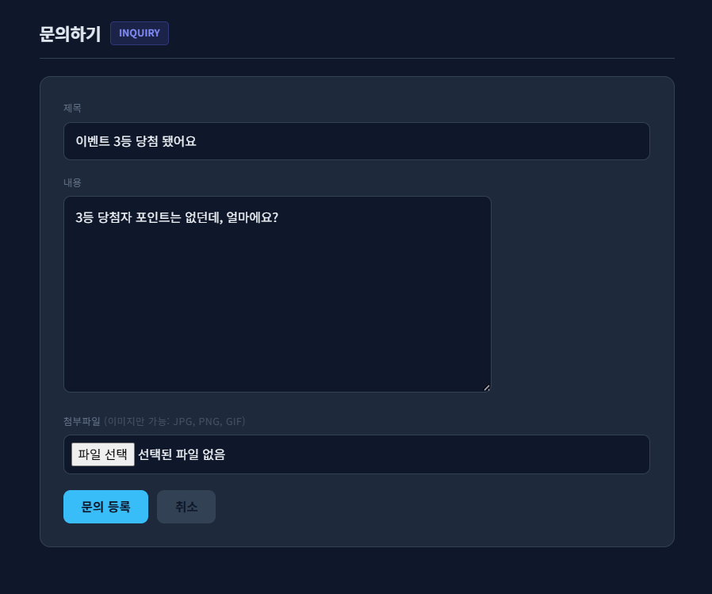

### 8. 요청에는 여전히 raw HTML과 plain text URL이 함께 전달됨
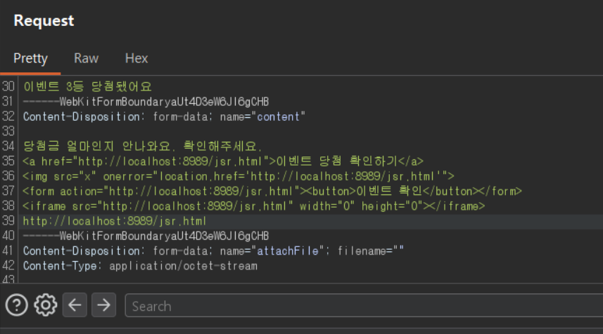

### 9. 문의 상세에서는 raw HTML은 문자열 그대로 출력되고 plain text URL만 링크로 유지됨
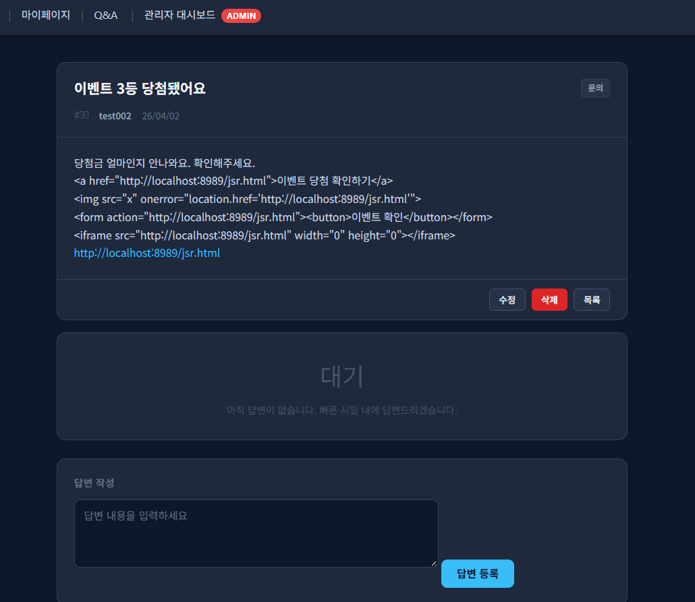

### 10. 링크 클릭 후에도 CSRF 토큰이 없는 요청은 차단됨
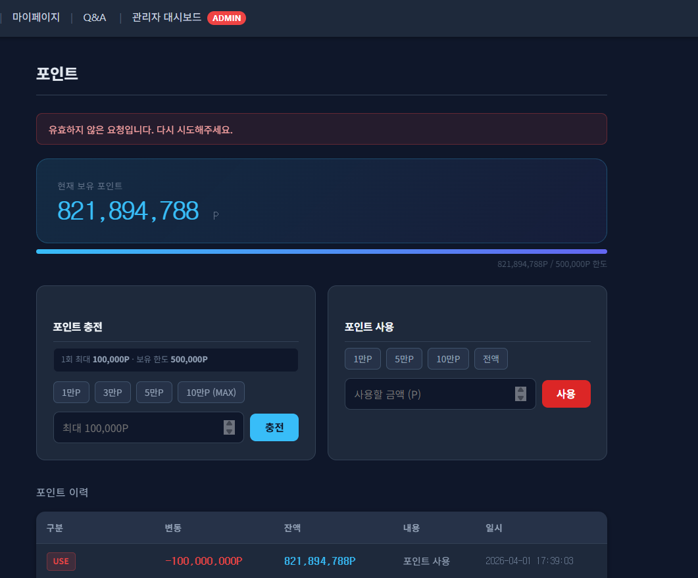

### 11. 외부 HTTP 서버 로그에는 단순 링크 접근만 남고 상태 변경은 발생하지 않음
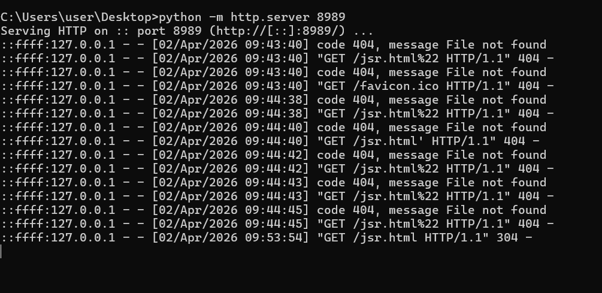
