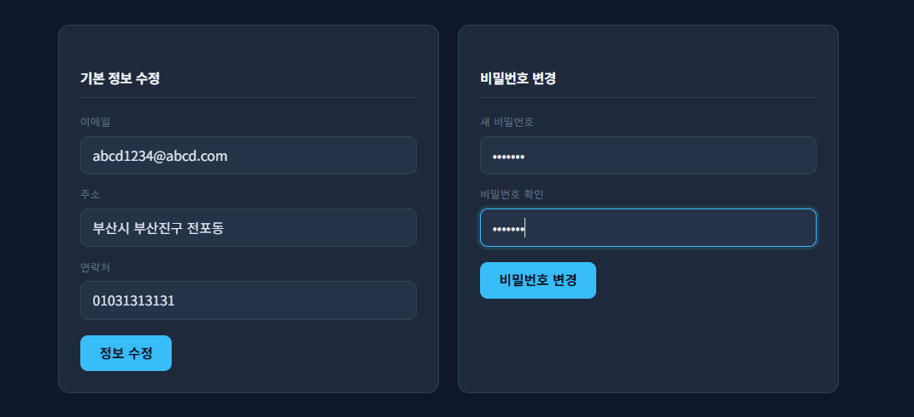
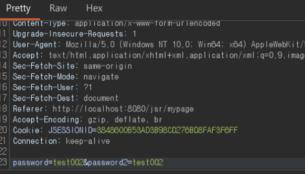
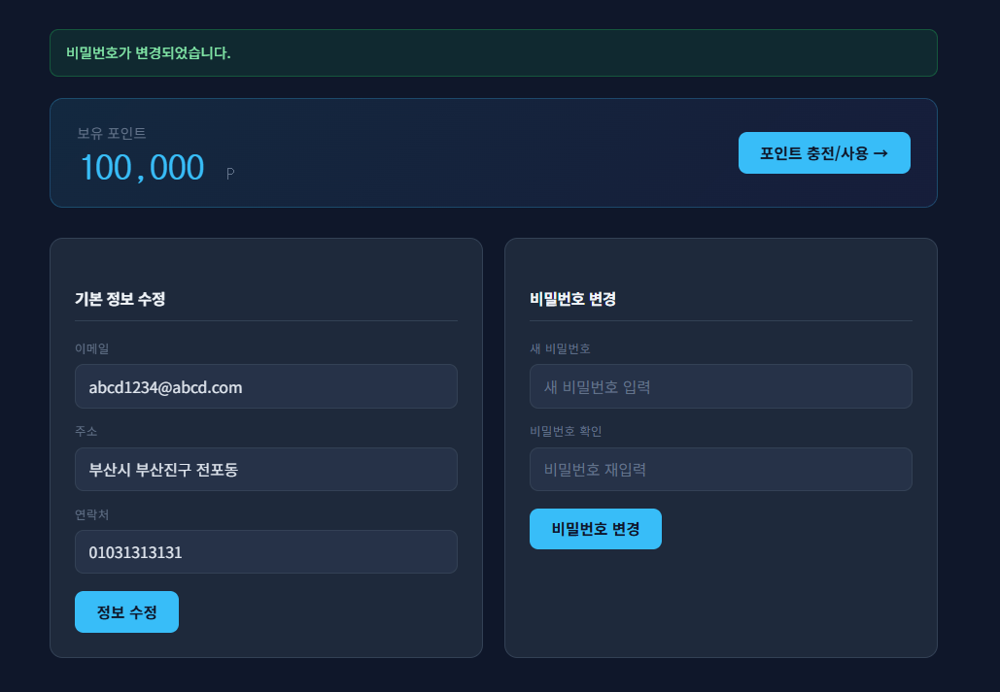
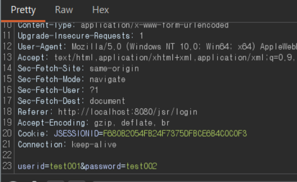
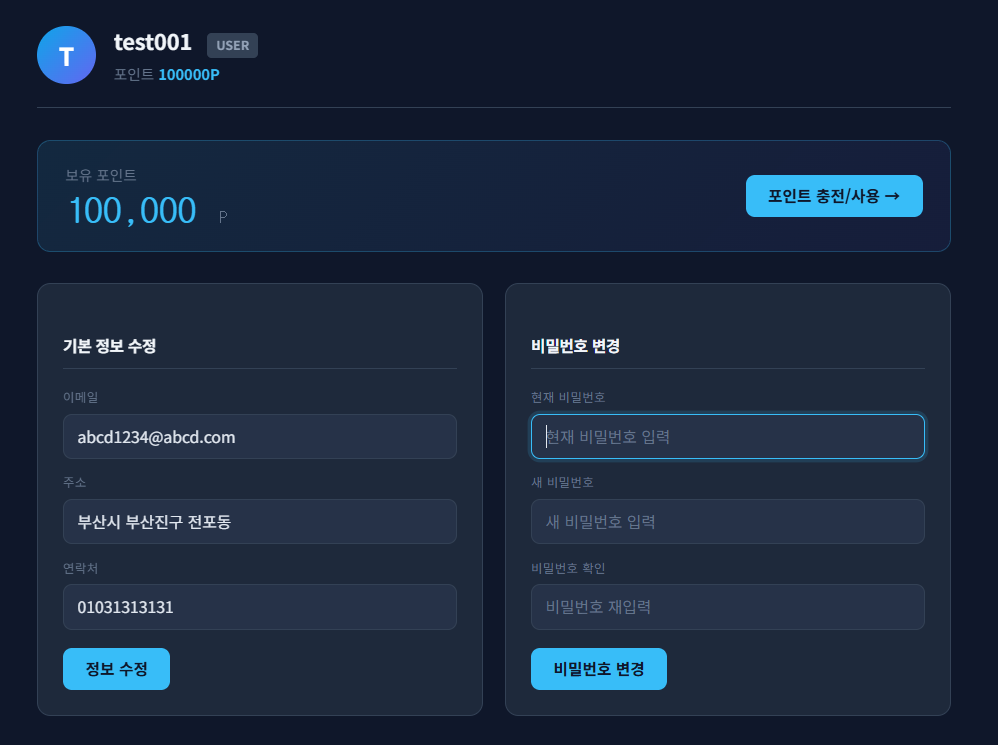
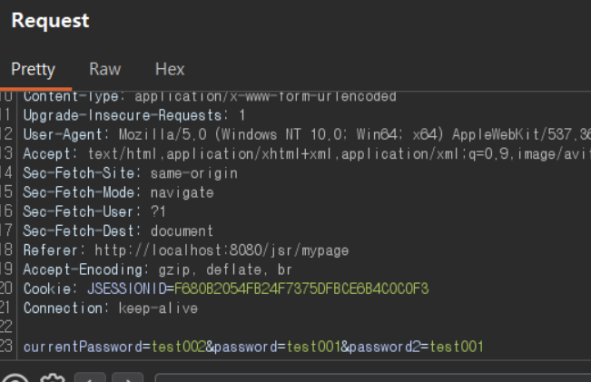
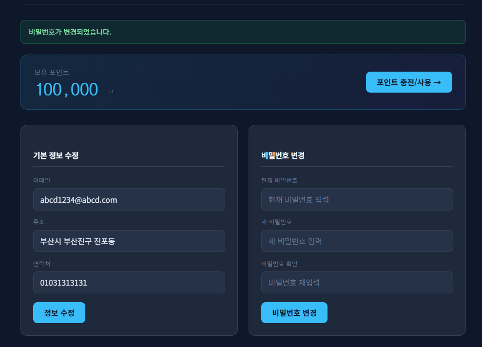
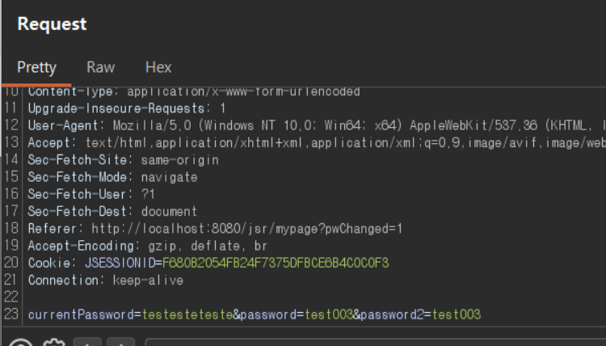
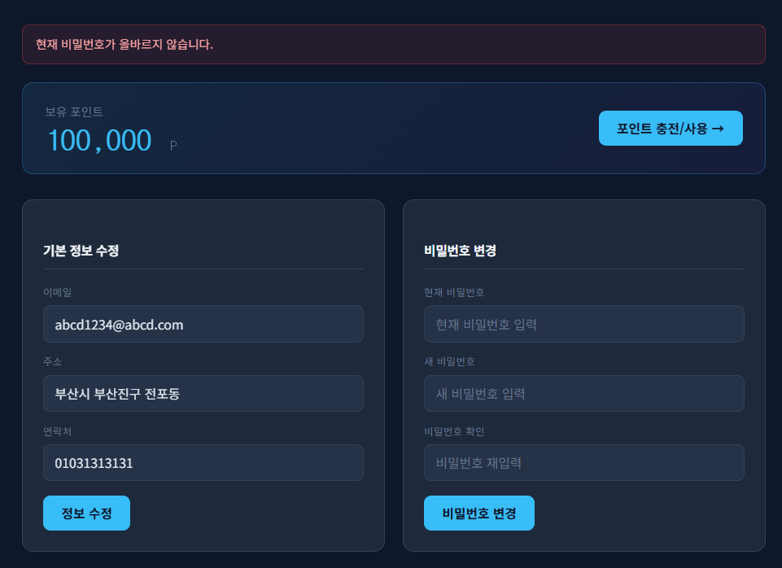

# 11. Password Change Security

## 개요
마이페이지의 비밀번호 변경 기능은 로그인된 사용자라면 현재 비밀번호를 다시 입력하지 않아도 새 비밀번호로 즉시 변경할 수 있다.
또한 화면에는 비밀번호 확인(`password2`) 입력란이 존재하지만, 서버에서는 해당 값을 검증하지 않아 클라이언트 측 검증에만 의존한다.

그 결과 사용자가 이미 로그인된 상태라면 현재 비밀번호를 모르는 상황에서도 계정 비밀번호를 변경할 수 있으며, 브라우저 개발자도구나 요청 변조를 통해 확인값 불일치 상태로도 비밀번호가 변경된다.

## 진입점
- `/jsr/mypage`
- `/jsr/mypage/pw_change`

## 포함 이슈
| 구분 | 취약점 | 설명 |
| --- | --- | --- |
| 주요 취약점 | Missing Current Password Verification | 현재 비밀번호 확인 없이 새 비밀번호만으로 변경이 가능하다. |
| 관련 이슈 | Weak Re-Authentication | 중요한 계정 정보 변경 시 재인증 절차가 없어 세션만 유지되면 비밀번호 변경이 가능하다. |
| 관련 이슈 | Missing Server-Side Confirmation Check | 화면의 비밀번호 확인 입력란은 존재하지만 서버에서 `password2`를 검증하지 않는다. |

## 취약한 부분
비밀번호 변경은 계정 보안에 직접 영향을 주는 민감 기능이므로, 일반적으로 현재 비밀번호 재입력 또는 추가 본인 확인 절차가 필요하다.
그러나 현재 구현은 로그인 세션만 있으면 `password` 파라미터 하나만으로 비밀번호를 변경하며, 화면에 존재하는 확인 입력값도 서버에서 재검증하지 않는다.

즉 사용자가 현재 비밀번호를 모르는 상황에서도 세션만 확보되어 있으면 비밀번호 변경이 가능하고, 클라이언트 검증을 우회하면 서로 다른 비밀번호 입력값으로도 변경 요청이 처리된다.

## 취약한 코드
파일: `src/main/java/com/jsr/ctf/MypageServlet.java`

```java
} else if (path.equals("/mypage/pw_change")) {
    String newPassword = request.getParameter("password");
    updatePassword(user.getUserId(), newPassword);
    response.sendRedirect(request.getContextPath() + "/mypage?pwChanged=1");
}
```

파일: `src/main/webapp/WEB-INF/views/mypage_view.jsp`

```jsp
<form method="post" action="<%= request.getContextPath() %>/mypage/pw_change">
    <input type="password" name="password" placeholder="새 비밀번호 입력" required>
    <input type="password" name="password2" placeholder="비밀번호 재입력" required>
    <button type="submit" class="jsr-btn">비밀번호 변경</button>
</form>
```

## 취약한 코드 동작 설명
서버는 `/mypage/pw_change` 요청을 받을 때 `password` 값만 읽어 바로 `updatePassword()`를 호출한다.
이 과정에서 현재 비밀번호 확인, 새 비밀번호와 확인값 일치 여부, 추가 재인증 여부를 전혀 검증하지 않는다.

따라서 로그인 상태의 사용자는 현재 비밀번호를 몰라도 새 비밀번호를 임의로 설정할 수 있고, 요청 변조를 통해 `password2`를 제거하거나 다른 값으로 보내더라도 서버는 이를 감지하지 못한다.

## 취약한 코드 증적자료
1. 마이페이지 비밀번호 변경 화면에서 현재 비밀번호 입력 없이 새 비밀번호만 입력
   

2. 비밀번호 확인 입력값 불일치 또는 미포함 상태의 요청을 Burp로 전송
   

3. 비밀번호 변경 성공 메시지 확인
   

4. 변경한 새 비밀번호로 로그인 요청 전송
   

5. 변경한 새 비밀번호로 재로그인 성공
   

## 영향
- 현재 비밀번호를 모르는 상태에서도 로그인 세션만 확보되면 계정 비밀번호를 임의로 변경할 수 있다.
- 화면상 존재하는 비밀번호 확인 입력란이 서버 검증으로 이어지지 않아, 클라이언트 검증 우회 시 잘못된 값으로도 변경 요청이 처리된다.
- 계정 탈취, 내부 사용자 오남용, 세션 탈취 이후 영구 계정 장악으로 이어질 수 있다.

## 대응 방안
- 비밀번호 변경 시 현재 비밀번호 입력을 필수로 받고, 서버에서 저장된 비밀번호와 반드시 비교한다.
- 새 비밀번호와 확인값(`password2`)의 일치 여부를 서버에서 재검증한다.
- 비밀번호 변경은 민감 기능이므로 실패/성공 이력을 로그로 남기고, 필요 시 추가 재인증 절차를 적용한다.
- 저장된 비밀번호는 해시 기반 비교를 사용하고, 평문 비교 또는 평문 저장을 피한다.

## 수정 코드 예시
파일: `src/main/java/com/jsr/ctf/MypageServlet.java`

```java
} else if (path.equals("/mypage/pw_change")) {
    String currentPassword = request.getParameter("currentPassword");
    String newPassword = request.getParameter("password");
    String confirmPassword = request.getParameter("password2");

    JsrUser fresh = getUserById(user.getUserId());
    if (fresh == null) {
        response.sendRedirect(request.getContextPath() + "/login");
        return;
    }
    if (currentPassword == null || !PasswordUtil.matches(currentPassword, fresh.getPassword())) {
        response.sendRedirect(request.getContextPath() + "/mypage?pwError=current");
        return;
    }
    if (newPassword == null || confirmPassword == null || !newPassword.equals(confirmPassword)) {
        response.sendRedirect(request.getContextPath() + "/mypage?pwError=mismatch");
        return;
    }

    updatePassword(user.getUserId(), PasswordUtil.hash(newPassword));
    response.sendRedirect(request.getContextPath() + "/mypage?pwChanged=1");
}
```

## 대응 코드 동작 설명
대응 후에는 현재 비밀번호, 새 비밀번호, 확인 비밀번호를 모두 서버에서 검증한다.
현재 비밀번호가 저장된 해시와 일치하지 않으면 변경을 거부하고, 새 비밀번호와 확인값이 다를 경우에도 즉시 차단한다.

즉 로그인 세션만으로는 비밀번호 변경이 불가능하며, 사용자가 실제 현재 비밀번호를 알고 있고 새 비밀번호를 정확히 확인한 경우에만 변경이 수행된다.

## 대응 코드 증적자료
1. 현재 비밀번호 입력란이 추가된 비밀번호 변경 화면
   

2. 비밀번호 변경 요청에 `currentPassword`가 함께 전송되는 것을 확인
   

3. 올바른 현재 비밀번호와 일치하는 새 비밀번호 입력 시 정상 변경
   

4. 잘못된 현재 비밀번호를 포함한 요청 전송
   

5. 현재 비밀번호가 일치하지 않으면 오류 메시지와 함께 차단
   
