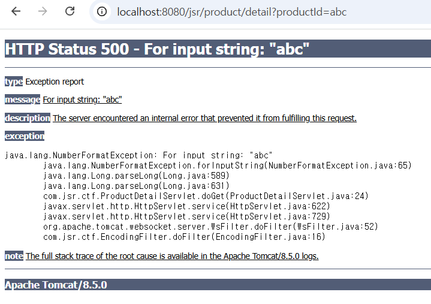
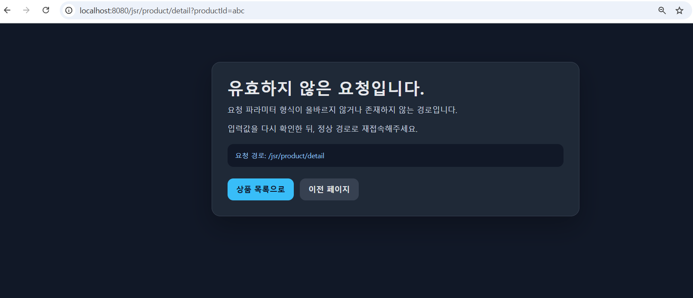
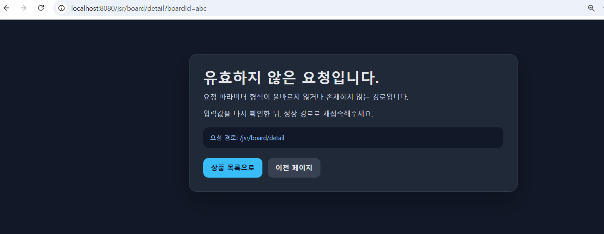

# 12. Information Exposure Security

## 개요
상품 상세 페이지는 `productId` 값을 숫자로 가정하고 바로 파싱한다. 이 과정에서 숫자가 아닌 값을 전달하면 `NumberFormatException`이 발생하고, 취약 버전에서는 별도 예외 처리 없이 Tomcat 기본 500 오류 페이지가 그대로 노출되었다.

그 결과 사용자는 단순한 입력값 변조만으로 예외 메시지, 클래스명, 메서드명, 줄번호 같은 내부 구현 정보를 확인할 수 있었다. 이는 애플리케이션 구조 노출로 이어지며, 이후 추가적인 공격 시도에 필요한 단서를 제공한다.

## 진입점
- `/jsr/product/detail`
- `/jsr/board/detail`

## 포함 이슈
| 구분 | 취약점 | 설명 |
| --- | --- | --- |
| 주요 취약점 | Information Exposure | 예외 발생 시 내부 클래스, 메서드, 줄번호 같은 구현 정보가 사용자에게 그대로 노출된다. |
| 관련 이슈 | Improper Input Validation | `productId`, `boardId` 같은 숫자 파라미터를 사전에 검증하지 않아 비정상 입력이 곧바로 예외로 이어진다. |
| 관련 이슈 | Verbose Error Message | 기본 오류 페이지가 상세 예외 메시지와 스택 정보를 그대로 보여준다. |

## 취약한 부분
상품 상세 페이지는 `productId`를 바로 `Long.parseLong()`으로 변환한다. `productId=abc`처럼 숫자가 아닌 값을 전달하면 SQL 실행 이전에 `NumberFormatException`이 발생하고, 취약 버전에서는 이 예외가 사용자에게 그대로 노출되었다.

문의 상세 역시 `boardId`를 숫자로 가정하기 때문에 동일한 유형의 예외가 발생할 수 있다. 즉, 개별 페이지 문제가 아니라 숫자 파라미터 검증과 예외 처리 전반이 부족한 상태였다.

## 취약한 코드
파일: `src/main/java/com/jsr/ctf/ProductDetailServlet.java`

```java
long productId = Long.parseLong(request.getParameter("productId"));

ps = conn.prepareStatement("SELECT * FROM JSR_PRODUCTS WHERE PRODUCT_ID=?");
ps.setLong(1, productId);
```

## 취약한 코드 동작 설명
`productId`가 정상 숫자이면 상품 상세를 조회한다. 하지만 숫자가 아닌 값이 들어오면 `Long.parseLong()` 단계에서 예외가 발생하고, 애플리케이션은 이를 처리하지 못한 채 컨테이너 기본 오류 페이지로 넘긴다.

이 과정에서 사용자에게 예외 메시지와 내부 클래스 구조가 그대로 노출되며, 공격자는 이를 통해 입력 처리 방식과 서버 내부 구현 단서를 얻을 수 있다.

## 취약한 코드 증적자료
1. 정상적인 `productId=1` 요청에서는 상품 상세 페이지가 정상적으로 조회된다.  
   

2. `productId=abc`처럼 숫자가 아닌 값을 전달하면 500 오류와 함께 `NumberFormatException`, 클래스명, 줄번호가 그대로 노출된다.  
   

## 영향
- 내부 클래스명, 메서드명, 줄번호 같은 구현 정보가 외부에 노출된다.
- 입력값 처리 방식과 예외 처리 흐름을 공격자가 쉽게 추정할 수 있다.
- 운영 환경에서 불필요한 디버그 정보가 사용자에게 그대로 제공된다.

## 대응 방안
- `productId`, `boardId`, `orderId` 같은 숫자 파라미터는 먼저 형식 검증 후 사용한다.
- `NumberFormatException` 같은 입력값 오류를 애플리케이션에서 직접 처리한다.
- 사용자에게는 일반화된 오류 메시지만 제공하고, 상세 예외 정보는 서버 로그로만 남긴다.
- 공통 오류 페이지를 두어 여러 엔드포인트에서 일관되게 예외를 처리한다.

## 수정 코드 예시
파일: `src/main/webapp/WEB-INF/web.xml`

```xml
<error-page>
    <exception-type>java.lang.NumberFormatException</exception-type>
    <location>/WEB-INF/views/error_view.jsp</location>
</error-page>

<error-page>
    <error-code>404</error-code>
    <location>/WEB-INF/views/error_view.jsp</location>
</error-page>

<error-page>
    <error-code>500</error-code>
    <location>/WEB-INF/views/error_view.jsp</location>
</error-page>
```

파일: `src/main/webapp/WEB-INF/views/error_view.jsp`

```jsp
<%
    Throwable ex = (Throwable) request.getAttribute("javax.servlet.error.exception");
    boolean invalidParam = ex instanceof NumberFormatException;
%>
<h1><%= invalidParam ? "유효하지 않은 요청입니다." : "요청을 처리할 수 없습니다." %></h1>
```

## 대응 코드 동작 설명
수정 후에는 숫자 파라미터 오류나 일반적인 404, 500 오류가 발생해도 Tomcat 기본 오류 페이지 대신 공통 오류 페이지가 표시된다. 사용자는 더 이상 스택 트레이스나 클래스 정보를 볼 수 없고, 일반화된 메시지만 확인할 수 있다.

또한 같은 방식이 `productId`뿐 아니라 `boardId`처럼 다른 숫자 파라미터에도 공통 적용되어, 예외 처리 방식이 일관되게 정리된다.

## 대응 증적자료
1. `productId=abc` 요청 시 더 이상 500 스택 트레이스가 노출되지 않고, 공통 오류 페이지가 표시된다.  
   

2. `boardId=abc` 요청도 동일한 공통 오류 페이지로 처리되어, 숫자 파라미터 오류가 일관되게 차단된다.  
   
